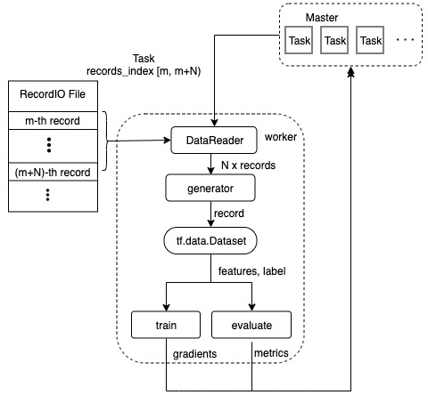

# Data IO Pipeline Design

Data IO pipeline for ElasticDL involves reading data from [RecordIO](https://github.com/elasticdl/recordio) file or ODPS table, making data generator for tf.data.Dataset and parsing features and labels by dataset_fn user defined (see <em> Figure 1</em>).

    
     
    
<em>Figure 1 </em>. elasticdl data IO pipeline

Let's take RecordIO file for example. After a worker is launched, it will send request to get tasks from the master. Each task contains the record index range [m, m+N) which can locate records in RecordIO file. DataReader read N records from RecordIO file by task index range and yield each record to create a generator. Then the worker will perform the following steps to consume the record data from the generator:

1. Create a dataset by [tf.data.Dataset.from_generator](https://www.tensorflow.org/api_docs/python/tf/data/Dataset#from_generator).
2. Convert dataset by dataset_fn user defined to generate features and labels.
3. Calculate gradients of trainable variables for the training task and predictions of samples for the evaluation task.
4. Send calculation result to the master.
5. Send task execution status to the master after processing all records of this task.
