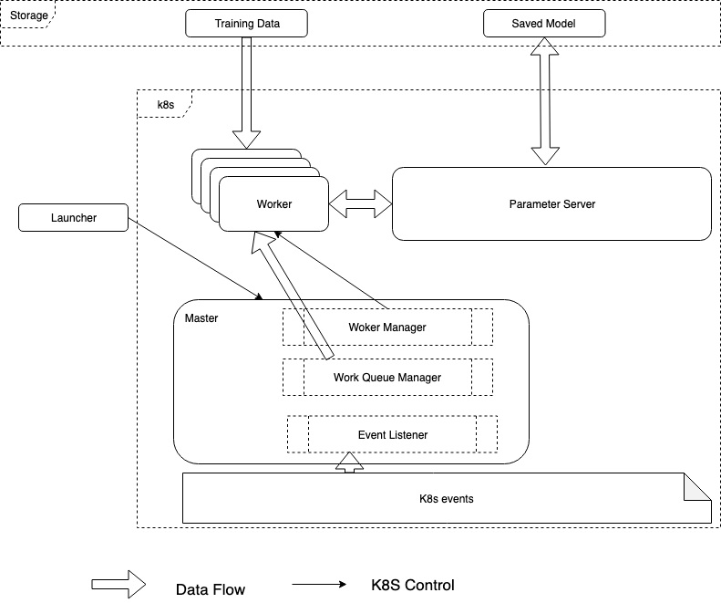

# Kubernetes Native Training 

## Overview

### Motivation
(TODO)

### Components



#### Launcher

Launcher is a command line application that runs on end users' machine and act as the entry point to the training system.

```
elasticdl 
  --model=user_module.py \
  --model_class=CIFAR \
  --max_workers=10 \
  --batch_size=100 \
  --num_epoch= 5 \
  --data=...
```

Here `user_module` is a python module derived from pytorch's `nn.module` base class. The launcher performs following actions:

* Copy user module to a storage accessible to workers.
   * another option is to add user module to worker image
* Launch master and parameter server in k8s cluster
   * another option is let master launch parameter server


#### Master

Master consists of several components that manage worker states and assign work to workers.

##### Worker Manager

Worker manager manages life cycle of workers.

* Launch extra workers in cluster when number of worker is less than the given threshold
   * If worker is failed to schedule due to resource constraint, etc., worker manager will do exponential backoff and retry.
* Delete workers when number of workers are greater than the threshold. This could happen if we support dynamic adjustment of the worker threshold.
   * Worker manager could also delete a worker when it is not making progress for a long time.

##### Event Listener

Event listener listens to workers' pod events and decide if the worker is pending, running or being deleted, etc. Worker manager relies on these events to maintain a global view of worker status.

The events could caused by worker manager launching or deleting worker pods. They could also be generated by k8s system via `kubectl` or scheduler. The event listener need to handle all such events.

##### Work Queue Manager

A unit of work consists of several training examples. Instead of the actual data, the examples contains 'pointer' to the data, e.g., when using RecordIO, training examples can be denoted by a (RecordIO file name,  starting, ending record number) triple.

The number of training examples in a unit of work is configurable to optimize master-worker communication and computation. The choice depends on batch size of number of workers. For instance, if there are maximum 10 workers, and batch size is 100, then number of examples per unit of work could pick between 5 and 10.

Work queue manager divides all training examples into unit of works and put them in an internal (logical) queue. The entries are repeated `num_epoch` times. When requested by a worker, the master will deque a unit of work and assign to the worker.

#### Worker

Once started, worker read in user provided python module form the shared storage of worker's Docker image and start to run 2 loops, training loop and model updating loop.

##### Training Loop

* Request a unit of work fom master
* For every training example in the unit of work:
   * If model is being updated by model updating loop, wait for the update to finish and then restart training loop, otherwise:
   * Read training data and label from data file for the example.
   * compute and accumulate gradient use current model
   * Send (model iteration, gradient sum) to parameter server.

##### Model Update Loop

* Start a streaming RPC to parameter server to retrieve latest model. Update local model once new iteration of model is available.

#### Parameter Server

Parameter server supports sync update of the model parameters. It runs 3 loops, model update loop, model push loop and model dump loop.

##### Model Update Loop

* Receive (model iteration, gradient) tuple from workers
* If model iteration is less than current iteration number, drop the gradient.
* Otherwise accumulate the gradient and increase example size
* When example size reaches predefined batch size, update parameters and increase iteration number.

#### Model Push Loop

* The loop is implicitly run by streaming RPC. When a new model is detected, it is sent back to workers via RPC reply.
    * There are some optimizations can be done, e.g. send only changed parameters, send parameter differences, etc.

#### Model Dump Loop

* When new model is detected, decide if it need to be dumped to storage.  
