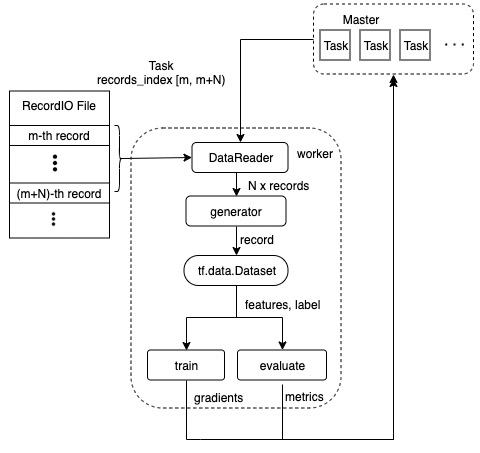

# ElasticDL Overall Design

## Component Architecture

ElasticDL uses the master-worker architecture. The master node plays the master role in two aspects.

1. It's the master of the cluster. It manages the lifecycle of all the worker pods, starts the worker pod, listens to the pod event and relaunches the terminated worker pod if necessary.
2. It's the master of the model training process.
   * Partition the training/evaluation data into mutiple shards.
   * Generate the training/evaluation tasks from the data shards.
   * Aggregate the gradients reported from the workers.
   * Update the model variables and save the checkpoint if necessary.

ElasticDL client is simple, just like a CLI command. User types ElasticDL command in the terminal to start the training/evaluation/prediction job. The client parses the parameters, builds the image which packages the ElasticDL framework and the model code, pushes the image into the hub, and then applies the CRD of the master node to the kubernetes ApiServer. After the master pod is created and started, it will then create other components and drive the process of the entire job.

## Distributed Training

## Dynamic Data Sharding

**Elastic** is the key feature of ElasticDL. A worker can join and left at any time and the entire job still keeps running.

The distributed execution of ElasticDL is data parallelism, not model parallelism. Each worker holds the whole model definition. Different shards of data are dispatched to different workers. The master doesn't care which worker reports the gradients, it just cares how many gradients are reported for the model version. In this way, adding or removing a worker won't interrupt the training process.

At the start of an epoch, the master node partitions the entire dataset into multiple shards which contain many records and then generates a todo list of tasks. Each task corresponds to a shard of data.\
At the start point, each task is not assigned to any worker. The worker pulls a task (aka. a shard of data) at runtime and the master assigns the task to this worker. And then the master moves this task to the doing list.\
After processing this task and reporting the result, the worker will pull the next task and continue processing it.

* If the task result is success, the master removes the task from the *doing* list and mark it done.
* If the task result is fail, the master removes the task from doing list and then inserts it back into the *todo* list for recovery. Several issues can cause the task failure, such as the worker is preempted by a job of higher priority, the network connection is timeout and so on.

The worker gets the task containing the data shard index (filename, startIndex, endIndex), it would be important to read the records of this shard efficiently from the data storage. In order to reach the IO efficiency, We choose the [RecordIO](https://github.com/elasticdl/recordio) data format for the input data.

## Data IO Pipeline

Data IO pipeline for ElasticDL involves reading data from [RecordIO](https://github.com/elasticdl/recordio) file, making data generator for tf.data.Dataset and parsing features and labels by dataset_fn user defined (see <em> Figure 2</em>).

    
     
    
<em>Figure 2 </em>. elasticdl data IO pipeline

After a worker is launched, it will send request to get tasks from the master. Each task contains the record index range [m, m+N) which can locate records in RecordIO file. DataReader read N records from RecordIO file by task index range and yield each record to create a generator. Then the worker will perform the following steps to comsume the record data from the generator:

1. Create a dataset by [tf.data.Dataset.from_generator](https://www.tensorflow.org/api_docs/python/tf/data/Dataset#from_generator).
2. Convert dataset by dataset_fn user defined to generate features and labels.
3. Calculate gradients of trainable variables for the training task and predictions of samples for the evaluation task.
4. Send calculation result to the master.
5. Send task execution status to the master after processing all records of this task.
