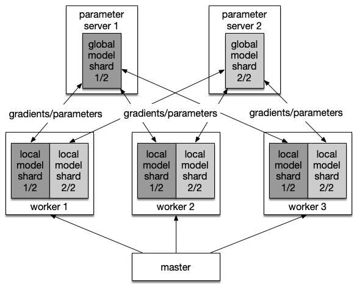

# Parameter Server Design

## Overview

A typical parameter server (pserver) architecture contains three roles:

- master, calling Kubernetes API to start workers and optionally parameter servers, and scheduling tasks to workers
- pserver, maintaining the global model, and providing parameter pull/push/optimize/checkpoint service
- worker, computing gradients of model parameters using local data and pushing gradients to pservers

Please refer to:

## Parameter Sharding

We prefer to shard the global model for some reasons:

- A model could be too large to fit in the memory of a process. For example, many recommending and ranking models take very high-dimensional (and sparse) inputs, thus require large embedding tables. In such cases, we'd have to have multiple parameter server instances to hold the global model.

- Even when a single process can hold the global model, we might still shard it onto multiple parameter server instances, who share the both communication and optimization workload.

There are several kinds of parameter to be handled separately:

- Very big embedding table: Embedding table is a collection of <item id, embedding vector> pairs. There is also a mapping from item id to pserver id, so the corresonding embedding vector will be stored at the certain pserver

- Big dense tensor: If the dense tensor parameter exceeds certain size, it will be sliced into several subtensors. The parameter name combining subtensor id will become a unique key, and the value is the subtensor(Please note that the slice tensor operation is zero-copy)

- Small dense tensor: The small dense tensor parameter will be stored at certain pserver wholely

The local model on workers and the global model on the parameter server(s) have the same size. In case that large embedding tables make the model size too big to fit in a single process's memory space, an intuitive solution is to save the model copies on an external storage service like Redis or Memcached.

However, such a solution creates a complex workflow which introduces too many cross-node communications.

We propose an alternative solution that doesn't rely on Redis or Memcachd. Instead, the global model, including the large embedding tables, is sharded across parameter servers, and the local model contains only part of the embedding table -- the small fraction that is required to compute recent minibatch(es).

## Parameter Initialization

Parameter initialization of a very big embedding table is lazy. For example, in online learning, there could be unkown item id in the training data. So, until worker send the unkown item id to pserver, will pserver initialize corresponding embedding vector and send back to worker. This is a `get_or_create` semantic.

Other parameters could be initialized before training.

## Distribution Strategy

We apply different strategies to different scenarios.

| scenario| hardware | update stragety | communication  stragety |
| :----  |:----  |:---|:---|
| Recommendation  | CPU|  async SGD|  Parameter server |
| CV | GPU | BSP SGD| AllReduce|
| NLP | GPU | BSP SGD| AllReduce |

BSP is short for Bulk synchronous parallel.

Following is the assumption under recommendation scenario:

- support asynchronous SGD
- support elastic scheduling and failover of pserver/worker

Please refer to [Elastic Scheduling](#Elastic Scheduling) part for more details.

**Note**

AllReduce failover and pserver failover will be discussed on other design docs.

## Master

- Master is responsible for creating/deleting/scheduling pserver and worker
- Master defines a parameter sharding strategy, and generate unique key for each parameter(or sharded parameter)
- Master defines a hash strategy from parameter key to pserver id 

Workflow:

1. Master creates several pservers and workers according to user's configuration
2. Master generates parameter sharding strategy based on model definition provided by user
3. Master initializes parameter, and send to pservers
4. Master triggers pservers and workers and start training
5. Master monitors cluster, and increase or decrease workerers according to priority

## Pserver

- Pserver provides kv store service, and workers could push/pull <key, value> to the pserver
- Pserver provides optimize service, apply gradients to parameters and update back to kv store

Workflow:

1. Pserver waits for workers pushing <key, gradient> to pserver
2. Pserver gets the key and queries kv store to get corresponding parameter
3. Pserver calls optimizer, applys <key, gradient> to <key, parameter>
4. Pserver updates <key, parameter> back to kv store
5. Pserver saves model checkpoint to disk periodially

**Note**

We could implement the kv store by ourselves, or we could use some already solution, such as redis.

## Worker

- Worker defines a forward/backward computation proccess
- Worker defines a dataloader module

Workflow:

1. Before forward layer starting, worker sends key to pserver, and pull <key, parameter> back from pserver
2. Worker starts forward layer computation
3. After backward layer finishing, worker generates <key, gradient>
4. Worker pushes <key, gradient> to pserver

There is also another kind of worker who does an evalution job. It define its own evalution computation process and dataloader of validation data. It pulls <key, parameter> from pserver, but never push data to pserver.

**Note**

There could be some same item id in a minibatch data. So some gradient vector of embedding table will have the same item id. We need to sum these gradient before pushing to pserver.

## Delayed model updating

In order to reduce the communication overhead between workers and pservers, we propose a stragety called delayed model updating.

A worker runs a round of forward/backward computation using its local model, and keep the gradients in its local. After several rounds finishing, it push gradients to pservers.

**Note**

Since local model is only a part of global model, in some circumstance, worker still has to pull embedding vector parameter from pservers if there exits unknow item ids in a minibatch data.

In async mode, this will lead to relative newer embedding part parameters, but relative older other part parameters.

## Elastic scheduling

### Analysis

First, we analyse the hardware resources that pserver and worker consume.

| role| CPU | memory | network bandwidth |  disk |
| :----  |:----  |:---|:---|:---|
| worker  | high| medium |  medium | low|
| pserver | low | medium | high| medium |

Worker does the forward/backward computation and consumes CPU most, while pserver provides kvstore service and consumes network bandwidth most.

Since our target is to scheduling deep learning jobs elasticly, we must have the ability to increase/decrease CPU resources of worker, and increase/decrease network bandwidth resources of pserver.

### Solution

As we are using asynchronous SGD, increasing/decreasing CPU resources of worker is trivial. We can just create more workers or kill some workers under different cluster status.

If job A requests 50 CPU cores, however, current cluster only has 30 CPU cores, it will lanuch the job immediately with 30 CPU cores. If the cluster has more CPU cores after a while, it will tell the master of job A to occupy the CPU cores and create more workers.

And for pserver, how can we adjust network bandwidth? One solution is to create or delete pserver nodes. Since each node has a network interface card, more pserver nodes means more network bandwidth.

If we change pserver node number, following things also need to be done:

1. modifying parameter sharding strategy
2. transforming old checkpoint to new one under new sharding strategy
3. loading changed checkpoint to pserver nodes
4. reseting grpc channels between pservers and workers
5. reseting parameters pull/gradients push logic in workers

The second solution to avoid parameter re-sharding is using consistent hashing. However, consistent hashing usually raises the time complexity of each push/pull operation, which causes a remarkable loss on performance.

The third solution is to adjust network bandwidth of current pserver node. We can create many pserver nodes first, but set network bandwidth limit to certain medium value. If we want to increase/decrease network bandwith, we increase/decrease the network bandwidth limit.

The third solution consumes the same memory, a little more CPU comparing to the former solutions, but avoids complex parameter re-sharding/consistent hashing under varying pserver nodes.

However, it's hard to manage network bandwidth resources in a data center. There could be a complex network topology. 

## Failover

There are two scenarios of failover to be taken into consideration:

- machines get breakdown
- some pods are killed because of priority scheduling

Since worker is stateless, we do not have to support failover for worker. 

However, pserver is stateful, which stores parameter shards. We must be careful when handling pserver.

To solve machines breakdown problem, we make replication for each pserver pod. The parameter sharding will be stored at one pserver pod, and also the neighbour pserver pods. The replication number is exposed to users to set, from 0 to 2.

So, if one pserver pod is breakdown, we could keep providing kvstore service without suspension. At the same time, the master will find another place to start a new pserver pod to recover to the original state.

In addition, if there is no big embedding table in the model, which means a worker holds whole parameters, the pserver could also recover from a worker.

Besides, we will save checkpoint periodially to a distributed file system. If we meets occasional many machines breakdown, the only thing to do is to setup a new job, and load corresponding parameter shards from the checkpoint.

Since pserver pods has relative higher priority than worker pods, worker pods of one lower priority job will be killed first to satisfy another job. If we kill all worker pods of one job, then the pserver pods of this job will also be idle. There is no load on CPU and network bandwidth, the pserver pods only occupy some memory. So, we do not need to kill pserver pods further.

We should avoid changing pserver numbers in general, since it will bring lots of other work. If this assumption is valid, the second scenario would be skipped.

## Deployment

After training some epoches, we will choose one checkpoint which has the best evalution metric as the final model. And this model will be deployed to online.

We provide two depolyment solutions which handles different model size separately.

### Solution one

If the checkpoint file is not very large, and could be loaded to a single node, the deployment of parameter server architecture will be the same as single node. 

We need to make both transformations to network definition and model parameter. In parameter server architecture, we may define some customized layers, but we have to use standard layers in deloyment. And some model parameter has to be merged, in order to coordinate with standard layers.

### Solution two

If the checkpoint file is too large to load into a single node, we have to spilt it into several pieces. The largest parameter could be a embedding table. We can split the embedding table by rows, and each piece hold a part of the embedding tale. 

We apply the first solution to each model piece. And then, the upcoming item id will be handled and dispatched to correct model piece. This is a divide-conque solution.
