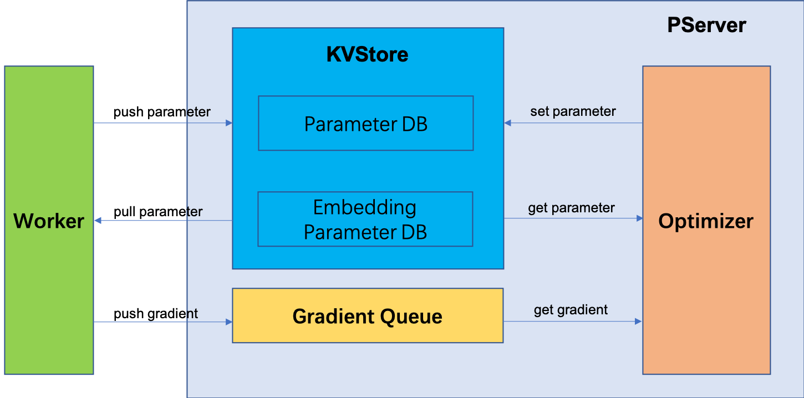

# Parameter Server Design


## Overview


## PServer


### Compoments





PServer contains three main compoments:

- KVStore
- Gradient Queue
- Optimizer

1. The worker initializes a model, and pushes parameters to KVStore.
2. Before each step of training, the worker pulls the latest model from KVStore.
3. After a round of forward/backward computation, the worker pushes gradients to the Gradient Queue waiting for processing.
4. Optimizer gets a gradient from the Gradient Queue.
5. Then, Optimizer looks up the corresponding parameter from KVStore.
6. Optimizer applies gradients to parameters, and updates parameter back to KVStore.


### Tensor Data Structure

To support data communication between pods, we introduce a `Tensor` proto message:

```proto
message Tensor {
    enum DataType {
        BOOL = 0;
        INT16 = 1;
        INT32 = 2;
        INT64 = 3;
        FP16 = 4;
        FP32 = 5;
        FP64 = 6;
    }
    string name = 1;
    DataType data_type = 2;
    repeated int64 dims = 3;
    bytes content = 4;
    repeated int64 indices = 5;
}
```

Correspondingly, we have a `Tensor` Python class.


```python
class Tensor(object):
    def __init__(self, name=None, value=None, indices=None):
        self.name = name
        self.value = value
        self.indices = indices
```

There are also some helper functions:

```python
def serialize_to_pb(tensor, pb):
    pass

def deserialize_from_pb(pb, tensor):
    pass

def convert_to_tf_variable(tensor):
    pass

def convert_to_tf_tensor(tensor):
    pass
```

### KVStore

For a common model variable, we use save it as a `tf.Variable` in Parameter DB. For the embedding table, we introduce a customized data structure.


```python
class EmbeddingTable(object):
    def __init__(self, name):
        self.name = name
        self.vectors = {}
        
    def get(self, indices):
        ...
        return tensor, unknown_indices
        
    def set(self, indices, value):
        pass        
```

The name of embedding table is the embedding layer name. EmbeddingTable uses a dictionary `vectors` to store `<id, embedding_vector>` pairs.

The KVStore could be like following:

```python
class KVStore(object):
    def __init__(self):
        self.param_db = {}
        self.embedding_table_db = {}
        
    def get_param(self, name):
        pass
        
    def get_embedding_vector(self, name, indices):
        pass
        
    def set_param(self, name, value):
        pass
        
    def set_embedding_vector(self, name, indices, value):
        pass
```


### Gradient Queue

We decouple KVStore and Optimizer by a gradient queue to make the overall design clean. And the complexity is all handled at the gradient queue.

The interface of Gradient Queue could be like this:

```python
class GradientQueue(object):
    def __init__(self):
        self.grad_queue = queue.Queue()
    
    def get_gradient(self):
        pass
        
    def put_gradient(self):
        pass
```

**Question 1** out-of-memory

Workers push gradients to the gradient queue of KVStore, pserver optimizer gets gradient from the queue, and does parameter optimization.

This is a classical producer-consumer problem. We have to ensure that the speed of optimizer processing gradients is large than the speed of workers pushing gradients. Otherwise, the gradient queue will become larger and larger and lead to out-of-memory.

We could set a limit size to the queue, if the condition is satisfied:

- just throwing away upcoming gradients from workers
- blocking `push_gradient` return from KVStore to workers


**Question 2** multi-threading optimizer

We could expose the optimizer numbers to users. If there is only one optimizer, the gradients will be handled one-by-one. So all gradients will be applied to parameters.

If there are multi-optimizers doing optimization, this will cause a race condition, and the order of reading/writing parameters will not be ensured.

The second choice is faster, but might loss some accuracy. Besides, we could also add a read-write-lock to avoid race condition in multi-threading circumstance.

**Question 3** async-SGD and sync-SGD


There are two ways to support async-SGD:
 
- Calling `apply_gradient` inside `push_gradient` gRPC service. The gradients will not be put into the queue.
- Putting gradients into the queue, and optimizer gets gradients from the queue immediately to `apply_gradient`.

In the first way, there may be several gRPC threads running in parallel. This will introduce race condition on parameter updating, some gradients may be overwrited.

The second way ensure each gradient could be applied, and decoupling these two procedures, `push_gradient` of worker and `apply_gradient` of optimizer. But the second way introduces more staleness in updating model, and may influence the final training accuracy.

We may consider the second way later.

In sync-SGD, optimizer needs to wait for a certain number of gradients, and then get the gradient after addition. We could implement a customized queue structure to support such logic efficiently.

### Optimizer

Optimizer gets a gradient from the gradient queue, and query to get the corresponding parameter from KVStore. Then it will apply the gradient to the parameter. It has a `tf.keras.optimizer` instance inside.

Many `tf.keras.optimizer` subclasses, such as `Adam` and `Adagrad` allocate and manage additional variables associated with the variables to train.  These are called `Slots`.

Embedding table slots are stored at KVStore, and other common parameter slots are stored and managed by `tf.keras.optimizer`.

The embedding table slot is also a embedding table data structure. For example, a embedding table parameter with name `embedding_layer0`, we will create a corresponding `embedding_layer0-momentum` EmbeddingTable object in `KVStore.embedding_table_db`.


### RPC Service

PServer provide RPC service for workers.

Since pserver will store a subset of the full model. And a worker will push/pull a submodel from the pserver. The model message is defined as following:

```proto

message Model {
    int64 version = 1;
    repeated Tensor tensors = 2;
}
```

Model could also be used as gradients collection.

Since embedding table is initialized lazily in pserver, worker should also send embedding table information to pserver.

So the RPC service will be defined as following:

```proto
message EmbeddingTableInfo{
    string name = 1;
    repeated int64 dims = 2;
    string initializer = 3;
}

message InitModel {
    Model model = 1;
    repeated EmbeddingTableInfo embedding_table_info = 2;
}

service PServer{
    rpc push_model(InitModel) returns (google.protobuf.Empty) {}
    rpc pull_model(Model) returns (Model) {}
    rpc pull_embedding_vector(Tensor) returns (EmbeddingResponse) {}
    rpc push_gradient(Model) returns (google.protobuf.Empty)
}
```

The interfaces of PServer could be like this:


```python
class PServer(elasticdl_pb2_grpc.PServerServicer):
    def __init__(self, kvstore, grad_queue, opt):
        self.kvstore = KVStore()
        self.grad_queue = GradientQueue()
        self.opt = Optimizer(opt, self.kvstore, self.grad_queue)

    def pull_model(self, request, _):
        pass

    def push_model(self, request, _):
        pass

    def push_gradient(self, request, _):
        pass

    # embedding param is handled lazily
    def pull_embedding_vector(self, reques, _):
        pass
```

### Checkpoint and Serving

Master will send signal to pservers to make checkpoint. Each pserver will save parameters in its current KVStore to a distributed file system.

Since a pserver only has a subset of the whole model, we have to merge these submodels to get final model for serving.


## Replica of PServer


## Master


## Worker
