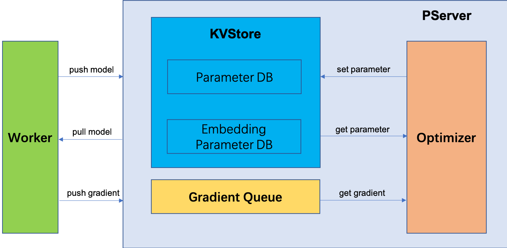

# Parameter Server Design


## Overview


## PServer


### Compoments





PServer contains three main compoments:

- KVStore
- Gradient Queue
- Optimizer

1. The worker initializes a model, and pushes parameters to KVStore.
2. Before each step of training, the worker pulls the latest model from KVStore.
3. After forward/backward computation, the worker push gradients to Gradient Queue waiting for processing.
4. Optimizer gets a gradient from the Gradient Queue.
5. Then, Optimizer looks up the corresponding parameter from KVStore.
6. Optimizer applies gradients to parameters, and updates parameter back to KVStore.


The interfaces of KVStore could be like this:


```python
class KVStore(elasticdl_pb2_grpc.KVStoreServicer):
    def __init__(self):
        self.param_db = {}
        self.embedding_param_db = {}

    def pull_model(self, request, _):
        pass

    def push_model(self, request, _):
        pass
    
    # embedding param is handled lazily   
    def pull_embedding_param(self, reques, _):
        pass

    def get_param(self):
        pass

    def set_param(self):
        pass
```


The interface of Gradient Queue could be like this:

```python
class GradientQueue(elasticdl_pb2_grpc.GradientQueueServicer):
    def __init__(self):
        self.grad_queue = queue.Queue()
        
    def push_gradient(self, request, _):
        pass
    
    def get_gradient(self):
        pass
        
    def put_gradient(self):
        pass
```

### Parameters Transfromation

Parameters will be transformed into different data types in different stages.

Common parameter:

- worker forward/backward computation: TensorFlow Variable
- worker pushing parameter: serialized protobuf
- KVStore parameter DB: TensorFlow Variable
- optimizer: TensorFlow Variable


Embedding parameter:

- worker forward/backward computation: numpy ndarry based Python struct
- worker pushing parameter: serialized protobuf
- KVStore embedding parameter DB: numpy ndarry based Python struct
- optimizer: TensorFlow Variable

We have to define a `Tensor` proto message and a corresponding `Tensor` Python class to support all these tranformations.


The `Tensor` proto message could be like this:

```proto
message Tensor {
    enum DataType {
        BOOL = 0;
        INT16 = 1;
        INT32 = 2;
        INT64 = 3;
        FP16 = 4;
        FP32 = 5;
        FP64 = 6;
    }
    string name = 1;
    DataType data_type = 2;
    repeated int64 dims = 3;
    bytes content = 4;
    repeated int64 indices = 5;
}
```

The `Tensor` Python class could be like this:

```python
class Tensor(object):
    def __init__(self, name=None, value=None, indices=None):
        self.name = name
        self.value = value
        self.indices = indices
```

There are also some helper functions:

```python
def serialize_to_pb(tensor, pb):
    pass

def deserialize_from_pb(pb, tensor):
    pass

def convert_to_tf_variable(tensor):
    pass

def convert_to_tf_tensor(tensor):
    pass
```

PServer will store a subset of the full model. And a worker will push/pull a submodel from the pserver. The model message is defined as following:

```proto
message Model {
    int64 version = 1;
    repeated Tensor tensors = 2;
}
```

Model could also be used as gradients collection.

So the RPC service will be defined as following:

```proto
message EmbeddingResponse{
    Tensor value = 1;
    repeated int64 unknown_indices = 2;
}

service KVStore{
    rpc push_model(Model) returns (google.protobuf.Empty) {}
    rpc pull_model(Model) returns (google.protobuf.Empty) {}
    rpc pull_embedding_param(Tensor) returns (EmbeddingResponse) {}
}

service GradientQueue {
    rpc push_gradient(Model) returns (google.protobuf.Empty) {}
}
```

### Gradient Queue

We decouple KVStore and Optimizer by a gradient queue to make the overall design clean. And the complexity is all handled at the gradient queue.

**Question 1** out-of-memory

Workers push gradients to the gradient queue of KVStore, pserver optimizer gets gradient from the queue, and does parameter optimization.

This is a classical producer-consumer problem. We have to ensure that the speed of optimizer processing gradients is large than the speed of workers pushing gradients. Otherwise, the gradient queue will become larger and larger and lead to out-of-memory.

We could set a limit size to the queue, if the condition is satisfied:

- just throwing away upcoming gradients from workers
- blocking `push_gradient` return from KVStore to workers


**Question 2** multi-threading optimizer

We could expose the optimizer numbers to users. If there is only one optimizer, the gradients will be handled one-by-one. So all gradients will be applied to parameters.

If there are multi-optimizers doing optimization, this will cause a race condition, and the order of reading/writing parameters will not be ensured.

The second choice is faster, but might loss some accuracy. Besides, we could also add a read-write-lock to avoid race condition in multi-threading circumstance.

**Question 3** async and sync update

In async mode, optimizer will get gradient from the queue immediately.

In sync mode, optimizer needs to wait for a certain number of gradients, and then get the gradient after addition.

We could implement a customized queue structure to support such logic efficiently.

### Evaluation

After some steps training, master will start to do evaluation. It will send evaluation tasks to workers. We allow some in-consistency, some workers do evaluation, some workers do training, and pservers still update the model.

The evaluation metrics will be calculated at the master.

### Checkpoint

we will save checkpoint periodially to a distributed file system during training. And we will also want to evaluate the checkpoint with validate dataset.

There are two candidate ways:

- Master sends sync signal to all workers and pservers, and training job is stopped. Evaluation job will be started. After evaluation, pservers will save checkpoint respectively. And afrer checkpoint is saved, the training job will be started again.

- Master send signal to all pservers, and tell pservers to save checkpoint. Then, master launch another evaluation worker pods and pserver pods to do evaluation job. The evaluation pserver pod will load the latest checkpoint. The training job will be still runing at the same time.

## Replica of PServer


## Master


## Worker
