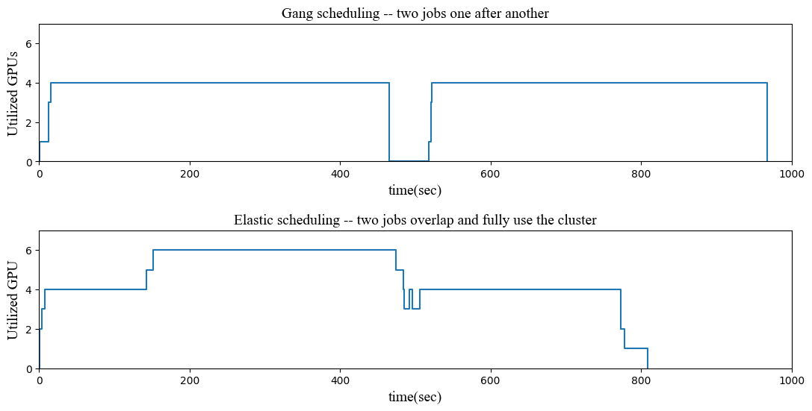
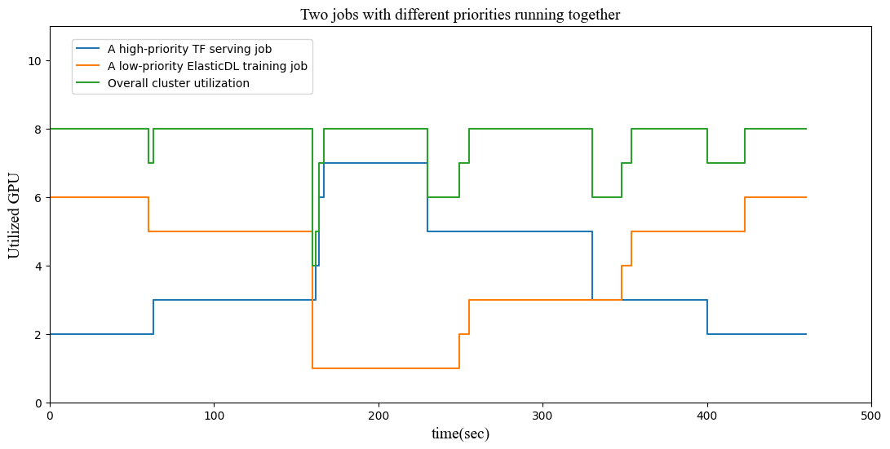

# Benchmark Performance Report

## Experiment 1: Submit Multiple AI Training Jobs Concurrently on a GPU Cluster

Supposed the GPU requirement of two jobs is a little over the total of the
cluster. Without elastic scheduling, the latter job cannot start until
another job completes. There are two problems:

- Bad user experience. The submitter of the latter job must wait a long time.
- Not efficient resource utilization. The rest of GPU in the cluster is free.

Using elastic scheduling, the latter job can start using the rest of GPU and
does not need to wait the earlier job completes. After the earlier job
completes, the latter job can scale up to speed up training. So, elastic
scheduling can improve user experience and resource utilization.

To verify the benefit of elastic scheduling, we perform an experiment on a
Kubernetes cluster with GPU. The experiment result is shown in the following
figure.

In the upper figure, we use gang scheduling to submit two training jobs one
after another, and each job needs 4 GPUs. However, we create a cluster
only with 6 GPUs using Alibaba Cloud Container Service for Kubernetes (ACK).
So, we cannot simultaneously run those two jobs on the cluster.
The latter cannot start until the earlier job completes.
We can find the earlier job completes at 465s. Then,
the latter job starts at 518s and ends at 968s. After the
earlier job completes, the latter job waits for 53s because ElasticDL must
launch the master pod firstly. The master pod does not need GPU,
so the GPU utilization is 0 before the master launches worker pods.

In the figure below, we use ElasticDL to submit the two same jobs.
We submit the latter job at 120s, and the latter job starts immediately.
All 6 GPUs on the cluster are used. After the earlier job ends at 474s,
the latter job scale up to 4 GPUs and ends at 809s. Due to elastic scheduling,
the elapsed time is less than gang scheduling.

## Experiment 2: AI Training Jobs and Serving Jobs are Running on a GPU Cluster

We usually set some rest on the serving cluster in case requests increase
sharply. We hope to utilize the rest to train an AI model to improve the
utilization of the cluster. On the experiment, we create a cluster with
8 NVIDIA T4 GPUs on ACK and start a TensorFlow Serving job for inference
with a Resnet20 model. Then we submit an ElasticDL training job with 6
low-priority GPUs configuration. When inference requests increase,
Kubernetes will scale up pods of the serving job, and the ElasticDL job will
release pods. When requests decrease, Kubernetes will scale down pods of
the serving job, and the ElasticDL job will relaunch pods to speed up training.

In the figure, the ElasticDL GPUs vary with the GPUs used by the serving job.
The total GPUs are almost used all the time.

## Experiment 3: Changing the Worker Number does not Hurt the Model Convergence

Some users may worry that changing the worker number will have a bad effect on
convergence. So, we experiment to verify it will not happen.
We use ElasticDL and gang scheduling to train ResNet20 with CIFAR-10 dataset.

The accuracy of the test dataset is the following:

In the experiment, we use gang scheduling with two workers or four workers
to train ResNet20. Each worker has an Nvidia Tesla P100 GPU.
The worker number of ElasticDL varies from 2 to 4. From the figure, there
is no obvious difference in the accuracy of training jobs.
