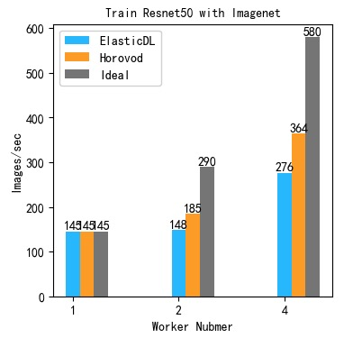
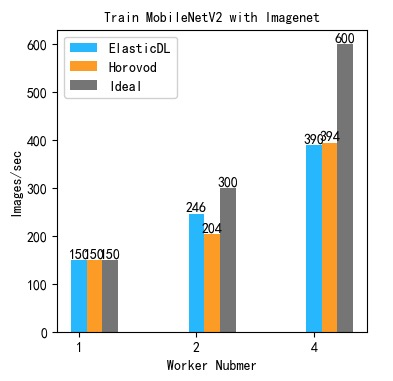

## Benchmark of FTlib AllReduce

We benchmark FTlib AllReduce with ElasticDL on three Kubernetes clusters:

1. a Minikube cluster,
2. an on-premise CPU cluster managed by the tailored Kubernetes system, and
3. a GPU cluster managed by the same tailored system.

We train a computation-intensive model, ResNet50, and a communication-intensive
one, MobileNetV2, in the benchmark.

## The Minikube Cluster

We start a local Kubernetes cluster on macOS by the command:

```bash
minikube start --vm-driver=hyperkit --cpus 2 --memory 6144 --disk-size=50gb
```

The experiment parameters are:

| Experiment parameter | Value    |
| -- | --- |
| Batch size | 64 |
| Batches per task | 50 |
| Images per task | 3220 |
| Dataset | CIFAR-10 |
| Input shape | (32, 32, 3) |
| Output classes| 10 |
| Worker resource| cpu=0.3,memory=2048Mi,ephemeral-storage=1024Mi|

### ResNet50 with CIFAR-10 on the Minikube Cluster

There are 214 parameter tensors in ResNet50 for CIFAR-10 dataset. And
those tensors totally have 23,555,082 (89.8 MB) trainable parameters.

| Workers |  computation/communication  |  Speed   |  Speedup Ratio |
| -- | --------------------------- | -------- | ------ |
| 1  |  -  | 3.1 images/s  |  1  |
| 2  | 10: 1 | 5.65 images/s | 1.82 |

### MobileNetV2 with CIFAR-10 on a Minikube Cluster

There are 158 parameter tensors in ResNet50 for CIFAR-10 dataset. And
those tensors have 2,236,682 (8.5MB) trainable parameters.

| Workers   |  computation/communication  |  Speed   |  Speedup Ratio |
| -- | --------------------------- | -------- | ------ |
| 1  |   -  | 29 images/s  |  1  |
| 2  | 10: 3 | 44.7 images/s | 1.54 |
| 3  | 10: 6 | 57.2 images/s  | 1.97 |

## On-premise CPU Cluster Managed by a Tailored Kubernetes System

Without the limit of the VM memory with Minikube, we can start more workers
on the on-premise cluster. And, We also increase the amount of memory and CPU
allocated to each worker. We use the same dataset CIFAR-10 as above experiments.
The experiment parameters are:

| Experiment parameter | Value |
| -- | --- |
| Batch size | 64 |
| Batches per task | 50 |
| Images per task | 3220 |
| Dataset | CIFAR-10 |
| Input shape | (32, 32, 3) |
| Output classes| 10 |
| Worker resource| cpu=4,memory=8192Mi,ephemeral-storage=1024Mi|

### ResNet50 with CIFAR-10 on an On-Premise CPU Cluster

| Workers   | communication   |  Speed   |  Speedup Ratio |
| -- | --------------------------- | -------- | ------ |
| 1  |   0%  | 26.7 images/s  |  1  |
| 2  | 18% | 41 images/s | 1.57 |
| 4  | 25% | 68.4 images/s  | 2.56 |
| 8  | 32% | 123 images/s | 4.61 |

### MobileNetV2 with CIFAR-10 on an On-premise CPU Cluster

| Workers   | communication   |  Speed   |  Speedup Ratio |
| -- | --------------------------- | -------- | ------ |
| 1  |   0%  | 353.6 images/s  |  1  |
| 2  | 24% | 503 images/s | 1.42 |
| 4  | 44.7% | 680 images/s  | 1.92 |
| 8  | 66.7% | 648 images/s  | 1.83 |

This experiment shows that the speedup achieved for ResNet50 is more
sustainable than MobileNetV2. This is because the ResNet50 model has
more parameters and it takes more time for the ElasticDL job to
compute than to communicate. Generally, the less communication cost,
the more sustainable the speedup.

## On-premise GPU Cluster Managed by a Tailored Kubernetes System

On the on-premise GPU cluster, we can launch the pod with a single P100 GPU.
As we known, GPUs are faster for computing than CPUs and the size of
CIFAR-10 is small to test the performance with GPUs. We use ImageNet with
input shape (256, 256, 3) to train Resnet50, MobileNetV2, and an image
compression model. The last model has less parameter tensors.

Experiment parameters are:

| Experiment parameter | Value    |
| -- | --- |
| Batch size | 64 |
| Batches per task | 16 |
| Images per task | 1024 |
| Dataset | ImageNet |
| Image shape | (256, 256, 3) |
| Output classes| 100 |
| Worker resource| cpu=8,gpu=1,memory=16000Mi,ephemeral-storage=1024Mi|

### ResNet50 with ImageNet on an On-premise GPU Cluster

There are also 214 trainable tensors in ResNet50 for ImageNet. But the
model trainable parameters is 23,739,492 (90.56) because there are 100 classes.

| Workers   | speed | speed-up ratio |total task time  | allreduce time| tensor.numpy() time| apply_gradients |
| --------- | ----- | ------------- |--------------- | -------- | ------ | ---------- |
| 1 (local) | 145 images/s| 1| 6.1s  |  - | - |  4.16s |
| 2  | 148 images/s| 0.88 | 13.76s | 10.36s | 5.04s | 1.35s |
| 4  | 276 images/s| 1.84 | 18s | 14.67s |  5.14s | 1.30s |

When we run the model locally, CPU timing is not accurate
because of async behavior of GPU ops.

Further, we use Horovod to test the performance with the same dataset and model.

| Workers | ElasticDL Speed|  Horovod Speed|
| ------- | --------------- | ---------------|
| 1 (local)| 145 images/s |  145 images/s |
| 2 |  148 images/s | 185 images/s |
| 4 |  276 images/s|  364 images/s |



### MobileNetV2 with ImageNet on an On-premise GPU Cluster

For ImageNet dataset with 100 classes, there are also 158 trainable tensors in
MobileNetV2 for ImageNet. And those tensors totally have 2,386,084 (9.1MB)
trainable parameters.

| Workers   | speed | speed-up ratio | total task time  | allreduce time| tensor.numpy() time| apply_gradients |
| --------- | ----- | -------- | --------------- | -------- | ------ | ---------- |
| 1 (local) | 169 images/s | 1 | 6.06s  |  - | - |  5.59s |
| 2  | 246 images/s | 1.45 | 8.34s  |   7.25026 | 5.79s | 0.6s |
| 4  | 390 images/s | 2.32 | 10.2029s | 8.9s |  5.78s | 0.71s |

Compared with Horovod, we list speeds of ElasticDL and Horovod using
different workers.

| Workers | ElasticDL Speed|  Horovod Speed|
| ------- | --------------- | ---------------|
| 1 (local)| 150 images/s |  150 images/s |
| 2 |  246 images/s | 198 images/s |
| 4 |  390 images/s|  394 images/s |



### An Image Compression Model with Conv2DTranspose with ImageNet

From the ResNet50 and MobileNetV2 experiments, we can find that
the speed-up of MobileNetV2 is better than ResNet50. MobileNetV2 has less
parameter tensors and parameters. In order to research what plays an important
role in speed-up, we also do exmperiments with an image compression model.
This model has less parameter tensors and more parameters than MobileNetV2.
For ImageNet dataset, there are 34 parameter tensors in the model and those
tensors totally has 11,238,723 (42.8MB) trainable parameters.

| Workers   | speed | speed-up ratio |total task time  | allreduce time| tensor.numpy() time| apply_gradients |
| --------- | ----- | --------| --------------- | -------- | ------ | ---------- |
| 1 (local) | 109 images/s | 1 | 9.36s  |  - | - |  8.95s |
| 2  | 176 images/s | 1.61 | 11.65s | 1.47s | 9.36s | 0.42s |
| 4  | 328 images/s | 3.01 | 12.47s | 2.44s |  9.32s | 0.37s |

In the table, totoal task time = forward/backward time + allreduce time +
apply gradients time. `tensor.numpy()` is a step of allreduce in ElasticDL now.


For the above experiments of GPU, we find that the speed-up ratio is better if
the number of parameter tensors is less. Because the computation on GPUs is
very fast for different models. The communication is the  bottleneck. So the
model complexity has little effect on the speed-up. The number of parameter
tensor is less, the communication is more light, so the speed-up is better.

## Conclusion

To improve the performance of FTlib AllReduce in ElasticDL, we need to
optimize the communication. In order to improve the communication efficiency,
we can:

1. Concurrent communication and computation.
2. Merge small tensors into a big tensor to reduce communication overhead.

Luckily, Horovod has implemented those two methods to improve performance.
We can research how to use Horovod in ElasticDL. Besides those two items,
We can also research other potential improvements mentioned in the
[original design doc](https://github.com/sql-machine-learning/elasticdl/blob/develop/docs/designs/allreduce.md#potential-future-optimizations)
