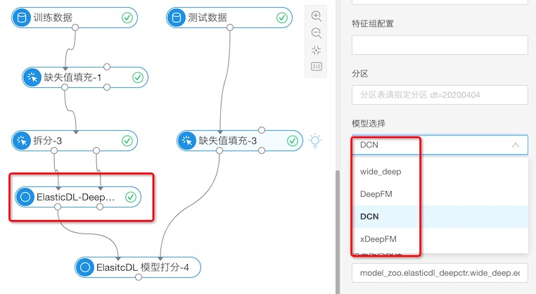
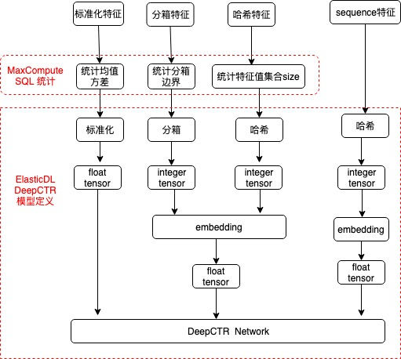

# ElasticDL: 结构化数据的分布式深度学习建模

在使用深度学习对结构化数据建模的时，主要包括两个阶段：

- 对数据特征做预处理变换，开发深度学习算法模型能训练预处理后的数据 -- 不同场景
的数据特征不同，对数据进行特征预处理适配不同的算法模型很繁琐
- 将开发的模型提交分布式训练 -- 如果资源紧张，等待时间长，影响模型调试和迭代效

为了提高用户深度学习建模效率，ElasticDL 针对这两个问题提出了相应的解决方案：

- 提供了结构化数据特征预处理的库，能与 Keras 模型定义无缝连接，提高模型开发效率。
- 在 Kubernetes 上实现了弹性分布式训练，能快速拉起分布式任务，缩短任务等待时间，
提高模型调试和训练效率。

本文主要介绍 ElasticDL 提供的结构化数据特征预处理方案。如果想了解 ElasticDL 的
弹性分布式训练特性，请阅读
[ElasticDL：同时提升研发效率和机群利用率](./elasticdl-antfin-introduction.md)

## 深度学习中结构化数据的特征预处理

在对结构化数据进行深度学习建模时，常需要将数据转换成更适合深度学习算法训练的格
式，常见的特征变换方式有：

- 对数值型特征进行标准化变换。
- 对数值型特征进行分箱变换，并输出特征值所在箱子的整数编号。
- 对字符型特征进行哈希分桶变换，即对字符串进行哈希后对桶数取模，映射成整数输出。
- 对字符型特征进行查词表变换，输出词在词表中的整数序号。

然而在特征变换之前，需要对数据集进行统计分析，得到特征的全局统计量。利用全
局统计量做特征变换，可以降低变换时的特征信息损失。不同特征变换所需要的特征
统计量：

| 特征变换 | 特征统计量 |
|--------| --------- |
| 标准化变换 | 均值，方差|
| 分箱 | 等频统计边界 |
| 哈希分桶 | 特征值集合的大小 |
| 查词表 | 特征值的集合 |

## ElasticDL 特征预处理与模型定义

在阿里云上，结构化数据主要以 MaxCompute 表的形式存储，为此 ElasticDL 针对
MaxCompute 表提供了特征统计和变换的特征预处理方案。

### MaxCompute 表的特征统计

针对常用的特征变换所需要的统计量，ElasticDL 利用 MaxCompute SQL 开发了特征统计
工具，并在 [PAI](https://pai.alipay.com) 上开发了 "ElasticDL 特征统计" 组件。


组件所执行的统计功能如下：

| 特征列统计配置 |  统计量 | MaxCompute SQL 算子 |
| ---------- | ------ | ----- |
| 数值特征列 |  统计所选特征列的最大值、最小值、均值方差和等频分10个箱的边界 | MAX, MIN, STDDEV, AVG|
| 数量统计特征列 | 统计所选特征列的特征值集合的大小 | COUNT(DISTINCT) |
| 词表统计 | 统计所选特征列的特征值结合，如果配置了词表频次过滤阈值，会过滤掉低频的特征值 | DISTINCT |

组件统计的结果会存入 MaxCompute 表中，分别存储特征统计量和特征词表。

### 特征变换 Keras layer

ElasticDL 支持分布式训练 Keras 模型，为了方便用户将特征预处理与 Keras 模型定义
相结合，ElasticDL 利用 TensorFlow op 开发了特征变换的 Keras layer 库
`elasticdl_preprocessing`。在训练时，TensorFlow 会将特征变换和模型定义组成
一张完整的计算图，在训练结束后，保存模型时会将完整的计算图以 SavedModel 格式
导出，保证了训练和预测的特征变换一致性。

`elasticdl_preprocessing` 的特征变换 layer 介绍：

| 特征变换 layer | 功能 |  所需的统计量 |
| --- | --- | --- |
| Normalizer | 对数值进行归一化或者标准化操作 | 均值、方差|
| Discretization | 将数值进行分箱，输出特征值所在的箱子的整数 id | 分享边界|
| LogRound | 将数值进行对数运算后取整 | 最大值 |
| RoundIdentity | 将数值进行取整操作 | 最大值 |
| Hashing | 将字符串进行 hashing 后对 bins 数量求余运算 | 特征值集合的大小|
| IndexLookup | 将字符串通过查词表转成整数，输出词所在词表的索引 | 特征值集合(词表) |

特征变换 layer 的使用教程请查看
[Preprocess Inputs using ElasticDL Preprocessing Layers](https://github.com/sql-machine-learning/elasticdl/blob/develop/docs/tutorials/preprocessing_tutorial.md)

### Keras 模型训练定义

ElasticDL 支持直接训练原生的 Keras 模型，用户只需使用 Keras API 来定义模型
即可。但是一个完整的深度学习训练定义，除了模型以外还需要定义 loss，optimizer
和 dataset，在 ElasticDL 中的定义方式如下:

```python
from elasticdl_preprocessing.layers import Normalizer

def custom_model():
    inputs = tf.keras.layers.Input(shape=(4, ), name="input") # 定义输入
    standardization = Normalizer(0.0, 1.0)(inputs) # 特征预处理
    x = tf.keras.layers.Flatten()(standardization)
    outputs = tf.keras.layers.Dense(3, name="output")(x)
    return tf.keras.Model(inputs=inputs, outputs=outputs, name="simple-model")


def loss(labels, predictions):
    return tf.reduce_mean(
        tf.nn.sparse_softmax_cross_entropy_with_logits(
            tf.cast(tf.reshape(labels, [-1]), tf.int32), predictions
        )
    )


def optimizer(lr=0.1):
    return tf.optimizers.SGD(lr)


def eval_metrics_fn():
    return {
        "accuracy": lambda labels, predictions: tf.equal(
            tf.argmax(predictions, 1, output_type=tf.int32),
            tf.cast(tf.reshape(labels, [-1]), tf.int32),
        )
    }


def dataset_fn(dataset, mode, metadata):
    def _parse_data(record):
        features = tf.strings.to_number(record[0:-1], tf.float32)
        label = tf.strings.to_number(record[-1], tf.float32)
        return features, label

    dataset = dataset.map(_parse_data)
    return dataset
```

模型定义完成后，将模型文件打入 ElasticDL 提供的基础镜像中，即可在 PAI 平台上提交分布式训练。

## PAI 平台上集成特征预处理的 DeepCTR 算法

为了让用户能快速将 ElasticDL 应用到真实业务场景，ElasticDL 在 [PAI](https://pai.alipay.com)
平台上提供了 ElasticDL-DeepCTR 组件，如下图所示:



该算法组件有如下特点：

- 根据用户配置的特征来自动生成特征预处理逻辑，并与深度学习 CTR 算法相结合，组成完整的模型。
- 提供了常用的 CTR 预估算法，包括 Wide & Deep, DeepFM, Deep Cross Network 和 xDeepFM。
- 分布式策略采用 ParameterServer，可以根据数据量来配置 worker 的数量来加速模型训练。

为了验证模型性能，我们选用了 [Kaggle Display Advertising Challenge](https://www.kaggle.com/c/criteo-display-ad-challenge) 的数据集,
来测试模型性能。将组件的标准化特征列和分箱特征列都配置成 I0-I13，哈希特征列配置成 C0-C13，
最终使用 xDeepFM 模型的 logloss 为 0.45634 (Kaggle best logloss: 0.44463)。
通过很简单的配置，就可以训练处一个性能比较好的模型，适合新场景数据集来快速实现 baseline。

ElasticDL DeepCTR 算法的实现原理如下图:


