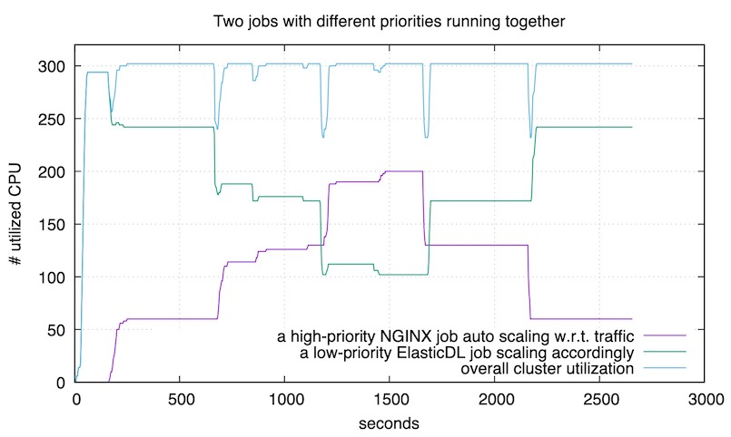
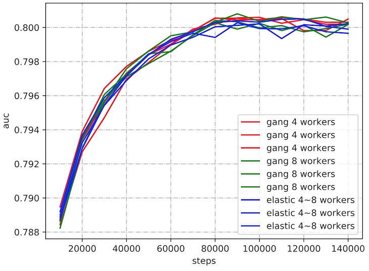

# ElasticDL：同时提升深度学习作业的研发效率和集群利用率

## 背景

Kubernetes 是目前最先进的分布式操作系统，是公有云和私有云的事实工业标准。
目前，在 Kubernetes 机群上运行 ***分布式*** TensorFlow 作业主要依赖 Kubeflow 项目
提供的 Kubernetes controller —— [kubeflow/tf-operator](https://github.com/kubeflow/tf-operator)
—— 这是因为 TensorFlow 不是一个 Kubernetes-native 的编程框架，自己不会调用
Kubernetes API 启动进程。类似的，很多诞生在 Kubernetes 之前的分布式编程框架
（比如 Spark）都需要一个 Kubernetes controller 来启动作业。这类应用或者框架
特定的 controller 被 CoreOS 公司的工程师们称为 Kubernetes Operator，后来
演化成了行业术语。

和早年间用 MPI 运行分布式深度学习作业一样，kubeflow/tf-operator 并不支持
弹性调度，而是启动 N 个进程去执行作业。如果执行中途有一些进程被
抢占（preempted）或者失败（fail），则作业失败，只能从最近的 checkpoint 重启。
这样的调度模式被称为 [gang scheduling](https://en.wikipedia.org/wiki/Gang_scheduling)。
最近随着 TensorFlow runtime 的改进，作业可能不会失败了，而是剩下的进程
继续执行，不过也不会因为随后集群里出现空闲资源而增加进程的数量。

使用刚性调度执行分布式训练作业，模型迭代必须等待申请的进程全部启动后才能开始。
如果集群资源不足以启动所有进程，则只能等待其他作业释放资源，影响作业
研发效率。为了缩短资源等待时间，可以给作业配置专有资源池。由于
资源不共享，必然导致资源利用率低。所以 Kubeflow 的 Kubernetes Operator 很难同时
兼顾研发效率和集群利用率。

ElasticDL 利用 TensorFlow eager execution 和 Kubernetes API，
可以在集群资源紧张时，使用少量资源开始训练作业。当其他作业释放资源时，
ElasticDL 的作业能自动扩容到所申请的资源量。这样既能缩短用户作业等待时间，
也能提升集群资源利用率。

## ElasticDL 弹性调度设计

深度学习作业的弹性调度需要了解深度学习的模型，所以弹性调度更适合实现在深度学习训练
作业专用框架里，而不是通用的 Kubernetes Operator 里。Kubernetes 的 Operator
只能管理作业集群状态，不能感知训练过程。所以 ElasticDL 通过在 Kubernetes 上
创建 master 进程来控制深度学习训练作业的弹性调度。

ElasticDL 的 master 会根据数据索引将数据分片，然后为每个分片的索引创建一个 task。
然后 master 会通过 Kubernetes API 启动多个 worker 进程。每个 worker 启动后，
会向 master 请求 task。 worker 收到来自 master 分发的 task 后，
会根据 task 的数据索引读取数据进行前向计算和梯度计算，
并通过分布式梯度更新机制来更新模型参数，例如 Parameter Server 和 AllReduce。

当有 worker 失败时，master 通过 Kubernetes API 能感知失败原因。
如果是因为被抢占导致的失败，master 会回收其计算的 task，
然后分发给其他正常 worker 重新计算。同时 master 会尝试重新拉起被抢占的 worker。
等到资源充足时，worker 进程会被重新启动，并加入训练作业。

## ElasticDL 弹性调度 Benchmark

为了说明 ElasticDL 弹性调度可以带来用户体验和集群利用率的双丰收，我们做了三个
实验来对比弹性调度和刚性调度的性能。

### 实验一：多个深度学习训练作业同时在集群上启动

考虑两个深度学习训练作业需要的资源总和略超过集群的情况：

- 如果没有弹性调度，则两个作业顺序执行。第二个作业的发起人需要等很久 —— 用户
体验不好。并且任何时刻只有一个作业在运行 —— 集群资源用不满。
- 如果有弹性调度，则两个作业并发执行，虽然后启动的作业拿不到期待的全部资源，
但是也马上就开始执行了 —— 用户体验好。因为两个作业并发 —— 集群被用满。

我们做了一个实验来验证上述好处，这个实验可以在蚂蚁金服的 Kubernetes 集群（ASI）
和开源 Kubernetes 集群上复现。

上图对应的实验里，我们用刚性调度的方式提交了两个训练作业，
每个作业都需要 175 个 CPU。而集群总 CPU 数是 320，不足以同时运行两个作业，
所以依次运行它们。可以看到第一个作业在 650 秒时结束。随后集群花了一点时间调度，
然后开始运行第二个作业，直到 1300 秒时结束。

下图对应的实验里，我们用 ElasticDL 来执行同样的两个训练作业。
第一个作业提交之后的 300 秒，我们提交了第二个作业。
第二个作业⻢上就开始运行，用满了集群剩下的资源，而不需要等到 第一个作业结束。
在 650 秒时，第一个作业结束。随后，在 1100 秒时，第二个作业也结束了。
因为弹性调度，使得两个作业尽量同时运行，所以总结束时间比也上图要早。

总结:

- 用户等待作业启动时间几乎是 0。这对于深度学习很重要，
因为用户最关注的是第一个迭代尽快开始 —— 如果第一个迭代 fail 了，
很可能是用户程序的 bug。
- 集群利用率高。第二个弹性调度实验执行期间，有一段时间集群利用率是 100%；
其他时间也不低于第一个刚性调度实验。
- 作业完成更快。第二个试验里，两个作业用了约 1100 秒；
第一个实验里需要约 1300 秒。

### 实验二：深度学习训练作业和在线服务混布

运行各种在线服务的生产集群，通常需要留出余量资源，以应付突然增⻓的用户请求量。
我们希望利用这些“余量”来做深度学习训练，从而提升集群利用率。
下面实验验证：通过用较低优先级运行 ElasticDL 训练作业，在用户请求增加的时候，
Kubernetes 自动扩容在线服务(nginx)；此时 ElasticDL 作业自动释放资源，
配合在线服务的扩容。当流量高峰过去之后，Kubernetes 自动缩容 nginx 服务，
此时，ElasticDL 自动利用释放的资源来扩容训练任务。

图中紫色曲线是 nginx 服务使用的 CPU 数量，随用户请求数量变化。
绿色曲线是 ElasticDL 训练作业使用的 CPU 数量，随 nginx 的资源需求自动变化。
蓝色曲线是机群的总体资源利用率 —— 保持在 90% 以上。

### 实验三：训练时调整 Worker 数量不影响收敛性

有用户担心训练过程中 worker 的数量发生变化，会导致不收敛。实际情况下
从未发生这类问题。使用 [Kaggle Display Advertising Challenge](https://www.kaggle.com/c/criteo-display-ad-challenge)
的数据集，用 ElasticDL 和用刚性调度的 kubeflow/tf-operator 分别
训练 wide & deep 模型，收敛曲线如下:

## ElasticDL 在蚂蚁金服花呗推荐场景的实践

蚂蚁金服部署了万级节点的 Kubernetes 集群，
同时蚂蚁金服有许多场景使用深度学习来提升产品性能和用户体验
算法工程师们共用一个 Kubernetes集群来训深度学习模型。
ElasticDL 已经成功将蚂蚁花呗推荐场景的深度学习模型运行在 Kubernetes 集群上。

蚂蚁花呗是蚂蚁金服推出的一款消费信贷产品。用户在购买商品时，
会给用户推荐花呗支付，并给予一定额度的优惠。
此推荐场景使用的是 Deep Interest Evolution Network [(DIEN)](https://arxiv.org/abs/1809.03672)
来预估推荐的点击率。DIEN 模型的输入包括用户属性特征、
商品属性特征和用户行为的序列特征，其中用户和商品属性特征是高维稀疏特征。
所以模型首先需要通过 embedding 将稀疏特征降维成稠密矩阵，
然后进行给深度学习模型进行计算。因为 embedding 的规模很大，
ElasticDL 采用 Parameter Server（PS）策略来进行分布式训练，
将参数分散到多个 PS 节点上，worker 负责前向计算并获取梯度，PS 负责梯度更新。
