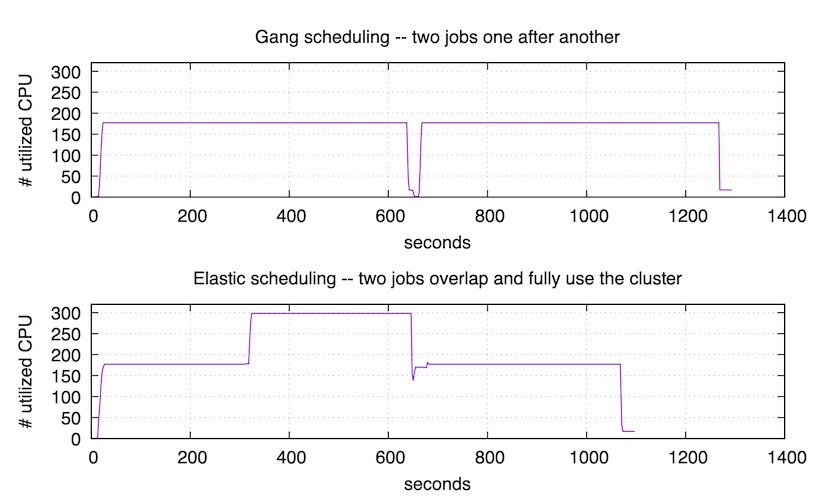
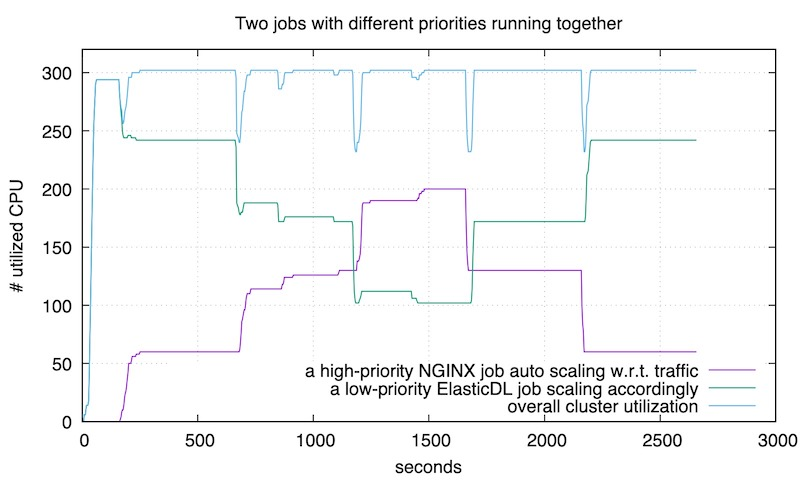
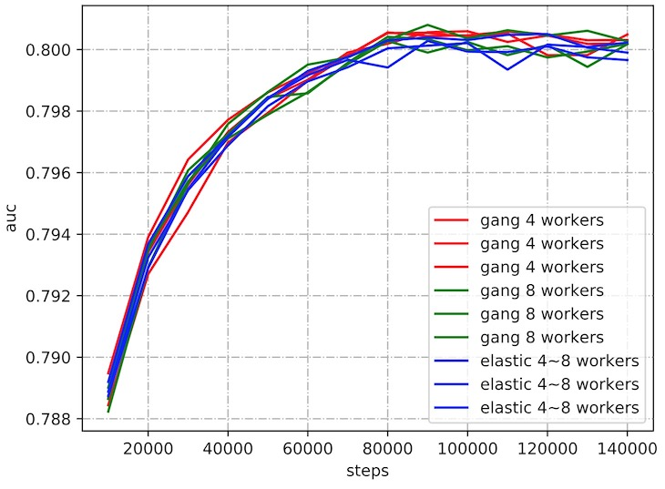

# ElasticDL: Kubernetes-native 弹性分布式深度学习系统

[ElasticDL](https://github.com/sql-machine-learning/elasticdl) 是基于 Kubernetes 和 TensorFlow 2.x eager execution
的支持容错和弹性调度的分布式深度学习系统。ElasticDL 具有如下特点：

- 弹性调度。在训练过程中可以动态伸缩 worker 数量，并保持训练过程不被中断停止。
- 高性能的 parameter server。ElasticDL 用 Go 实现了 Parameter Server，
具有良好的吞吐能力和可扩展性，同时优化了 embedding table 的梯度更新策略，减少通信开销，加速模型迭代。
- TensorFlow 2.x Keras API 定义模型。keras API 具有很高的易用性和灵活性，
学习成本低，同时开源社区基于 Keras 开发了很多经典模型和 layer，便于复用。

## 弹性调度

在很多人共用计算集群的情况下，支持弹性调度意味着极大提升团队效率和集群的总体利用率。前者支持快速迭代以保持技术领先；后者决定企业成本和云计算业务的盈利能力。

一个展示弹性调度效果的例子如下。假设一个集群里有 N 个 GPU，一个作业包 括一个进程，占用了 N/2 个 GPU。
第二个作业需要 N/2+1 个 GPU；但是此时机 群里空闲 GPU 只有 N/2 个。如果没有弹性调度能力，那么第二个作业被迫等待， 直到第一个作业结束释放资源。
这个等待时间很可能和第二个作业的运行时间同 量级。此时，集群的利用率很低，是 50%。
如果有弹性调度，那么第二个作业可 以马上启动，用 N/2 个 GPU 做计算。日后如果有更多空闲资源了，调度系统可 以增加其进程数量，充分利用资源。

另一个例子是，假设有一个作业已经在执行了，此时一个新的更高优先级的作业需要资源，所以调度系统杀掉了（preempt）了第一个作业的几个进程来腾出资 源启动第二个作业。
如果没有弹性调度和容错，那么第一个作业会失败，所有进程都结束。直到有足够资源重启它，并且沿着最近的 checkpoint 继续。
如果有弹性调度，则第一个作业的剩下的进程可以继续执行，只是因为可用的进程 (GPU）少了，所以速度慢一些而已。

以上两个例子都展示了弹性调度对集群利用率的提升，以及对团队工作效率的保障。

### 弹性调度和刚性调度

- 刚性调度[（gang scheduling）](https://en.wikipedia.org/wiki/Gang_scheduling): **一个作业里的 n 个进程，要么都运行，要么都死掉。**

  - Google 开源的 Kubeflow 是一个 Kubernetes 扩展 operators，支持在 Kubernetes 上分布式地运行 TensorFlow 作业。
  因为 TensorFlow runtime 目前支持一定程度的容错，所以作业执行过程中，如果有一些 workers 挂了，剩下的可以继续。不过不支持因为日后资源富余，恢复 workers 数量。
  - Facebook 开源的 PyTorch Elastic 也是类似的扩展，支持分布式 PyTorch 作业。号称 Elastic，其实是 job 失败后从 checkpoint 重启。
  - XGBoost、MXNet 社区也习惯于复用 Kubeflow。用 MPI 写的程序也可以利用 Kubeflow 拉起。
  
  以上 Kubernetes operators 都可以在蚂蚁金服的 ASI（旧称 Sigma）上部署。

  Gang scheduling 的特点是：运行时如果有一个进程挂了（比如被更高优先级的作业抢占了资源），则整个作业挂掉。等资源足够再启动所有的 n 个进程了，则可以重启（或者从最近的 checkpoint 恢复）。
  
- 弹性调度（elastic scheduling）：**训练作业运行过程中，进程数量的变化不影响作业。**

  - 运行过程中，一个或者几个进程被高优先级的作业抢占，剩下的进程不受影响地继续进行。如果将来资源丰沛了，系统可以加几个进程，此时作业仍然不受影响地继续运行。
  - ElasticDL 可以启动和调度分布式 TensorFlow、PyTorch 作业。也很容易支持分布式 XGBoost 作业。

### ElasticDL 弹性调度分布式架构

ElasticDL 采用 master-worker 的分布式架构，下图为采用 Parameter Server 分布式策略的 ElasticDL 架构。


图中的 mater 主要包含两个角色：

1. 负责启动 worker pod 和 PS pod，并管理所启动 pod 的生命周期，当有 pod 因为被抢占等原因失败时，会重启 pod。
2. 将数据构造成 task，每个 task 包含一个数据分片，并将 task 分派给 worker 来计算梯度。如果 worker 负责的 task 失败，则 master 会将此 task 分配给其他 worker。

ElasticDL 的 master 给 worker 分派计算任务 task 的示意图：


### ElasticDL 弹性调度 benchmark

为了说明 ElasticDL 弹性调度的优点，我们做了两组实验来说明 ElasticDL 可以带来用户体验和集群利用率的双丰收。

#### 实验一：多个 AI 训练作业

考虑两个 AI 训练作业需要的资源总和略超过集群的情况：

- 如果没有 elastic scheduling，则两个作业顺序执行。第二个作业的发起人需要等很久 —— 用户体验不好。并且任何时刻只有一个作业在运行 —— 集群资源用不满。
- 如果有 elastic scheduling，则两个作业并发执行，虽然后启动的作业拿不到期待的全部资源，但是也马上就开始执行了 —— 用户体验好。因为两个作业并发 —— 集群被用满。

我们做了一个实验来验证上述好处，这个实验可以在 ASI 集群和开源 Kubernetes 集群上复现。



上图对应的实验里，我们用 gang scheduling 的方式提交了两个训练作业，每个作业都需要 175 个 CPU。
而集群总 CPU 数是 320，不足以同时运行两个作业，所以依次运行它们。可以看到第一 个作业在 650 秒时结束。
随后集群花了一点时间调度，然后开始运行第二个作业，直到 1300 秒 时结束。
下图对应的实验里，我们用 ElasticDL 来执行同样的两个训练作业。第一个作业提交之后的 300 秒，
我们提交了第二个作业。第二个作业⻢上就开始运行，用满了集群剩下的资源，而不需要等到 第一个作业结束。
在 650 秒时，第一个作业结束。随后，在 1100 秒时，第二个作业也结束了。因 为弹性调度，
使得两个作业尽量同时运行，所以总结束时间比也上图要早。

总结:

- 用户等待作业启动时间几乎是 0。这对于 AI 很重要，因为用户最关注的是第一个迭代尽快 开始 —— 如果第一个迭代 fail 了，很可能是用户程序的 bug。
- 集群利用率高。第二个实验(elastic scheduling)执行期间，有一段时间集群利用率是 100%;其他时间也不低于第一个实验(gang scheduling)。
- 作业完成更快。第二个试验里，两个作业用了约 1100 秒;第一个实验里需要约 1300 秒。

### 实验二：AI 作业和在线服务混布

运行各种在线服务的生产集群，通常需要留出余量资源，以应付突然增⻓的用户请求量。我们希望 利用这些 “余量” 来做 AI 训练，
从而提升集群利用率。下面实验验证:通过用较低优先级运行 ElasticDL 训练作业，在用户请求增加的时候，Kubernetes 自动扩容在线服务(NGINX);
此时 ElasticDL 作业自动释放资源，配合在线服务的扩容。当流量高峰过去之后，Kubernetes 自动缩容 NGINX 服务，此时，ElasticDL 自动利用释放的资源。



图中紫色曲线是 NGINX 服务使用的 CPU 数量，随用户请求数量变化。绿色曲线是 ElasticDL 训练作业使用的 CPU 数量，随 NGINX 的资源需求自动变化。蓝色曲线是机群的总体资源利用 率 —— 保持在 90% 以上。

### 实验三：训练时调整 worker 数量不影响收敛性

有用户担心训练过程中 worker 的数量发生变化，会导致不收敛。实际情况下从未发生这类问题。
使用 [Kaggle Display Advertising Challenge](https://www.kaggle.com/c/criteo-display-ad-challenge) 的数据集,
用 ElasticDL 和用 gang scheduling 分别训练 wide-and-deep DNN model，收敛曲线如下:



 此实验使用了异步 SGD 更新。多项研究(如[[Ho2013](http://www.cs.cmu.edu/~seunghak/SSPTable_NIPS2013.pdf)], [[Zhang2016](https://arxiv.org/pdf/1511.05950.pdf)])表明，在异步 SGD 下 worker 数量越多，参数滞后(Staleness)越严重，并且严重的 staleness 会影响到模型收敛。在 ElasticDL 弹性调度下，worker 数量可能因为被抢占而下降，staleness 会减轻，理论上不会对模型训练产生负面影响。实验结果也符合此理论。
 
## 高性能的 Parameter Server

在搜索广告等场景，模型中可能包含较大的 embedding table，其内存会超过单机内存，我们通常使用 Parameter Server (PS) 分布式策略来训练此类模型，在 PS 策略下，PS 上存储着模型参数，Worker 从 PS 上请求参数，
在本地使用训练数据计算梯度，最后把梯度再发送到 PS 上，PS 使用 worker 传来的梯度来迭代更新模型参数。

ElasticDL 用 Go 实现了 Parameter Server，具有良好的吞吐能力和可扩展性。并且，我们针对 embedding table 做了一些额外的优化。

- embedding vector 惰性初始化，从而可以支持任意大小的embedding table
- 把一个 embedding table 拆分到多个PS上存储与更新，均衡存储/通信/更新的负载
- worker从PS请求参数时，先滤除重复ID，只请求不同的参数，减少通信量
- worker向PS发送梯度时，本地先把相同ID的梯度进行合并，减少通信量

通过上述设计与实现，ElasticDL可以很高效的完成搜索推荐广告模型的训练。

## TensorFlow 2.x Keras API 定义模型

ElasticDL 支持原生 Keras API 来定义模型，用户在定义模型时并需要感知 ElasticDL，只需用 TensorFlow 提供的 Keras API 定义模型即可。
除了模型定义，ElasticDL 还提供了基于 TensorFlow op 开发的 Keras 特征预处理 layer，方便用户进行特征预处理。

### Keras API 定义模型

ElasticDL 使用 TensorFlow eager execution 来计算模型梯度，支持用户使用 TensorFlow 2.x 的 Keras API 来定义模型，如下所示：

```python
def custom_model():
    inputs = tf.keras.layers.Input(shape=(4, ), name="input")
    x = tf.keras.layers.Flatten()(inputs)
    outputs = tf.keras.layers.Dense(3, name="output")(x)
    return tf.keras.Model(inputs=inputs, outputs=outputs, name="simple-model")
```

如果本地安装了 TensorFlow 2.x，可是直接带本地调试模型，观察模型输出：

```python
import tensorflow as tf
model = custom_model()
outputs = model.call(tf.constant([[0.4, 0.7, 1.5, 0.3], [1.4, 0.2, 0.5, 1.3]]))
```

训练一个模型不只需要上述模型定义，还需要指定数据 (dataset)、优化目标（cost）、和
优化算法（optimizer）。ElasticDL 和 TensorFlow 其他的 high-level API，
例如 Keras 和 TensorFlow Estimator 一样，提供了相关配置的定义方式，比如

```python
def loss(labels, predictions):
    return tf.reduce_mean(
        tf.nn.sparse_softmax_cross_entropy_with_logits(
            tf.cast(tf.reshape(labels, [-1]), tf.int32), predictions
        )
    )


def optimizer(lr=0.1):
    return tf.optimizers.SGD(lr)


def eval_metrics_fn():
    return {
        "accuracy": lambda labels, predictions: tf.equal(
            tf.argmax(predictions, 1, output_type=tf.int32),
            tf.cast(tf.reshape(labels, [-1]), tf.int32),
        )
    }


def dataset_fn(dataset, mode, metadata):
    def _parse_data(record):
        features = tf.strings.to_number(record[0:-1], tf.float32)
        label = tf.strings.to_number(record[-1], tf.float32)
        return features, label

    dataset = dataset.map(_parse_data)
    return dataset
```

在TensorFlow eager execution时，上述的定义的每个接口都可以单独测试，
在配置好模型训练参数后，用户只需使用 ElasticDL client 就可以提交分布式训练任务

```shell
elasticdl train \
  --image_base=elasticdl:latest \
  --model_zoo=model_zoo \
  --docker_image_repository=reg.docker.alibaba-inc.com/qinlong-wql/ \
  --model_def=dac_ctr.elasticdl_train.custom_model \
  --minibatch_size=512 \
  --num_epochs=20 \
  --num_workers=8 \
  --num_ps_pods=2 \
  --training_data=/testdata/elasticdl/dac_records/train  \
  --validation_data=/testdata/elasticdl/dac_records/val \
  --evaluation_steps=10000 \
  --job_name=test-edl-changfan \
```

### Keras 特征预处理 layer

通常情况下，原始数据是不能直接被深度学习模型来训练的，需要将原始数据进行预处理，同时需要保证预处理逻辑的离线训练和在线部署的一致性。
为了方便用户在开发模型时进行数据预处理，ElasticDL 基于 TensorFlow op 开发了特征预处理库 elasticdl_preprocessing，
使用 elasticdl_preprocessing，用户可以对原始数据做如下操作：

- 对数值特征做标准化或者归一化
- 对数值特征进行分箱或者转成整数
- 将字符特征通过 hashing 或者 lookup 转成整数。

elasticdl_preprocessing 提供了下列特预处理 layer：

| 预处理 layer | 功能  |
| ----------  | ---- |
| Normalizer | 对数值进行归一化或者标准化操作 |
| Discretization | 将数值进行分箱，输出特征值所在的箱子的整数 id |
| LogRound |  将数值进行对数运算后取整 |
| RoundIdentity | 将数值进行取整操作 |
| Hashing | 将字符串进行 hashing 后对 bins 数量求余运算|
| IndexLookup | 将字符串通过查词表转成整数，输出词所在词表的索引|

elasticdl_preprocessing 的特征预处理 layer 可以和 TensorFlow 的 Keras layer 一起构造一个完成的模型，
并在训练结束后保存到 TensorFlow 的 SavedModel 中。特征预处理 layer 的使用可以参考
[Preprocess Inputs using ElasticDL Preprocessing Layers](https://github.com/sql-machine-learning/elasticdl/blob/develop/docs/tutorials/preprocessing_tutorial.md)
