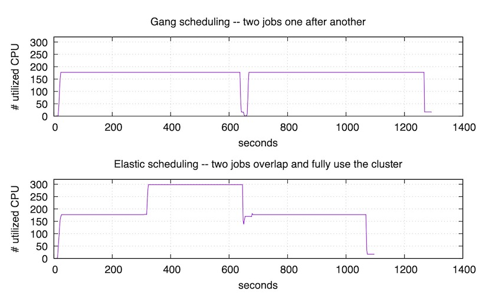

# ElasticDL：Kubernetes-Native 弹性分布式深度学习系统

在工业界的应用场景中，我们常常需要使用海量数据来训练深度学习模型，
同时在搜索推荐和广告的领域，深度学习模型因为需要大规模的 embedding，
所以模型会比较大，需要将模型分散到多个节点存储。
所以需要分布式训练深度学习模型。在开发分布式训练任务时，
一方面我们需要开发分布式深度学习程序，另一方面有能运行分布式程序的分布式集群。
前者除了需要考虑算法原理还需要考虑分布式环境下的通信、同步和容错等，
开发者既需要了解深度学习算法也需要了解分布式系统。
后者需要考虑集群资源利用率，节省成本。

ElasticDL（https://github.com/sql-machine-learning/elasticdl）
是一个基于 TensorFlow 2.x 和 Kubernetes 的分布式深度学习系统。
ElasticDL 通过提供简化的分布式深度学习编程框架来提高分布式程序的编程效率，
通过分布式深度学习的弹性调度来提高集群的资源利用率。

ElasticDL 的首要设计意图是简化分布式编程。它允许用户只提供用 TensorFlow 2.0 API 描述的模型，
而不需要用户写分布式训练过程代码。用户的模型定义只要能在本地调通，
即可在分布式环境下用大规模数据训练模型，从而提升研发效率。

同时，ElasticDL 提供的弹性调度的能力在实践中可以让集群的利用高达 90%。
当集群资源不足时，一个训练作业里的进程减少；当其他作业结束释放资源后，
进程数量随之增加。这样的做法比 TensorFlow distribution strategy 以及
TorchElastic 专注容错（进程减少的情况下作业不失败，但不会增加进程数量）更进一步。
并且，因为 ElasticDL 作业容忍变化的 worker 数量，
所以每个作业的启动都不必等待集群有足够的资源，而是可以见缝插针的尽早开始训练，
从而缩短 等待作业启动的时间，让研发人员可以尽快看到第一个迭代的结果，
万一分布式训练有问题，也能尽早发现，从而进一步提升了研发效率。

接下来我们会根据以下内容逐步介绍 ElasticDL:

- ElasticDL 简化分布式深度学习编程
- ElasticDL 分布式深度学习训练的弹性调度
- ElasticDL 弹性调度提升集群利用率
- ElasticDL 在蚂蚁集团 CTR 预估场景的实践

## ElasticDL 简化分布式深度学习编程

为了从海量数据中学习规律，我们需要编写分布式深度学习程序来完成训练任务。
这在工业场景中尤为常见。

可分布式深度学习程序的编写很难 —— 编程者既要了解深度学习，
也要了解分布式系统开发。在一个分布式深度学习系统中，需要启动和监控若干个
workers。因为既要拆分训练数据给 workers，还要综合各个 worker 算出的
gradients 来更新模型，所以涉及通信（communication）和同步（synchronization）。
此外，当 worker 数目很多时，作业在执行过程中有 worker 挂掉的概率也会变得很大。
如果一个 worker 挂掉，则整个作业重启或者恢复到最近的
checkpoint（fault recovery），那么重启之后可能又会有 worker
挂掉导致重启，于是作业不断陷入重启和恢复，永远也无法完成。
这进一步要求编程者具备设计容错（fault tolerance）系统的能力。
其实不仅分布式深度学习，其他分布式机器学习程序、
分布式离线和在线数据处理程序等程序的写作，都对编程者有类似上述要求。

一个常见的解决思路是为特定类型的作业提供分布式编程框架，
让用户只需要完形填空一样补上业务逻辑，而分布式计算（包括通信、同步、和容错）
都由框架的代码来完成。一个典型的例子是离线数据处理程序用 MapReduce 框架来写。
不管是 Google MapReduce 还是 Hadoop MapReduce，用户基本都只需填写 map
和 reduce 两个函数的实现即可。类似的，在线数据流系统基于 Storm 和 Flink 来写，
用户只需提供 bolts 和 nuts 这样的业务逻辑定义。

在 ElasticDL 之前，蚂蚁金服的同事们使用过多种框架和类似框架的高层 API。
这些方案大都基于 TensorFlow 和 Kubernetes。

1. TensorFlow Estimator 作为构建在 TensorFlow 之上的一层 API，
允许用户只需定义模型，而训练过程封装在一个函数调用里。利用 Kubeflow 提供的
TF operator，我们可以将该训练过程以分布式作业的方式启动在Kubernetes 上。
这个方案的局限是：它仅支持 TensorFlow 的 graph mode，不支持 eager execution；
而 eager execution 可以大幅简化调试，尤其方便跟踪网络各层输出。

1. Keras API 支持 TensorFlow 2.x 和 eager execution。目前 TensorFlow 2.x
Keras API 还暂不支持 ParameterServer 分布式策略，对 AllReduce
分布式策略提供了实验性的支持。

1. Horovod 对用户代码有侵入性，用户除了必须熟悉 TensorFlow API 之外，
还需学习 Horovod API。

以上三个方案的共同局限是，虽然具备一定的容错能力，不过不支持弹性调度。
而且它们都依赖部署 Kubernetes operator，了解 Kubernetes 对 AI
专家来说颇有挑战。

| 方案 | 模型定义方式 | 分布式执行机制 |
| ----| ---------- | ------------ |
| Estimator | TensorFlow Eastimator API | Kubeflow TF-operator |
| Keras | TensorFlow Keras API | Kubeflow TF-operator |
| Horovod | Horovod with TensorFlow | Kubeflow MPI-operator |
| ElasticDL | TensorFlow Keras API | ElasticDL master process per job|

针对这些局限，我们设计和开发了 ElasticDL 分布式计算框架。用户定义可以用 TensorFlow 2.x
的 Keras API 来定义模型。并且，分布式执行不要求 Kubernetes 集群有任何特殊配置，
而是利用每个作业里的 master 进程来协调训练数据分配、通信、同步、和容错 ——
这也是 ElasticDL 除了容错，支持弹性调度的原因。

### 基于 ElasticDL 框架编写深度学习程序

就像 MapReduce 框架中只需要用户完形填空两个函数：map 和 reduce，ElasticDL
需要用户填写 forward、loss、optimizer、feed 函数。其中 forward
定义深度学习的前向计算过程（forward pass），ElasticDL 会调用 TensorFlow
eager execution 的 GradientTape 机制来自动推导对应的后向计算过程（backward
pass）；loss 函数返回模型训练时使用的损失函数，即优化目标；
optimizer 函数返回模型训练时使用的优化器；feed 定制化训练数据到 TensorFlow
模型输入（tensors）的转换过程。


这些函数的编程只需要了解 TensorFlow API，不需要对分布式训练有任何背景知识。
写完之后，用户可以在单机上用小数据做调试验证。如果通过，
可以不做任何代码修改就提交到 Kubernetes 集群上做分布式的容错的大规模训练。

不同于 Kubeflow/TF-operator 给每个集群部署一个 Kubernetes Operator 的方式，
ElasticDL 为每个作业引入一个 master 进程。通过调用 Kubernetes API，master
进程了解集群情况；同时，作为作业的一部分，master 还了解深度学习作业的特点
—— 包括利用 Python inspection 机制了解上述各个函数的特点，
其中调用的 API 函数等。所以，master 有非常充分的信息来做更优的调度。
比如 master 可以请 Kubernetes 把两个 worker 启动在同一台物理机上，
共用一个 GPU —— 当一个 worker 读数据的时候，请另外一个 worker 来做计算，
从而始终保持较高的 GPU 利用率。

### 一个例子

我们用一个 MNIST 手写数字识别的例子来说明。

```python
def forward():
    inputs = tf.keras.Input(shape=(28, 28), name="image")
    x = tf.keras.layers.Reshape((28, 28, 1))(inputs)
    x = tf.keras.layers.Conv2D(32, kernel_size=(3, 3), activation="relu")(x)
    x = tf.keras.layers.Conv2D(64, kernel_size=(3, 3), activation="relu")(x)
    x = tf.keras.layers.BatchNormalization()(x)
    x = tf.keras.layers.MaxPooling2D(pool_size=(2, 2))(x)
    x = tf.keras.layers.Dropout(0.25)(x)
    x = tf.keras.layers.Flatten()(x)
    outputs = tf.keras.layers.Dense(10)(x)
    return tf.keras.Model(inputs=inputs, outputs=outputs, name="mnist_model")
```

除了模型定义之外，训练模型还需要指定 feed, loss，optimizer函数。

```python
def loss(labels, predictions):
    labels = tf.reshape(labels, [-1])
    return tf.reduce_mean(
        input_tensor=tf.nn.sparse_softmax_cross_entropy_with_logits(
            logits=predictions, labels=labels
        )
    )

def optimizer(lr=0.1):
    return tf.optimizers.SGD(lr)

def feed(dataset, mode, _):
    def _parse_data(record):
        if mode == Mode.PREDICTION:
            feature_description = {
                "image": tf.io.FixedLenFeature([28, 28], tf.float32)
            }
        else:
            feature_description = {
                "image": tf.io.FixedLenFeature([28, 28], tf.float32),
                "label": tf.io.FixedLenFeature([1], tf.int64),
            }
        r = tf.io.parse_single_example(record, feature_description)
        features = {
            "image": tf.math.divide(tf.cast(r["image"], tf.float32), 255.0)
        }
        if mode == Mode.PREDICTION:
            return features
        else:
            return features, tf.cast(r["label"], tf.int32)

    dataset = dataset.map(_parse_data)

    if mode == Mode.TRAINING:
        dataset = dataset.shuffle(buffer_size=1024)
    return dataset
```

上述每个函数都很容易做单独测试（unit test）。而且，利用 TensorFlow 2.x
eager execution，上述函数很容易 log 每一层的输出。基于个特点，
ElasticDL worker 在调用 forward 函数的时候，可以打印中间结果，
便于调试和复现问题。

### ElasticDL 提交分布式训练作业

定义后模型和训练代码后，我们需要将模型代码放入到 docker 镜像中。
假如我们的模型代码放入在 `model_zoo` 的路径中，则制作 docker 镜像的 Dockerfile
如下所示：

```shell
FROM tensorflow
RUN pip install elasticdl
COPY model_zoo /model_zoo
```

生成 docker 镜像后，我们就可以在 kubernetes 集群上提交 ElasticDL 训练作业了，
比如本地可以在 minikube 上提交。ElasticDL 提交作业的命令：

```shell
elasticdl train \
    --image_name=elasticdl_mnist:v0 \
    --model_zoo=model_zoo \
    --model_def=mnist_model.custom_model \
    --training_data=/data/mnist/train \
    --num_epochs=1 \
    --master_resource_request="cpu=1,memory=300Mi,ephemeral-storage=1024Mi" \
    --worker_resource_request="cpu=1,memory=300Mi,ephemeral-storage=1024Mi" \
    --ps_resource_request="cpu=1,memory=300Mi,ephemeral-storage=1024Mi" \
    --minibatch_size=64 \
    --num_ps_pods=1 \
    --num_workers=2 \
    --job_name=mnist-train \
    --distribution_strategy=ParameterServerStrategy \
    --output=model_output
```

## ElasticDL 分布式深度学习训练的弹性调度

### 对弹性调度的诉求

在分布式计算场景中，为了提供资源的利用率，工程师们经常共用一个分布式集群。
支持弹性调度意味着极大提升团队效率和集群的总体利用率。集群资源是有限的，
有时集群运行的作业会较多，如果所剩资源不足以满足作业所需资源，
则需要等到其他任务结束释放资源。同时这部分剩余的资源也无法被使用，
影响了集群的资源利用率。

一个展示弹性调度效果的例子如下。假设一个集群里有 N 个 GPU，
一个作业包括一个进程，占用了 N/2 + 1 个 GPU。第二个作业也需要 N/2+1 个 GPU；
但是此时机 群里空闲 GPU 只有 N/2 个。如果没有弹性调度能力，
那么第二个作业被迫等待，直到第一个作业结束释放资源。
这个等待时间很可能和第二个作业的运行时间同量级。此时，集群的利用率很低，是
50%。

如果有弹性调度，可以有两种方式让第二个作业启动。一是第二个作业有高优先级，
能从第一个作业抢占资源来启动。如果作业二运行完了，作业一还在运行的话，
可以恢复到原来的 N/2 + 1 个 GPU。二是第二个作业使用剩余的资源来启动，
当第一个作业结束时，能将资源扩充到 N/2 + 1 个 GPU。
这两种方式都要求两个作业具有容错和弹性调度能力。

如下图所示，图中右侧最上面为没有弹性调度的情况。
右侧下面两种方式为使用弹性调度的作业运行情况。


### 基于 TensorFlow Eager Execution 构造分布式训练系统

基于 TensorFlow 的分布式训练系统大致可以分为以下四类：

|    | TensorFlow 1.x graph mode | TensorFlow 2.x eager execution |
| -- | ------------------------- | ------------------------------ |
|in TensorFlow runtime | TensorFlow's parameter server | TensorFlow distributed startegy |
| above TensorFlow API | Horovod | ElasticDL/Horovod |

其中， ElasticDL 位于田字格的右下角是为了实现容错和弹性调度。

TensorFlow 的 runtime 是与平台无关的，只要在集群上启动多个进程，
并让每个进程知道其他所有进程的 IP 和 Port，就可以运行 TensorFlow
原生的分布式程序。比如早些时候在 Yarn 集群上运行 TensorFlow 分布式作业，
和现在的使用 kubeflow/tf-operator 在 Kubernetes 集群上运行分布式作业。
正因为 TensorFlow 的 runtime 与平台无关，所以其也没法让集群来给调整进程数量。
所以，我们没法通过修改 runtime 来实现完备的主动的容错和弹性调度。

而使用 TensorFlow API，我们可以基于 TensorFlow API 来自定义 training loop，
并在 training loop 中调用集群管理系统的 API 来调整进程数量。
基于 TensorFlow API 来实现分布式训练系统有 Horovod 和 ElasticDL。Horovod 和
ElasticDL 一样，都是在每个进程里运行完整的计算逻辑，并通过 TensorFlow API
来获取每次迭代的梯度，然后进行梯度合并与权重更新。ElasticDL 的 training loop
中，每个 worker 进程都会做如下操作：

1. 读取一个 mini-batch 的训练数据
1. 用本地模型 (local model) 作为参数调用用户定义的 forward 函数计算 cost，
如果模型很大，则部分参数可能来自 parameter server (PS).
1. 根据计算的 cost，使用 TensorFlow eager execution 的 GradientTape
机制来进行 backward 计算，得到梯度（gradient）
1. 如果是 synchronous SGD，此时 worker 调用 FTlib 实现的 AllReduce 来同步
gradients 并且更新模型。如果是 asynchronous SGD，worker 不定时的向 parameter
server 上传 gradients，也不定时地从 parameter server 获取全局模型参数。

由于每个 worker 进程都有完整计算逻辑，
所以某个进程挂了，其他进程还是可以继续运行的，这样就可以支持容错。
而弹性调度在缩减进程数量时是需要支持容错的。
由于 Horovod 也是和平台无关的，所以其也不会调用集群管理系统来调整进程数量，
从而不支持弹性调度。而 ElasticDL 在自己的 training loop 中会调用 Kubernetes
API 来监听进程状态和集群资源状态，从而调整进程数量，实现弹性调度。
所以 ElasticDL 是 Kubernetes-Native 的，只能运行在 Kubernetes 集群上。

### 调用 Kubernetes API 来实现训练的弹性调度

ElasticDL 通过在 Kubernetes 上创建 master 进程来协调训练数据分配、通信、
梯度同步和容错，从而支持弹性调度。针对 asynchronous SGD 方法，master
进程会启动一个高性能的 parameter server 来供 worker 存储和更新模型参数。


当 master 进程启动后，master 会调用 Kubernetes API 来启动 PS 进程和 worker
进程。PS 的进程数量按照用户指定的数量，而 worker 的数量会根据集群资源状况而定，
且总数不超过用户指定的数量。因为 worker 数量越多，在 asynchronous SGD
梯度更新方法下，worker 之间的梯度滞后现象越严重，会影响模型收敛性。

在 training loop 执行过程中，master 会通过 Kubernetes API 来监听 worker
的状态，如果发现 worker 被抢占，则会请 Kubernetes 在有空闲资源时重启 worker。

为了实现弹性调度，master 除了管理 worker 外，还需要负责数据划分并给 worker
分配数据来执行计算。当有 worker 失败时，master 需要回收其数据分片，
并重新分配给其他 worker。当有新的 worker 加入作业时，master 需要给其分配数据。

### Master 动态数据划分

在用 MPI 写分布式程序的时候，因为作业中进程数量是恒定的，
所以经常采用静态数据划分的做法 —— 在训练之前把训练数据预先分成 N 个文件，
对应作业中的 N 个 worker 进程。


所以这个做法在弹性调度的时候就失效了 ——因为弹性调度时，
作业中的进程数量是可变的。如果 worker 数量减少，则分配给其的数据没法被其他
worker使用，会造成训练数据的缺失。如果有 worker 新加入作业，
其没法拿到数据分片，也就没法进行计算。为此，需要实现动态数据划分。

ElasticDL 的动态数据划分是基于索引的。ElasticDL 要求训练数据是一个或者多个
[RecordIO](https://github.com/wangkuiyi/recordio) 格式的文件，或者是 MaxCompute
数据库系统中的 表（table）。这两种数据源都允许 master 进程在开始训练之前，
在基本存储单元（block）间快速跳跃着扫描数据，把数据分成小段，称之为任务（task）。


每个 task 包括的内容如下：

1. 文件名或者表名，
1. 第一条记录相对于文件（或者表）开始处的偏移（offset），
1. 这个 task 里的总记录数。

扫描结果是很多 tasks，master 把这些 tasks 放进一个 TODO 队列里。
这个队列不一定需要是 master 进程里的数据结构，可以是放在 etcd 里的 —— 因为 etcd
是不死的，所以 master 即使被高优先级作业抢占了，这个信息也不会丢失；
可以通过在资源富余时重启 master 进程来恢复作业状态。

扫描和划分数据的同时，master 开始请 Kubernetes 启动 workers，
总数不超过用户指定的数量 N（最大并发度）。每当一个 worker 启动起来了，
master 会收到 Kubernetes 发来的通知；
master 在一个 etcd 数据结构里记录“活着”的 workers。

扫描和划分数据结束之后，master 就依次从 TODO 队列里取出 task，
通过 gRPC 发给某一个活着的 worker，同时 master 把这个 task 挪进 DOING 队列里。
接收到 task 的 worker 负责打开文件（或者表），并且从指定的 offset
开始依次读取记录，并且更新本地模型。根据用户选择的 asynchronous 或者
synchronous 算法，workers 会通过调用 parameter server
或者 AllReduce 来协调更新全局模型。

当一个 worker 处理完了接收到的 task，它通过 gRPC 返回一个表示成功的标记；
master 就把这个 task 从 DOING 队列挪到 DONE 队列了。当所有 task 都从
TODO 挪进了 DONE，则说明一个 epoch 完成了。

如果一个 worker 失败了（比如被更高优先级作业抢占了），则 master 的 gRPC call
会 timeout；此时，master 把对应的 task 从 DOING 队列挪回 TODO 队列了。
下一次有 worker 完成 task 时，master 会把这个 task 再发出去。
这里有一个细节：有的 task 可能被某个 worker 使用了一部分，
也因此影响到了模型更新；此时 worker 被抢占，那么这部分已经被处理的数据会因为
task 的下一次分发，被重复使用。
不过这个并不影响深度学习训练要求数据统计一致性的假设。


### 高效训练的优化

在使用 Parameter Server 分布式训练深度学习模型时，随着 worker 数量的曾加，
parameter server 的并发性能会成为训练速度提升的瓶颈，为此 ElasticDL
Go 语言实现了 parameter server 来提升并发性能，使训练速度能随着 worker
数量的增加呈线性增加。同时针对大规模的 embedding table 做了优化，
均衡 parameter server 之间的负载，减少 worker 与 parameter server
之间的通信量。。这些优化策略包括：

1. 在 parameter server 上惰性初始化（lazy initialize） embedding vectors
—— 在使 用到 vector 的时候才初始化。
1. 把一个 embedding table 拆分到多个 parameter server
进程里以均衡存储与通信负载。
1. worker 从 PS 请求 embedding vectors 时，先滤除重复的 embedding ID，
只取回不同 ID 的 vectors，从而减少通信量。
1. worker 向 PS 发送梯度时，先把相同 ID 的梯度进行合并（调用 TensorFlow
的 embedding vector combinanation 函数），从而减少通信量。

基于 DeepFM 模型训练，我们测试了不同 worker 数量下，整体训练速度，如下图所示：


## ElasticDL 弹性调度提升集群利用率

ElasticDL 实现的弹性调度和刚性调度（[gang scheduling](https://en.wikipedia.org/wiki/Gang_scheduling)）
是对应的。刚性调度的简洁不求甚解的描述是：一个作业里的 n 个进程，
运行时如果有一个进程挂了（比如被更高优先级的作业抢占了资源），则整个作业挂掉。
等资源足够再启动所有的 n 个进程了，则可以重启（或者从最近的 checkpoint 恢复）。

上文提到的几种分布式运行 TensorFlow 作业的方式都使用了 Kubeflow 项目提供的
Kubernetes operators，支持在 Kubernetes 上分布式地运行 TensorFlow 作业。
因为 TensorFlow runtime 目前支持一定程度的容错，所以作业执行过程中，如果有一些
workers 挂了，剩下的可以继续。不过不支持因为日后资源富余，恢复 workers 数量。
Facebook 开源的 TorchElastic 也是类似的扩展，支持分布式 PyTorch 作业。
它号称 Elastic，其实是 job 失败后从 checkpoint 重启。XGBoost、MXNet
社区也习惯于复用 Kubeflow 的 Kubernetes operator。用 MPI 写的程序也可以用
Kubeflow 拉起。

而弹性调度（elastic scheduling）实现的是训练作业运行过程中，
进程数量的变化不影响作业进行。 具体的说，
如果一个或者几个进程被高优先级的作业抢占，剩下的进程不受影响地继续进行。
如果将来资源丰沛了，系统可以加几个进程，此时作业仍然不受影响地继续运行。

上文简述了 ElasticDL 实现弹性调度的机制，包括动态数据分配以及由 master
来启动、监控、和管理 workers，而不依赖 Kubernetes operator。
本节展示三个 benchmark 试验，帮助大家直观地了解 ElasticDL
对集群利用率和研发效率的同时提升。

### 实验一：多个 AI 训练作业并发

考虑两个 AI 训练作业需要的资源总和略超过集群的情况：如果没有 elastic
scheduling，则两个作业顺序执行。第二个作业的发起人需要等很久
—— 用户体验不好。并且任何时刻只有一个作业在运行 —— 集群资源用不满。
而如果有 elastic scheduling，则两个作业并发执行，
虽然后启动的作业拿不到期待的全部资源，但是也马上就开始执行了
—— 用户体验好，而且因为作业并发集群被用满。

我们做了一个实验来验证上述好处。这个实验可以在 ASI 集群和开源
Kubernetes 集群上复现。实验结果如下图。



上图对应的实验里，我们用 gang scheduling 的方式提交了两个训练作业，
每个作业都需要 13 个 CPU。而 Google Cloud 上租用的实验集群总 CPU 数是 24，
不足同时运行两个作业，所以依次运行它们。可以看到第一个作业在 395 秒时结束。
随后集群花了一点时间调度，然后开始运行第二个作业，直到 795 秒时结束。

下图对应的实验里，我们用 ElasticDL 来执行同样的两个训练作业。
第一个作业提交之后的 30 秒，我们提交了第二个作业。第二个作业马上就开始运行，
用满了集群剩下的资源，而不需要等到第一个作业结束。在 395 秒时，
第一个作业结束。随后，在 580 秒时，第二个作业也结束了。因为弹性调度，
使得两个作业尽量同时运行，所以总结束时间 比也上图要早。

总结：

- 用户等待作业启动时间几乎是 0。这对于 AI 工作很重要，
因为用户最关注的是第一个迭代尽快开始—— 如果第一个迭代失败了，
很可能是用户程序的 bug。另外，深度学习模型往往需要手动调优，
学习率、optimizer、activation 等配置如果不合理，往往在前几个迭代就能发现；
因此第一个迭代能立刻开始，对模型调优的工作效率提高有很大帮助。
- 集群利用率高。第二个实验（elastic scheduling）执行期间，
有一段时间集群利用率是 100%； 其他时间也不低于第一个实验（gang scheduling）。
- 作业完成更快。第二个试验里，两个作业用了约 580 秒；第一个实验需要约 795 秒。

### 实验二：AI 作业与在线作业混布

运行各种在线服务的生产集群，通常需要留出余量资源，以应付突然增长的用户请求量。
我们希望利用这些“余量”来做 AI 训练，从而提升集群利用率。下面实验验证：
通过用较低优先级运行 ElasticDL 训练作业，在用户请求增加的时候，Kubernetes
自动扩容在线服务（NGINX）；此时 ElasticDL 作业自动释放资源，
配合在线服务的扩容。当流量高峰过去之后，Kubernetes 自动缩容
NGINX 服务，此时，ElasticDL 自动利用释放的资源。


图中紫色曲线是 NGINX 服务使用的 CPU 数量，随用户请求数量变化。绿色曲线是
ElasticDL 训练作业使用的 CPU 数量，随 NGINX 的资源需求自动变化。
蓝色曲线是集群的总体资源利用率 —— 保持在 90% 以上。

### 实验三：训练时更改 worker 数量不影响收敛性

有用户担心训练过程中 worker 的数量发生变化，会导致不收敛。在使用 asynchronous
SGD 时，worker 的数量越多，worker 之间的梯度滞后就越严重，从而会影响收敛性。
但是 ElasticDL 的弹性调度给作业启动的 worker 数量不会超过用户配置的数量，
所以梯度滞后和使用 gang scheduling 是一样的。为了验证 ElasticDL
的弹性调度不影响模型收敛性，我们用 ElasticDL 和用 gang scheduling
分别训练 Wide & Deep model，收敛曲线如下：


可以看到，采用 gang scheduling 持续用 4 个或者 8 个 workers，
和用 ElasticDL 并且 worker 数量 在 4 到 8 之间变化，得到的收敛曲线很难分辨。
差别在自然误差范围之内。

## ElasticDL 在蚂蚁集团 CTR 预估场景的实践

蚂蚁集团从事的金融行业涉及支付、微贷、和保险等业务，会涉及一些产品推荐场景。
这些推荐场景需要使用到 CTR 预估模型，且数据都是以结构化表的形式存储在阿里云的
MaxCompute 数据库中。为了提高用户使用深度学习进行 CTR 预估，ElasticDL
提供了 End-to-End 的建模方案，包括特征分析、特征预处理和模型训练。


在特征统计部分，我们使用 MaxCompute SQL 来统计数据集的均值、方差、
特征值集合等信息。比如:

```SQL
SELECT AVG(x) as x_avg, STDDEV(x) as x_stddev FROM TABLE
```

得到数据集统计信息后，ElasticDL 基于 TensorFlow op 开发了 keras
[preprocess layers](https://github.com/sql-machine-learning/elasticdl/tree/develop/elasticdl_preprocessing)
来实现训练过程中的特征变换。现在提供的特征变换 layer 如下。

| 特征变换 layer | 功能描述 | 所需统计量 |
| ------------- | ------ | -------- |
| Normalizer | 对数值进行归一化或者标准化 | 均值、方差 |
| Discretization | 对数值进行分桶，输出特征值所在桶的整数编号| 分桶边界 |
| LogRound | 对数值进行对数运算后取整 | 最大值 |
| RoundIdentity| 对数值进行取整 | 最大值 |
| Hashing | 哈希分桶运算，对字符串进行哈希后对桶数量求余| 特征值集合大小 |
| IndexLookup | 词表查询，对字符串进行查表，输出词在词表中的整数索引| 特征值集合(词表)|

对特征进行预处理后，我们可以复用开源的深度学习 CTR 预估模型，比如
Wide & Deep、DeepFM、xDeepFM 和 Deep Cross Network 等模型。
然后我们会将模型代码放入 docker image 里，并通过 ElasticDL Client
来提交分布式训练作业。

为了进一步提升用户的易用性，让用户无需编写代码即可完成 CTR 深度学习建模，
我们在阿里巴巴的 PAI 平台上实现了自动特征预处理的建模方案。
用户只需配置特征预处理方式，包括标准化、分箱、哈希和Sequence特征，
即可对实际业务场景训练深度学习模型。在 PAI 平台上，
ElasticDL 根据用户的配置，自动进行特征分析，并生成特征变换逻辑，
并适配不同的 CTR 深度学习模型。


为了自动特征预处理方案的性能，我们选用了 Kaggle Display Advertising Challenge
数据集进行测试。该数据共包含 39 列特征，其中 I0-I13 是整数型特征，
C1-C26 为字符串型特征。训练集包含约 4 千万条样本，测试集包含约 6 百万条样本。
我们将将 I0-I13 整数型特征全部做标准化和分箱处理，对 C1-C26 全部做哈希分桶。
分别用 xDeepFM、Wide & Deep 和 Deep Cross Network 模型训练，并将预测结果提交
Kaggle 计算 logloss 得分，最后结果如下：

| CTR 预估算法 | 测试集 logloss |
| ----------- | ------------- |
| xDeepFM |  0.45634 |
| Wide & Deep | 0.45998 |
| Deep Cross Network | 0.45988 |
| Kaggle Best | 0.44463 |

从上表中可以看出，通过很简单的配置，我们就能训练出一个性能比较好的模型。

## 总结

ElasticDL 是 Kubernetes-Native 的弹性分布式深度学习系统，
旨在通过弹性调度来提高 Kubernetes 集群利用率和分布式深度学习作业的研发效率。
同时 ElasticDL 基于 TensorFlow 2.x 提供了一个简单高效的深度学习编程框架，
让用户像写单机程序一样写分布式程序，降低分布式深度学习的编程门槛。
如果您对 ElasticDL 项目感兴趣，可以在  https://github.com/sql-machine-learning/elasticdl 
获得帮助。也可以使用我们提供的本地 playground 快速试用
https://github.com/sql-machine-learning/elasticdl/blob/develop/docs/tutorials/elasticdl_local.md。