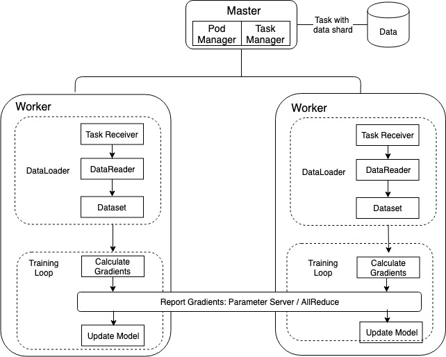

# Support Customizing the Training Loop Using AllReduce

This document describes the design for supporting customizing
the training loop when users use the AllReduce distribution strategy.

## Motivation

Users need to define a forward computation, a loss function, an optimizer,
and a dataset function in ElasticDL. ElasticDL provides
the training loop with those definitions. ElasticDL only supports
Keras API to define the forward computation. This is not very flexible for
users to define some complex models in CV or NLP. Also, users may wan to
customize the training loop to control the model iteration.
For example, given a pre-trained network, users might only want to
optimize a new set of output weights.

If ElasticDL supports customizing the training loop, users can use different
deep-learning libraries (e.g., TensorFlow, Pytorch) to define their training
loop. ElasticDL only needs to provide dynamic data partitioning for
dataset and elastic AllReduce to merge gradients across workers.

## The Training Loop of ElasticDL

The training loop of ElasticDL on the worker contains two steps:

- Get tasks from the master to create dataset with data shards in tasks.
- Execute training loop to calculate gradients and update the model
using the gradients.



In order to support customized training loop with ElasticDL AllReduce,
ElasticDL provides users with a dataset with dynamic partition support,
and an API `elastic_run` for elastic training. Users need to implement
their own training logic for a training data batch in a function
`train_one_batch`.

```Python
def train_one_batch(batch_data):
    loss = forward(batch_data)
    gradients = backward(loss)
    gradients = allreduce(gradients)
    upate_model(gradients)
```

Then users can write the training loop using `train_one_batch`,
the dataset and `elastic_run` API provided by ElasticDL.

```python
def train(dataset, elastic_manager):
    """
    Arguments:
        dataset: tf.data.Dataset. ElasticDL creates a dataset according to
            tasks from the master
        elastic_manager: A manager to execute elastic training.
    """
    for batch_data in dataset:
        elastic_train = elastic_manager.elastic_run(train_one_batch)
        elastic_train(batch_data)
```

## Elastic AllReduce Wrapper for Customized Training Loop

ElasticDL AllReduce is based on Horovod. Using Horovod, users only need to
use Horovod APIs to wrap optimizer or tape to execute AllReduce in their
training loop.

```python
tape = hvd.DistributedGradientTape(tape)
grads = tape.gradient(loss, model.trainable_variables)
optimizer.apply_gradients(
    zip(grads, model.trainable_variables)
)
```

We can develop a decorator to wrap the gradient combination process
using AllReduce. The decorator should support fault-tolerance and
elastic training. If AllReduce fails, the decorator will query the
master for a new AllReduce ring and retry to combine gradients
across alive workers. And the decorator also queries the master
for a new ring periodically if the master adds new workers.

```python
class ElasticAllReduceManager(object):
    def elastic_run(self, func):
        def wrapper(*args, **kwargs):
            # In case where the master add new workers
            if ITER_STEP % STEPS_TO_CHECK_RING == 0:
                init_horovod_if_needed()

            for i in range(MAX_ALLREDUCE_RETRY_COUNT):
                # Retry to allreduce if failed.
                try:
                    func(*args, **kwargs)
                    report_batch_finished()
                except HorovodInternalError:
                    init_horovod_if_needed()

                ITER_STEP += 1
        return wrapper

    def broadcast(self):
        broadcast_model()
        broadcast_optimizer()

    def set_broadcast_object(self, broadcast_obj):
        ...
```

## Examples of Different Libraries Using ElasticDL AllReduce

Users only need to make the following changes to their training loop:

- Use the decorator of elastic training to wrap the code of gradient
combination using Horovod.
- Set objects to broadcast like the model and optimizer. Because an alive
worker should broadcast its model and optimizer to other workers if
AllReduce fails.

### TensorFlow 1.x

Using Tensorflow 1.x, we use `tf.Session` to execute the forward and backward
computation. The training function definition likes the following
code snippets.

<table>
<tr valign="top"><td>ElasticDL</td><td>Horovod</td></tr>

<tr valign="bottom"><td>

```python
def train(dataset, elastic_manager):
    dataset_iter = dataset.make_one_shot_iterator()
    features, labels = dataset_iter.get_next()

    predict, loss = forward(features, labels)

    base_lr = 0.001
    lr = tf.Variable(base_lr)
    opt = tf.train.GradientDescentOptimizer(lr)
    opt = hvd.DistributedOptimizer(opt)
    global_step = tf.train.get_or_create_global_step()
    train_op = opt.minimize(loss, global_step=global_step)

    hooks = [
        tf.train.LoggingTensorHook(
            tensors={'step': global_step, 'loss': loss},
            every_n_iter=10
        ),
    ]

    with tf.train.MonitoredTrainingSession(hooks=hooks) as mon_sess
        # ElasticDL provides ElasticBroadcastObject to
        # set broadcast objects
        elastic_manager.set_session(mon_sess)

        while not mon_sess.should_stop():
            # Users should wrap their forward and backward computation
            # using ElasticDL decorator
            elastic_train = elastic_manager.elastic_run(train_one_batch)
            lr.load(base_lr * hvd.size(), session)
            elastic_train(mon_sess, train_op)


def train_one_batch(session, train_op):
    """Users should wrap the backward computation using ElasticDL
    """
    session.run(train_op)
```

</td><td>

```python
def main(_):
    hvd.init()

    dataset = ...
    images, labels = dataset_iter.get_next()
    predict, loss = forward(features, labels)

    base_lr = 0.001
    lr = tf.Variable(base_lr * hvd.size())
    opt = tf.train.GradientDescentOptimizer(lr)
    opt = hvd.DistributedOptimizer(opt)
    global_step = tf.train.get_or_create_global_step()
    train_op = opt.minimize(loss, global_step=global_step)

    hooks = [
        hvd.BroadcastGlobalVariablesHook(0),

        # Horovod: adjust number of steps based on number of GPUs.
        tf.train.StopAtStepHook(last_step=20000 // hvd.size()),

        tf.train.LoggingTensorHook(
            tensors={'step': global_step, 'loss': loss},
            every_n_iter=10
        ),
    ]

    with tf.train.MonitoredTrainingSession(hooks=hooks) as mon_sess:
        while not mon_sess.should_stop():
            mon_sess.run(train_op)
```

</td></tr>
</table>

### TensorFlow 2.x

<table>
<tr valign="top"><td> ElasticDL </td><td> Horovod </td></tr>

<tr valign="bottom"><td>

```python
def train(dataset, elastic_manager):
    """ ElasticDL will call the function to execute the training loop

    Arguments:
        dataset: tf.data.Dataset which initialized by ElasticDL
    """
    mnist_model = tf.keras.Sequential([
        tf.keras.layers.Conv2D(16, [3, 3], activation='relu'),
        tf.keras.layers.Conv2D(16, [3, 3], activation='relu'),
        tf.keras.layers.GlobalAveragePooling2D(),
        tf.keras.layers.Dense(10)
    ])

    opt = tf.train.AdamOptimizer(0.001)

    # Set object to broadcast
    elastic_manager.set_model(mnist_model)
    elastic_manager.set_optimizer(opt)

    for batch, (features, labels) in enumerate(dataset):
        elastic_train = elastic_manager.elastic_run(train_one_batch)
        loss_value = elastic_train(mnist_model, opt, features, labels)

        if step % 10 == 0:
            print('Step #%d\tLoss: %.6f' % (batch, loss_value))


def train_one_batch(model, opt, features, labels):
    with tf.GradientTape() as tape:
        logits = mnist_model(images, training=True)
        loss_value = tf.losses.sparse_softmax_cross_entropy(
            labels, logits
        )

    # Horovod: add Horovod Distributed GradientTape.
    tape = hvd.DistributedGradientTape(tape)

    opt.lr = opt.lr * hvd.size()
    grads = tape.gradient(loss_value, mnist_model.variables)
    opt.apply_gradients(
        zip(grads, mnist_model.variables),
        global_step=tf.train.get_or_create_global_step()
    )
    return loss_value
```

</td><td>

```python
import tensorflow as tf
import horovod.tensorflow as hvd

def main(_):
    # Horovod: initialize Horovod.
    hvd.init()

    datast = ...

    mnist_model = tf.keras.Sequential([
        tf.keras.layers.Conv2D(16, [3, 3], activation='relu'),
        tf.keras.layers.Conv2D(16, [3, 3], activation='relu'),
        tf.keras.layers.GlobalAveragePooling2D(),
        tf.keras.layers.Dense(10)
    ])

    # Horovod: adjust learning rate based on number of GPUs.
    opt = tf.train.AdamOptimizer(0.001 * hvd.size())

    # Horovod: adjust number of steps based on number of GPUs.
    for (batch, (images, labels)) in enumerate(
            dataset.take(20000 // hvd.size())):
        loss_value = train_one_batch(mnist_model, opt, images, labels)
        if batch == 0:
            hvd.broadcast_variables(mnist_model.variables, root_rank=0)
            hvd.broadcast_variables(opt.variables(), root_rank=0)

        if batch % 10 == 0 and hvd.local_rank() == 0:
            print('Step #%d\tLoss: %.6f' % (batch, loss_value))


def train_one_batch(mnist_model, opt, images, labels):
    with tf.GradientTape() as tape:
        logits = mnist_model(images, training=True)
        loss_value = tf.losses.sparse_softmax_cross_entropy(
            labels, logits
        )

    # Horovod: add Horovod Distributed GradientTape.
    tape = hvd.DistributedGradientTape(tape)

    grads = tape.gradient(loss_value, mnist_model.variables)
    opt.apply_gradients(
        zip(grads, mnist_model.variables),
        global_step=tf.train.get_or_create_global_step()
    )
    return loss_value
```

</td></tr>
</table>

### PyTorch

<table>
<tr valign="top"><td>ElasticDL</td><td>Horovod</td></tr>

<tr valign="bottom"><td>

```python
import torch
import horovod.torch as hvd

def train(dataset, elastic_manager):
    """ ElasticDL will call the function to execute the
    training loop.

    Arguments:
        dataset: tf.data.Dataset which initialized by ElasticDL.
        We can use eager execution to fetch batch data from
        the dataset for PyTorch.
    """
    model = Net()

    base_lr = 0.001
    optimizer = optim.SGD(model.parameters(), base_lr)
    optimizer = hvd.DistributedOptimizer(optimizer)

    # Set object to broadcast
    elastic_manager.set_model(model)
    elastic_manager.set_optimizer(optimizer)

    for images, labels in dataset:
        # Now, the dataset if tf.data.Dataset,
        # so we should convert the outputs
        # to numpy array for Pytorch.
        images = images.numpy()
        labels = labels.numpy()

        for param_group in optimizer.param_groups:
            param_group['lr'] = base_lr * hvd.size()

        elastic_train = elastic_manager.elastic_run(train_one_batch)
        loss = elastic_train(model, optimizer, images, labels)

def train_one_batch(model, optimizer, images, labels):
    optimizer.zero_grad()
    output = model(images)
    loss = F.nll_loss(output, labels)
    loss.backward()
    optimizer.step()
    return loss
```

</td><td>

```python
def main()
    dataloader = ...

    model = Net()

    base_lr = 0.001
    lr_scaler = hvd.size()
    optimizer = optim.SGD(model.parameters(), base_lr * lr_scaler)

    # Horovod: broadcast parameters & optimizer state.
    hvd.broadcast_parameters(model.state_dict(), root_rank=0)
    hvd.broadcast_optimizer_state(optimizer, root_rank=0)

    # Horovod: wrap optimizer with DistributedOptimizer.
    optimizer = hvd.DistributedOptimizer(optimizer)

    for images, labels in enumerate(train_loader):
        loss = train_one_batch(model, optimizer, images, labels)

def train_one_batch(model, optimizer, imagesl, labels)
    optimizer.zero_grad()
    output = model(images)
    loss = F.nll_loss(output, labels)
    loss.backward()
    optimizer.step()
    return loss

```

</td></tr>
</table>
