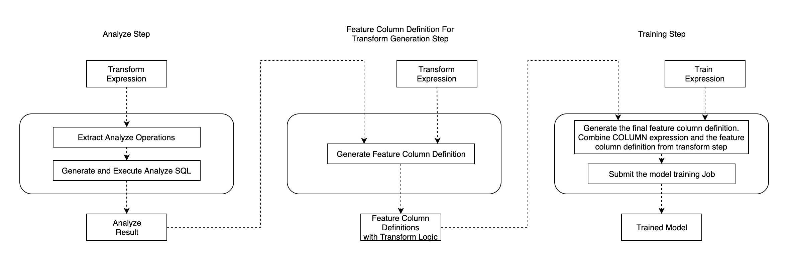
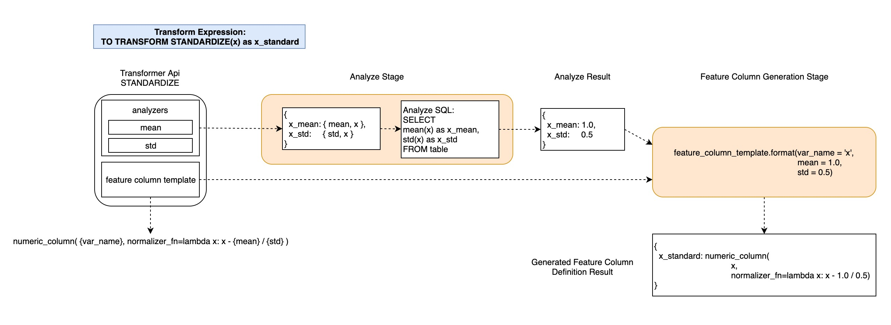
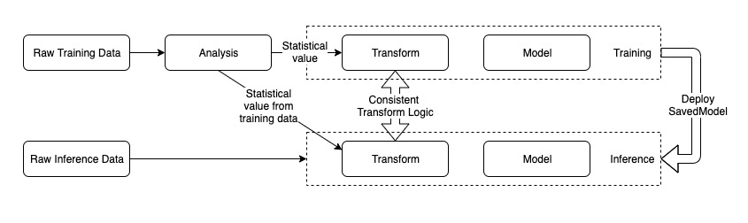

# Data Analysis and Tranformation

## The Problem

We want to add data analysis, in addition to data transformation, into the end-to-end machine learning pipeline generated by SQLFlow.

End-to-end machine learning means a pipeline from raw data to model training and applications. With SQLFlow, we propose to describe complex pipelines with SQL in concisely.  An essential part of the solution is to describe the processing of raw data into model inputs. SQLFlow provides a COLUMN clause for this purpose.

Currently, SQLFlow converts content in the COLUMN clause into the Python source code of data transformation.  The following example would call the Feature Column API [`tf/feature_column/categorical_column_with_hash_bucket`](https://www.tensorflow.org/api_docs/python/tf/feature_column/categorical_column_with_hash_bucket) from TensorFlow to convert a string `address` from the database into a single-element tensor of an integer ID.

```sql
SELECT * FROM welfare TO TRAIN DNNRegressor COLUMN hash_bucket(address, 1000) LABEL income;
```

However, data transform often requires parameters. The above example requires the bucket size, 1000. Other examples include

```SQL
standardize(age, mean, stdev)
normalize(size, min, max)
categorize(city, city_name_list)
```

The challenge is -- users don't want to specify these parameters; instead, they want SQLFlow to do the data statistics and derives these parameters from data automatically. So, the above examples become

```SQL
standardize(age)
normalize(size)
categorize(city)
```

In the terminology of TFX Transform, the word *analysis* refers to data statistics that derives the above parameters, given which, the *transforming* refers to the conversion of raw data into model inputs.  This design document is about making SQLFlow support data analysis, in addition to transformation.

## The Syntax Extension

Without any syntax extension, users can write SQL statements for data analysis.  For example, the following SQL statement works with MySQL and can normalize the field `size` of table `plates`.

```sql
SELECT 1.00 * (t1.size - t2.size_min) / t2.size_range
FROM plates t1
JOIN
(
    SELECT
        MIN(size) AS size_min,
        MAX(size) - MIN(size) AS size_range
    FROM plates
) t2
ON 1 = 1
```

Unfortunately, the above code is tricky and hard to read.  And users might have to write it multiples time -- one before training and one before the prediction -- thus doubles the source code complexity.

For the goal of making deep learning more straightforward, we hope our users can write the following statement.

```sql
SELECT * FROM plates TO TRAIN DNNRegressor COLUMN normalize(size) LABEL price INTO a_model;
```

This syntax implies that SQLFlow can convert the above statement into a Python program that does data analysis and data transformation.

To use the trained model to make predictions, we hope the users don't have to rewrite the COLUMN clause.   For example, the following statement assumes that the table `new_plates` has a field `size`. The converted Python code should normalize `size` before sending it to the input of `a_mode`.

```sql
SELECT * FROM new_plates TO PREDICT price USING a_model;
```

If the user doesn't want normalization, but the raw value, as the input, she could write the following.

```sql
SELECT * FROM new_plate TO PREDICT price USING a_model COLUMN size
```

Or, if she wants standardization instead of normalization, she could write the following.

```sql
SELECT * FROM new_plate TO PREDICT price USING a_model COLUMN standardize(size)
```

How if the table new_plate doesn't have the field used to train the model? How if there is no field named `size`, but a field `diameter`. We should allow users to use the latter as well.

```sql
SELECT * FROM new_plates TO PREDICT price USING a_model COLUM normalize(diameter)
```

Please be aware that if the user wants normalization, she must write `normalize(diameter)` instead of `diameter`.  The following example uses the raw value of `diameter` without normalization.

```sql
SELECT * FROM new_plates TO PREDICT price USING a_model COLUMN diameter
```

## The Challenge

From the above examples, we see that a challenge is that the `TO TRAIN` clause must be able to save the input field names and the data analysis results and transformation steps together with the model, so to make sure that the predictions using the same data transformation as the training.

## Related Work

### TensorFlow Transform

[TensorFlow Transform](https://www.tensorflow.org/tfx/transform/get_started) is the open source solution for data transform in [TensorFlow Extended](https://www.tensorflow.org/tfx/guide). Users need write a Python function `preprocess_fn` to define the preprocess logic. The preprocessing function contains two group of API calls: TensorFlow Transform Analyzers and TensorFlow Ops. Analyzer will do the statistical work on the training dataset once and convert to constant tensors. And then the statistical value and TensorFlow Ops will make the concrete transform logic as a TensorFlow graph to convert the record one by one. The graph will be used for both training and serving.  
Let's take [normalizing (min-max normalization)](https://en.wikipedia.org/wiki/Feature_scaling) the column value `capital_gain` in [census income dataset](https://archive.ics.uci.edu/ml/datasets/Census+Income) for example. The following is the `preprocess_fn` definition with TensorFlow Transform:

```python
import tensorflow_transform as tft

def preprocess_fn(inputs):
    outputs = inputs.copy()
    outputs["capital_gain"] = tft.scale_to_0_1(inputs["capital_gain"])
    return outputs
```

From users' perspective, SQLFlow users prefer to write SQL instead of python. It's not user-friendly if we integrate TF Transform with SQLFlow directly.  

### Internal System

The feature engineering library in the internal system is configuration driven. It contains some primitive transform ops and users compose the transform logic with configuration file. A part of the parameters in the configuration is the statistical value. Users need to do analysis work on the dataset at first and then complete the configuration. What's more, the development work of auto analysis is also on-going.  

## Our Approach

From the perspective of SQLFLow, SQL can naturally support statistical work just like the analyzer. [Feature column API](https://tensorflow.google.cn/api_docs/python/tf/feature_column) and [keras preprocessing layer](https://github.com/tensorflow/community/pull/188) can take charge of the transform work as transformer. We plan to use SQL and feature column/keras preprocessing layer together to do the data transform and analysis work.  

Since we use SQL to do the analysis work, SQL requires the table schema to be wide - one column one feature.  

### Normalize Table Schema to Be Wide

Wide table means that it only store one feature or label in one column. It's friendly to SQL for data analysis.  

#### Why

Let's take this analysis work for example: calculate the max of `age` and mean of `education_num`.  
If it's a wide table as follows:  

|  age | education_num |  income_category  |
|:----:|:-------------:|:-----------------:|
|  39  |      10       |         0         |
|  52  |      9        |         1         |
|  28  |      13       |         0         |

The SQL statement for analysis is straightforward:

```SQL
SELECT
    MAX(age) AS age_max,
    AVG(education_num) AS education_num_mean
FROM census_income
```

Sometimes users may encode multiple feature values as a key-value string and store it in one column of the table, just like the following table:  

|            features       |  income_category  |
|:-------------------------:|:-----------------:|
|  age:39;education_num:10  |        0          |
|  age:52;education_num:9   |        1          |
|  age:28;education_num:13  |        0          |

We can't use SQL directly to do the same analysis work as above.

#### Solution

We can provide common tools to normalize the table schema. If the data is stored in Odps table, we can use [PyOdps](https://pyodps.readthedocs.io/en/latest/) + [UDF](https://www.alibabacloud.com/help/doc-detail/73359.htm) to complete the task.

As the data source is ready, we can

### SQLFlow Syntax Extension

### Generate Analysis SQL from SQLFlow Statement

### Generate Transform Code From SQLFlow Statement

Both feature column and keras preprocessing layer can guarantee the consistency between training and serving. The data transform logic in the training stage is built into the inference graph using the SavedModel format.  

### Transform Expression in SQLFlow

We can extend the SQLFlow syntax and enrich the COLUMN expression. We can add the built-in transform API call in it to describe the transform process. Let's take the following SQL expression for example. It trains a model to classify someone's income level using the [census income dataset](https://archive.ics.uci.edu/ml/datasets/Census+Income). The transform expression is **COLUMNS NUMERIC(NORMALIZE(capital_gain)), NUMERIC(STANDARDIZE(age)), EMBEDDING(BUCKETIZED(hours_per_week, bucket_num=10), dim=128)**. It will normalize the column *capital_gain*, standardize the column *age*, bucketize the column *hours_per_week* to 10 buckets and then map it to an embedding value.  
We will implement some built-in transform API. The API set contains NORMALIZE, STANDARDIZE, BUCKETIZED, LOG and more to be added in the future.  

```SQL
SELECT *
FROM census_income
TO TRAIN DNNClassifier
WITH model.hidden_units = [10, 20]
COLUMNS NUMERIC(NORMALIZE(capital_gain)), NUMERIC(STANDARDIZE(age)), EMBEDDING(BUCKETIZED(hours_per_week, bucket_num=10), dim=128)
LABEL label
```

### Implementation

Data transform contains two stages: analyze and transform. In our design, we will do the analysis using SQL as the first step, and generate the feature column definition as the second step. The feature column contains the transform logic and executes along with the model training process.  
We choose to convert the transform expression into two steps of the work flow described by [Couler](https://github.com/sql-machine-learning/sqlflow/blob/develop/python/couler/README.md): analyze and feature column generation. Couler is a programming language for describing workflows. Its compiler translates a workflow represented by a Python program into an [Argo](https://argoproj.github.io/) YAML file. The output of feature column generation will be passed to the next model training step.  


Let's take STANDARDIZE(age) for example, the following figure describes how the data transform pipeline works in detail.  



A transform API contains two members: analyzers and feature column template. Analyzer is the statistical operation which needs run at first to complement the whole transform logic. Feature column template is used to build the concrete feature column definition.  

The **Analyze Step** and **Feature Column Generation Step** are two couler steps. Analyze Result and Generated Feature Column Definition Result are the output of these two couler steps.  
In the Analyze step, we will parse the TRANSFORM expression and collect the statistics requirements. It's a dictionary of {statistic_variable_name} -> tuple({analyze_operation_name}, {column_name_in_source_table}). The SQL generator will generate the analyze SQL expression containing built-in aggregate functions from this dictionary for different data sources such as [Hive](https://cwiki.apache.org/confluence/display/Hive/LanguageManual+UDF), [MaxCompute](https://help.aliyun.com/document_detail/48975.html) and so on. After executing the SQL, the statistical result will be writen to the standard output of the container.  
In the feature column generation step, we will format the feature column template with the variable name and the statistical values to get the integral feature column definition for the transform logic.  
The generated feature column definitions will be passed to the next couler step: model training. We combine them with the COLUMN expression to generated the final feature column definitions and then pass to the model. Let's take **NUMERIC(STANDARDIZE(age))** for example, the final definition will be **numeric_column('age', normalizer_fn=lambda x: x - 18.0 / 6.0)**  

We plan to implement the following common used transform APIs at the first step. And we will add more according to further requirements.

|            Name             |                      Feature Column Template                                   |      Analyzer      |
|:---------------------------:|:------------------------------------------------------------------------------:|:------------------:|
|       STANDARDIZE(x)        | numeric_column({var_name}, normalizer_fn=lambda x : x - {mean} / {std})        |    MEAN, STDDEV    |
|        NORMALIZE(x)         | numeric_column({var_name}, normalizer_fn=lambda x : x - {min} / {max} - {min}) |      MAX, MIN      |
|           LOG(x)            | numeric_column({var_name}, normalizer_fn=lambda x : tf.math.log(x))            |         N/A        |
| BUCKETIZED(x, bucket_num=y) | bucketized_column({var_name}, boundaries={percentiles})                        |     PERCENTILE     |

## Further Consideration

In the design above, we generated the concrete feature column definition for data transformation in the Transform stage. The actual transform logic on the raw data executes along with the model training process. Based on this design, we can further consider transforming the raw data and writing the transformed result into a new table in the stage.  
After analyzing the data, we construct the TF graph for transform instead of feature column definition and export it to SavedModel. And then we submit a data processing job to transform the raw data by executing UDF with the SavedModel. The whole process is also matched with the TFX pipeline.  
This solution can bring the following benifits:

1. We can reuse the transformed data in the temporary table to execute multipe model training run for different hyperparameter combinations and all the epochs. Data transformation is only executed once.
2. We can support more flexible transform logic such as inter column calculation. Feature column has some limit on the inter column calculation. Please check the [Wiki](https://github.com/sql-machine-learning/elasticdl/wiki/ElasticDL-TF-Transform-Explore#inter-columns-calculation) for more details.

We need figure out the following points for this further solution:

1. Model Export: Upgrade keras API to support exporting the transform logic and the model definition together to SavedModel for inference. [Issue](https://github.com/tensorflow/tensorflow/issues/34618)
2. Transform Execution: We will transform the data records one by one using the transform logic in the SavedModel format and then write to a new table. We also need write a Jar, it packages the TensorFlow library, loads the SavedModel into memory and processes the input data. And then we register it as UDF in Hive or MaxCompute and use it to transform the data.  

## Background

Data transform is an important part in an end-to-end machine learning pipeline. It processes the raw data using operations such as [standardization, normalization](https://en.wikipedia.org/wiki/Feature_scaling), [bucketization](https://en.wikipedia.org/wiki/Data_binning), etc. After transformation, the data is in the right format and ready for both model training and inference. Data transform contains two key parts: analyzer and transformer. Analyzer scans the entire data set and calculates the statistical values such as mean, min, variance, etc. Transformer combines the statistical values if any and the transform function to construct the concrete transform logic. And then it transforms the data records one by one. The transform logic should be consistent between training and inference.  


[SQLFlow](https://github.com/sql-machine-learning/sqlflow) is a bridge that connects a SQL engine and machine learning toolkits. It extends the SQL syntax to define a machine learning pipeline. Naturally SQLFlow should be able to describe the data transform process. In this doc, we are focusing on how to do data transform using SQLFlow.  

## Challenge

* In some ML systems, users use different transform code for training and serving. It may cause inconsistency between these two stages. Consistency between training and serving is the key point of data transform. Users write the transform code only once. And then the same logic can run in batch mode for training and in real time mode for serving.  
* We can not execute the transform code directly to transform the data records. The statistical values are required for some transform functions such as mean and variance for standardization. They need be analyzed from the entire dataset at runtime to make the transform logic concrete.  
* The transform logic is very flexible. How do we design a SQL extended syntax to fully express the logic elegantly?  