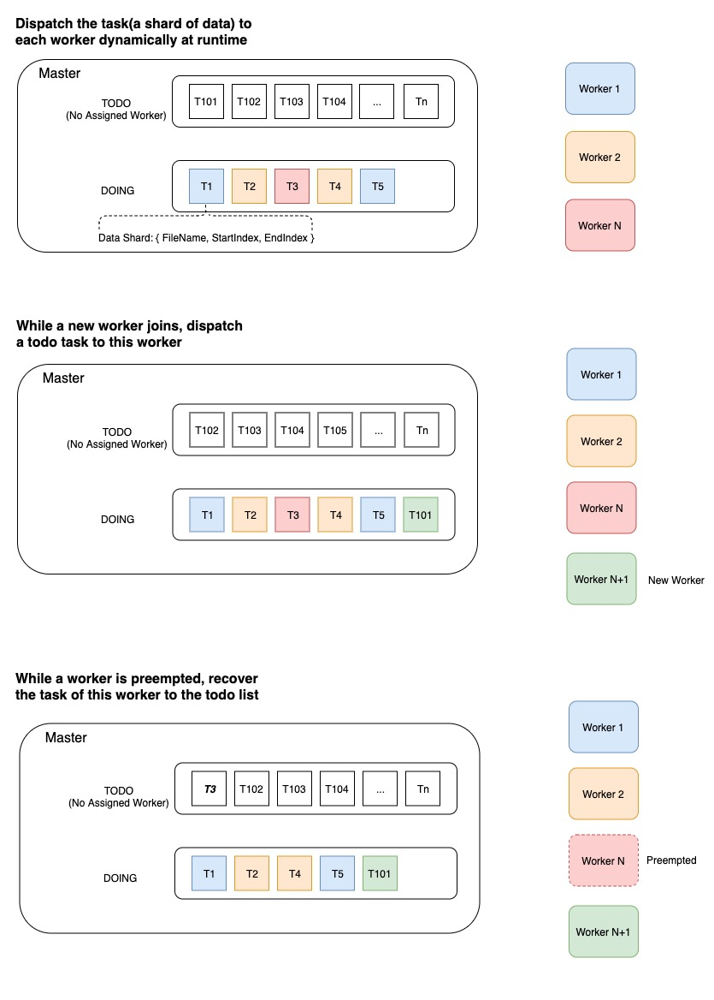

# Dynamic Data Sharding Design

**Elastic** is the key feature of ElasticDL. A worker can join and left at any time and the entire job still keeps running.

The distributed execution of ElasticDL is data parallelism, not model parallelism. Each worker holds the whole model definition. The master dispatches different shards of data  to different workers. The master doesn't care which worker reports the gradients, it just cares how many gradients are reported for the model version. In this way, adding or removing a worker won't interrupt the training process.

At the start of an epoch, the master node partitions the entire dataset into multiple shards which contain many records and then generates a todo list of tasks. Each task corresponds to a shard of data.\
At the start point, each task is not assigned to any worker. The worker pulls a task (aka. a shard of data) at runtime and the master assigns the task to this worker. And then the master moves this task to the doing list.\
After processing this task and reporting the result, the worker will pull the next task and continue processing it.

* If the task result is success, the master removes the task from the *doing* list and mark it done.
* If the task result is fail, the master removes the task from doing list and then inserts it back into the *todo* list for recovery. Several issues can cause the task failure, such as the worker is preempted by a job of higher priority, the network connection is timeout and so on.

The worker gets the task containing the data shard index (filename, startIndex, endIndex). It would be important to read the records of this shard efficiently from the data storage. In order to reach the IO efficiency, we choose data that supports AbstractDataReader, such as [RecordIO](https://github.com/elasticdl/recordio) and ODPS table.
