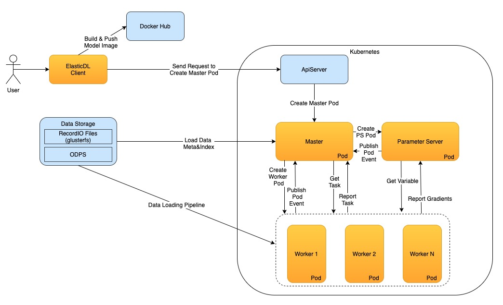

# ElasticDL Overall Design

## Architecture

ElasticDL uses the master-worker architecture. The master node plays the master
role in two aspects.

1. It's the master of the cluster. It manages the lifecycle of all the worker
pods, starts the worker pod, listens to the pod event and relaunches the
terminated worker pod if necessary.
1. It's the master of the model training/evaluation/prediction process. It
partitions data into shards, generates and dispatches tasks to workers,
coordinates all the nodes to complete the training/evaluation/prediction job.
(see more details in [distributed training](#Distributed-Training) section)

ElasticDL client is simple, just like a CLI command. User inputs ElasticDL
command in the terminal to start the training/evaluation/prediction job. The
client parses the parameters, builds the docker image which packages the
ElasticDL framework and the model code, pushes the image into the hub, and then
sends request to the kubernetes ApiServer to create the master pod. After the
master pod is created and started, it will then create other components and
drive the process of the entire job.

## Distributed Training

Master

- Partition the training/evaluation data into mutiple shards. (see
[dynamic_data_sharding_design](dynamic_data_sharding.md))
- Generate the training/evaluation tasks from the data shards.
- Dispatch these tasks to different workers.
- Aggregate the gradients reported from the workers.
- Update the model variables and save the checkpoint if necessary.

Worker

- Pull the task from the master. The task contains the index of this data
shard.
- Read the data according to the data index message. (see
[data_io_pipeline_design](data_io_pipeline.md))
- Run the training process using this data shard.
- Report the calculated gradients and task result to the master.
