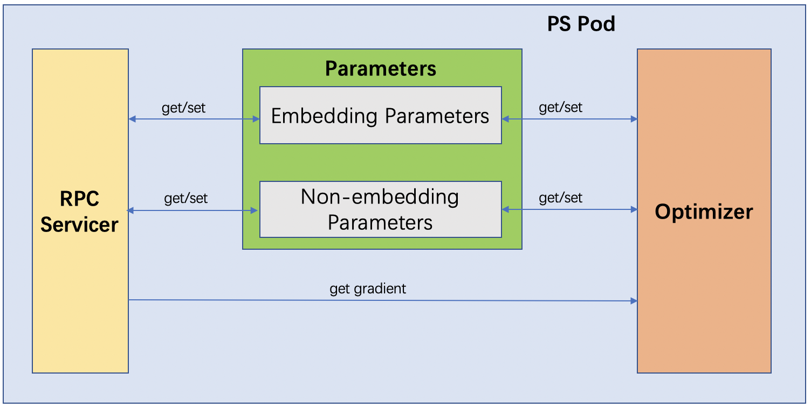
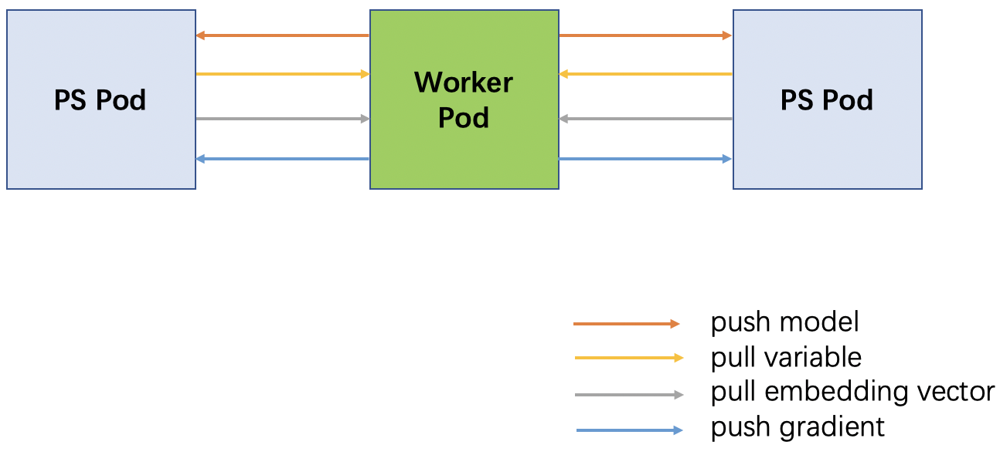

# ElasticDL Parameter Server Design
This document describes the design of a distributed parameter server for ElasticDL.

## Motivation
Parameter server (PS) stores model parameters which are used by workers. Workers get model parameters from PS, compute gradients using different training data and send computed gradients to PS. PS iteratively updates these model parameters using gradients sent by workers. A PS based distributed training system can use an arbitrary number of workers to support the scalability of training data size.

We want to have one or more PS instances in each ElasticDL job. One reason is that models could be large and overrun the memory space of a single PS instance. In such case, we need to partition the model and store different partitions in different PS instances. Even if the model is not too big and fits in the memory of a single PS instance, we might still want to partition the model, as this distributes the model parameter communication from workers among PS instances. This also distributes the computation on PS such as parameter optimization. 

ElasticDL is a Kubernetes-native fault-tolerable deep learning system. An ElasticDL distributed PS consists of multiple PS pods, with each PS pod as a PS instance. A failed PS pod will interrupt the training. We can relaunch any failed PS pod and recover the corresponding model parameter partition to support PS fault tolerance.

In the following sections, we will explain the design of the ElasticDL distributed PS with fault-tolerance in detail, including how to [partition the model](#model-parameter-partition), [store model parameters](#model-parameter-storage), [access parameters from workers](#model-parameter-access-from-worker), [initialize parameters](#model-parameter-initialization), [update parameters from gradients](#model-parameter-update) and support [PS fault-tolerance](#ps-fault-tolerance).

## Model Parameter Partition
For a distributed PS with *N* PS pods, each PS pod stores a model parameter partition. It is noticeable that Kubernetes may preempt some PS pods. In such a case, *N* might not be a constant. However, we can overcome this case by setting PS pods having higher priority than worker pods in a job. In case a PS pod is preempted, the master will relaunch it using Kubernetes APIs. Since PS pods have a higher priority than worker pods, if there are still some worker pods running, the relaunch will succeed by using either idle or preempted Kubernetes resources. If no worker pods left, ElasticDL has to wait for Kubernetes resources to continue the training. Thus, we can assume that *N* is a constant number in ElasticDL.

We consider two kinds of model parameters:

1. non-embedding parameters, and
1. embedding tables

Theoretically, non-embedding parameters might have tremendous size and require partitioning. However, in practices, limited by the amount of GPU memory, researchers don't often define models depending on huge dense tensor parameters. Hence in this design, we don't partition non-embedding parameters; instead, we place each of them on a PS pod.

For a non-embedding parameter, we select its PS pod *PSᵢ* using a hashing function *hash* and the parameter name *p_name*:

```
i = hash(p_name) % N
```

Each embedding layer has an embedding table which maps a discrete ID *i* to an embedding vector *vᵢ*. Embedding tables could be huge, especially in some recommending and ranking models. Thus, we partition each embedding table and store every partition in an unique PS pod. For an embedding vector *vᵢ*, we select *PS<sub>i % N</sub>* to store it.

## Model Parameter Storage
Each PS node has a dictionary-based data structure to store its partition of model parameters.

We choose to store each non-embedding parameter using the parameter name as its key, and a [`tf.Variable`](https://www.tensorflow.org/api_docs/python/tf/Variable) instance as its value. This is because that we want to update non-embedding parameters directly by [TensorFlow optimizers](https://www.tensorflow.org/api_docs/python/tf/optimizers).

If a model has one or more embedding layers, a minibatch of training data contains a set of discrete IDs. These discrete IDs correspond to a set of embedding vectors. The worker needs to pull these embedding vectors from their corresponding PS pods using the embedding layer name and the discrete IDs. To store an embedding vector, We use its corresponding embedding layer name and discrete ID as the key, and a 1-D numpy.ndarry as the value.

## Model Parameter Access from Worker
Each PS pod has a RPC servicer to provide RPC services. Workers use RPC services to pull model parameters. `pull_variable` service is to pull all non-embedding parameters. `pull_embedding_vector` service is to pull embedding vectors specified by an embedding layer name and a list of discrete IDs.

```proto
service PServer{
    rpc pull_variable(PullModelRequest) returns (PullModelResponse);
    rpc pull_embedding_vector(PullEmbeddingVectorRequest) returns (Tensor);
}
```

## Model Parameter Initialization
We use lazy initialization for model parameters in PS. PS does have the model definition. Even if PS has the model definition, it cannot initialize Keras subclass model parameters, as only a forward-pass with a minibatch of data can initialize the parameters. Thus workers are responsible for initializing parameters and push the initialized parameters to corresponding PS pods.

Each PS pod has a parameter initialization status, which is `False` after the PS pod launch. When a worker tries to get non-embedding parameters from the PS pod through a RPC call `pull_variable`, the PS pod tells the worker that the parameter initialization status is `False` in response. If the worker has already initialized non-embedding parameters, it sends non-embedding parameter values to the PS pod by a GRPC call `push_model`. `push_model` is a RPC service in the PS pod.

```proto
service PServer{
    rpc push_model(Model) returns (google.protobuf.Empty);
}
```

If worker has not initialized non-embedding parameters, since the worker has the model definition and some training data, it can run a forward-pass to initialize them first before `push_model`.

When the PS pod receives non-embedding parameters in its first RPC service for `push_model`, it initializes non-embedding parameters and sets the parameter initialization status as `True`.

For an embedding vector, the corresponding PS pod will initialize it in the first `pull_embedding_vector` service that contains this embedding vector. The PS pod needs the embedding vector size and the initialization method for the initialization. The embedding vector size and the initialization method are in the model definition and workers can send them in `push_model` to PS pods together with non-embedding parameter values.

Thus, we introduce two data structures: `Parameters` and `EmbeddingTable`. `Parameters` stores both embedding parameters and non-embedding parameters. `EmbeddingTable` stores embedding vectors, which is a subset of an embedding table.

```python
class Parameters(object):
    def __init__(self):
        # Parameter initialization status
        self.parameter_init_status = False
        # Non-embedding parameter dict, maps parameter name to tf.Variable instance
        self.non_embedding_params = {}
        # Embedding table dict, maps embedding layer name to `EmbeddingTable` instance
        self.embedding_params = {}

class EmbeddingTable(object):
    def __init__(self, dim, initializer):
        # Embedding vector dict, maps ID to 1-D numpy.ndarray
        self._embedding_vectors = {}
        # the dimension of embedding vectors
        self._dim = dim
        # the initializer name for initializing embedding vectors
        self._initializer = initializer
```

## Model Parameter Update
A worker computes gradients in each training iteration, which contain gradients for non-embedding parameters and some embedding vectors if applicable. The worker partitions these gradients using their corresponding parameter names or discrete IDs for embedding vectors. Then the worker sends gradient partitions to their corresponding PS pods by RPC calls `push_gradient`.

```proto
service PServer{
    rpc push_gradient(PushGradientRequest) returns (PushGradientResponse);
}
```

When a PS pod receives gradients in `push_gradient`, it uses a TensorFlow optimizer to apply gradients to non-embedding parameters. 

We have already implemented an [`OptimizeWrapper`](https://github.com/sql-machine-learning/elasticdl/blob/develop/elasticdl/python/master/optimizer_wrapper.py) to sparsely update embedding vectors. `OptimizeWrapper` uses corresponding embedding vectors to form a temporary variable, applies gradients to this temporary variable, and writes results back to these embedding vectors. The PS pod can use this OptimizeWrapper directly to update embedding vectors.

In asynchronous SGD, the PS pod can apply gradients directly to model parameters once it receives gradients. For synchronous SGD, the PS pod accumulates `grads_to_wait` gradients from workers then updates model parameters with these gradients. `grads_to_wait` is an ElasticDL argument specified by the user.


## PS Fault Tolerance
When the master detects that a PS pod fails, it will relaunch it using Kurbernetes APIs to keep the number of PS pods *N* constant. After the relaunch, the PS pod recovers its partition of model parameters so that ElasticDL can continue the training job. 

### Fixed Domain name for PS Pod
Each PS pod provides RPC services for workers. Workers are using RPC stubs to send RPC service requests to PS pods. RPC stubs require PS pod domains. Because ElasticDL is Kubernetes-native, the master can use Kubernetes services to launch/relaunch PS pods with fixed domain names. The master sends these domain names to workers as arguments when launching worker pods. In such way, workers do not need to re-configure RPC stubs after a PS pod relaunch.

### Model Parameter Recovery
The model may contain one or more embedding layers with embedding tables as their parameters. If so, a minibatch of training data in a worker contains some embedding IDs, which correspond to a subset of embedding tables. The worker pulls all non-embedding parameters and only a subset of embedding tables from PS pods in the training. Thus, the PS pod can recover non-embedding parameters from workers but not embedding tables.

For non-embedding parameters, the PS pod can recover them from workers in the same way as the parameter initialization by setting its parameter initialization status as `False`.

For embedding tables, PS creates replicas to support fault-tolerance. For each PS pod *PSᵢ*, it can store *M* replicas of its embedding table partitions in *M* PS pods from *PS<sub>i+1 % N</sub>* to *PS<sub>i+M % N</sub>*. The relaunched PS pod can recover embedding tables from one of its replicas. 

### Embedding Replica
Assume *Eᵢ* is the embedding table partition in PS pod *PSᵢ*, it has *M* replicas stored in PS pods from *P<sub>(i + 1) % N</sub>* to *P<sub>(i + M) % N</sub>*. Also, *PSᵢ* stores *M* other PS pod replicas *E<sub>(i - M) % N</sub>* to *E<sub>(i - 1) % N</sub>*. 

*PSᵢ* maintains *M* updated embedding vector key sets *UKSᵢ(j) for j ∈ [0， M)*. When *PSᵢ* sparsely updates its embedding table partition *Eᵢ*, it also adds the updated embedding vector keys into these *M* sets. 

*PSᵢ* also periodically synchronize the replicas stored in it from PS pods *PS<sub>(i - M) % N</sub>* to *PS<sub>(i - 1) % N</sub>*. The synchronization frequency can be several seconds.

*PSᵢ* uses *M* RPC calls `SynchronizeEmbedding` the replicas store in it. `replica_index` values in `SynchronizeEmbeddingRequest` are from *(i - M) % N* to *(i - 1) % N*.

When *PSᵢ* needs to recover its embedding vectors after relaunch, it chooses a pod *PSⱼ* from *P<sub>(i + 1) % N</sub>* to *P<sub>(i + M) % N</sub>* which is still alive. *PSᵢ* uses a RPC call `GetReplica` to get its replica from *PSⱼ*.

Following diagram shows the RPC calls among PS pods for PS fault-tolerance:


Here, we set up 5 PS pods, and set embedding replica number *M* to 1. PS pod 2 has an embedding replica `R1` of PS pod 1. It will periodically synchronize the replica from PS pod 1. If PS pod 1 is dead, the master will relaunched it and it needs to get the replica from PS pod 2 after relaunch.

```
message SynchronizeEmbeddingRequest {
    int32 replica_index = 1;
}

message SynchronizeEmbeddingResponse {
    repeated Tensor embedding_vectors = 1;
}

service PServer{
    # RPC service for replica synchronization
    rpc SynchronizeEmbedding(SynchronizeEmbeddingRequest) returns (SynchronizeEmbeddingResponse);

    # RPC service for PS to recover embedding vectors after relaunch
    rpc GetReplica(SynchronizeEmbeddingRequest) returns (SynchronizeEmbeddingResponse);
}
```

Each PS pod has a thread dedicated to the replica synchronization:

```
# T is the number of seconds for synchronization frequency
# Assume current PS is PS(i), self._stub[index] is the stub for PS((i - index) % N)'s GRPC server.
# self.replicas[index] is the replica for PS((i - index) % N).
req = elasticdl_pb2.SynchronizeEmbeddingRequest()
while still training:
    time.sleep(T)
    for index in range(M):
        req.replica_index = index
        updated_vectors = self._stub[replica_index].SynchronizeEmbedding(req)
        update self.replicas[index] from updated_vectors.embedding_vectors
```

## Diagram

Following diagram shows the details inside a PS pod:



Following diagram shows the RPC calls between a worker pod and two PS pods:



Please note that there are many worker pods in an ElasticDL job, and each worker pod will have RPC connections with all the PS pods. Here we only show one worker pod for simplicity.

## Appendix
### Message Definition
```proto
message Tensor {	
    enum DataType {	
        BOOL = 0;	
        INT16 = 1;	
        INT32 = 2;	
        INT64 = 3;	
        FP16 = 4;	
        FP32 = 5;	
        FP64 = 6;	
    }	
    string name = 1;
    DataType data_type = 2;
    repeated int64 dim = 3;
    bytes content = 4;
    repeated int64 indices = 5;
}

message EmbeddingTableInfo{
    string name = 1;
    repeated int64 dim = 2;
    string initializer = 3;
}

message Model {
    int64 version = 1;
    repeated Tensor variables = 2;
    repeated EmbeddingTableInfo embedding_table_info = 3;
}

message PullModelRequest{
    int64 version = 1;
}

message PullModelResponse{
    bool model_init_status = 1;
    Model model = 2;
}

message PushGradientRequest{
    int32 model_version = 1;
    repeated Tensor gradients = 2;
}

message PushGradientResponse{
    bool accepted = 1;
    int32 model_version = 2;
}

message PullEmbeddingVectorRequest{
    string name = 1;
    repeated int64 ids = 2;
}

message SynchronizeEmbeddingRequest {
    int32 replica_index = 1;
}

message SynchronizeEmbeddingResponse {
    repeated Tensor embedding_vectors = 1;
}
```

### RPC Definition
```proto
service PServer{
    # pull trainable tensorflow variables created by Keras layers
    rpc pull_variable(PullModelRequest) returns (PullModelResponse);
    
    # pull embedding vectors in ElasticDL embedding layers
    # Do we need to create a new message `PullEmbeddingVectorRequest` rather than use `Tensor`?
    rpc pull_embedding_vector(PullEmbeddingVectorRequest) returns (Tensor);
    
    # push trainable tensorflow variables and meta info for ElasticDL embedding layers
    rpc push_model(Model) returns (google.protobuf.Empty);
    
    rpc push_gradient(PushGradientRequest) returns (PushGradientResponse);
    
    # PS to recover embedding vectors after relaunch
    rpc get_replica(SynchronizeEmbeddingRequest) returns (SynchronizeEmbeddingResponse);
    
    # PS replica synchronization
    rpc synchronize_embedding(SynchronizeEmbeddingRequest) returns (SynchronizeEmbeddingResponse);
}
```

### Data Structure
```python
class Tensor(object):
    def __init__(self, name=None, value=None, indices=None):
        self.name = name
        self.value = value
        self.indices = indices
        
def serialize_to_pb(tensor, pb):
    pass

def deserialize_from_pb(pb, tensor):
    pass

def convert_to_tf_variable(tensor):
    pass

def convert_to_tf_tensor(tensor):
    pass
```

```python
# In `Parameters`, interfaces `set_*_param` have two arguments, `value` and `name` (or `layer_name`).
# If `value` is a ElasticDL `Tensor` instance, `name` can be None. 
# Otherwise `value` is a numpy ndarray, and `name` must be specified.
class Parameters(object):
    def __init__(self):
        # Parameter initialization status
        self.parameter_init_status = False
        # Non-embedding parameter dict, maps parameter name to tf.Variable instance
        self.non_embedding_params = {}
        # Embedding table dict, maps embedding layer name to `EmbeddingTable` instance
        self.embedding_params = {}

    @property
    def non_embedding_params(self):
        return self._non_embedding_params

    def set_embedding_param(self, value, layer_name=None):
        pass
    
    def get_embedding_param(self, layer_name, ids):
        return self._embedding_params.get(layer_name).get(ids)

    def set_non_embedding_param(self, value, name=None):
        pass
         
    def init_non_embedding_param(self, value, name=None):
        pass
        
    def set_meta_info(self, layer_name, dim, initializer):
        pass

class EmbeddingTable(object):
    def __init__(self, dim, initializer):
        # Embedding vector dict, maps ID to 1-D numpy.ndarray
        self._embedding_vectors = {}
        # the dimension of embedding vectors
        self._dim = dim
        # the initializer name for initializing embedding vectors
        self._initializer = initializer
    
    def get(self, ids):
        values = []
        for id in ids:
            if id not self._embedding_vectors:
                val = initialize_embedding_vector(self._dim, self._initializer)
            else:
                val = self._embedding_vectors.get(id)
            values.append(val)
        return np.concatenate(values).reshape(len(ids), -1)
        
    def set(self, ids, values):
        pass
```

### Some pseudocodes

Here is the pseudocode for a worker to pull variable from the PS. If the non-embedding variables are not initialized, the PS will tell the worker to initialize them and report to the PS.

```python
class PServer(elasticdl_pb2_grpc.PServerServicer):
    ...
    def pull_variable(self, request):
        res = PullModelResponse()
        if self._need_initialize_model:
            res.model_init_status = True
            return res
        res.model_init_status = False
        res.model = self._get_model() # get model in this PS instance
        return res

    def push_model(self, request):
        model = request.model
        ... # initialize model in this PS instance
	
class Worker(object):
    ...
    def pull_variable(self):
        # for-loop should be implemented in multithread
        for ps_index in range(self._ps_node_num):
            req = PullModelRequest() # create request code keeps the same with current code
            res = self._stub[ps_index].pull_variable() # pull variable from PS
            if res.model_init_status:
                // worker initializes its model here if needed
                model = serialize_model_to_pb()
                self._stub[ps_index].push_model(model) # get model in this worker
            req = PullModelRequest() # create request code keeps the same with current code
            res = self._stub[ps_index].pull_variable() # pull variable from PS
            if res.model_init_status:
                raise Error or try a pre-defined constant times 
```


Here is the pseudocode for getting replica from specified PS pod and synching replicas:

```python
# T is the number of seconds for synchronization frequency
# Assume current PS is PS(i), self._stub[index] is the stub for PS((i - index) % N)'s GRPC server.
# self.replicas[index] is the replica for PS((i - index) % N).
req = elasticdl_pb2.SynchronizeEmbeddingRequest()
while still training:
    time.sleep(T)
    for index in range(M):
        req.replica_index = index
        updated_vectors = self._stub[replica_index].SynchronizeEmbedding(req)
        update self.replicas[index] from updated_vectors.embedding_vectors

def SynchronizeEmbedding(self, request, _):
    synch_embeddings = elasticdl_pb2. SynchronizeEmbeddingResponse()
    # self.UKS are the M updated embedding vector key sets in current PS
    # self.embedding_vector are the embedding vectors in current PS
    with self.lock():
        assign synch_embeddings.embedding_vectors from self.embedding_vector
        self.UKS.clear()
    return synch_embeddings
    
def GetReplica(self, request, _):
    replica = elasticdl_pb2. SynchronizeEmbeddingResponse()
    assign replica.embedding_vectors from self.replicas[request.replica_index]
    return replica
```

