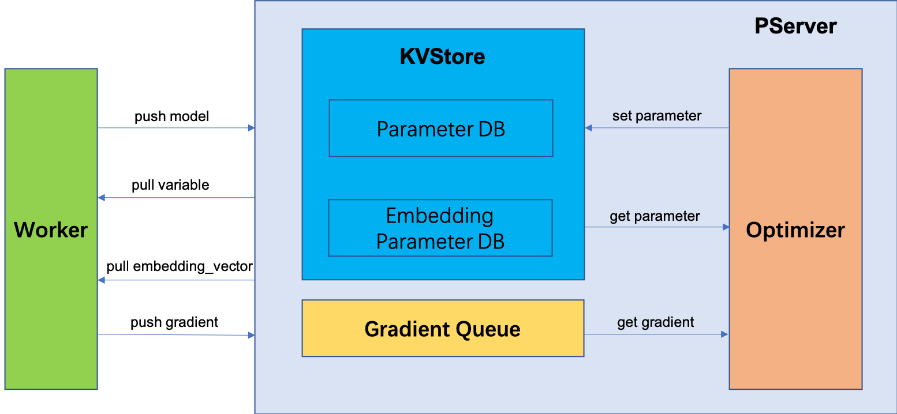

# Parameter Server Design

## Overview

Parameter server design is widely used in distributed
training systems. Both data and workloads
are distributed over workers, while the server
maintains global model.

Many systems use multiple parameter server instances in a job, especially when the model could be large and overruns the memory space of a process. In such cases, we can shard the model and distribute the pieces to multiple parameter server instances. Even if the model is not too big, model sharding prevents the case that a single-node parameter server architecture becomes the bottleneck of communication and computation.

In addition, we want to launch machine learning jobs in a Kubernetes supported cluster. The pods in Kubernetes are scheduled with priority, and could be preempted at any time. At the same time, hardware failure problem is also nonnegligible in a large scale distributed system. Here, we introduce another role called master to watch the status of worker pods and parameter server pods. It calls Kubernetes API to start or relaunch worker pods and optionally parameter server pods, and scheduling tasks to worker pods. For more details on the master role, please refer to the [project background](https://github.com/sql-machine-learning/elasticdl#background).

In conclusion, a high preformance distributed parameter server architecture with scalability and fault-tolerance is needed.

Following is the overview architecture diagram:


We will answer following questions in next sections:

- How to make model sharding in parameter server pods?
- What kind of data structure is used to keep parameters in the memory of parameter server pods?
- How parameters are initialized in parameter server pods?
- How parameters are updated in parameter server pods?
- How to make the parameter server architecture fault-tolerant?

## Model Sharding

We will distribute model parameters into multiple PS pods, which is called model sharding. We can use a hash function p(x) to decide that parameter x will be stored at PS pod p(x).

There are several kinds of parameter to be handled separately:

- Very big embedding table: Embedding table is a collection of <item id, embedding vector> pairs. The embedding table name combining an item id becomes a key of the hash function.
- Dense tensor: The dense tensor parameter name is the key of the hash function.

Assuming that there are N parameter server pods in a training job. We could use a simple round-robin policy at first.

*PS(i) = hash(key) mod N*

Each parameter server pod will store some embedding vectors and dense tensor parameter, it only holds a subset of the whole model.

The number of parameter server pods will keep unchanged during a job. We set the priority of parameter server pods higher than worker pods. Thus, worker pods of a lower priority job will be killed first to satisfy another job. If all worker pods of a job are dead , this job is actually stopped. We will restart the job again when the hardware resources are sufficient.

## Model Data Structure

We use two hashmaps to store embeding table parameters and dense tensor parameters.

Since `tf.keras.optimizer` only accept `tf.Variable` type parameter, to avoid unnecessary memory copy, we save a dense tensor parameter as a `tf.Variable` directly. We use a hashmap to store all the dense tensor parameters, the key is the variable name, the value is the variable itself.

However, an embedding table parameter could not be represented by a standard `tf.Variable`. For example, in an online learning case, new item id may come in sometimes. The shape of the embedding table is not determined. Besides, we have to initialize corresponding embedding vector value on the fly for the new item id in the parameter server pod.

We introduce a customized data structure `EmbeddingTable` to meet such demands. Following is the definition of `EmbeddingTable`:

```python
class EmbeddingTable(object):
    def __init__(self, name, dim, initializer):
        self.name = name
        self.dim = dim
        self.initializer = initializer
        self.embedding_vectors = {}

    def get(self, indices):
        res = []
        for i in indices:
            if i not in self.embedding_vectors:
                value = init_value(self.initializer, self.dim)
            else:
                value = self.embedding_vectors[i]
            res.append(value)
        return res

    def set(self, indices, value):
        pass
```

The name of an embedding table is actually the embedding layer name. The embedding table uses a dictionary `embedding_vectors` to store embedding vectors, the key is the item id, the value is the embedding vector.

Please note that the embedding tables in the parameter server pods which have the same name, form the big embedding table for a certain embedding layer.

Since embedding vectors are lazily initialized in parameter server, `EmbeddingTable` also has `dim` and `initializer` fields. Inside the `get` interface of `EmbeddingTable `, if the id is not in the `vectors` dictionary, the corresponding value will be initialized.

There could be multiple embedding tables from different embedding layers. We will create an `EmbeddingTable` instance for each embedding layer. These instances are stored at another hashmap. The key is embedding layer name, the value is the embedding table itself.


## Model Initialization

There is no model definition file in the parameter server side. Workers will initialize the model when the first mini-batch data comes in. Then workers push the model to the parameter server side.

Following is a RPC service for model initialization.

```proto
service PServer{
    rpc push_model(Model) returns (google.protobuf.Empty);
}
```

Following is the definition of the model proto message:

```proto
message Tensor {	
    enum DataType {	
        BOOL = 0;	
        INT16 = 1;	
        INT32 = 2;	
        INT64 = 3;	
        FP16 = 4;	
        FP32 = 5;	
        FP64 = 6;	
    }	
    string name = 1;	
    DataType data_type = 2;	
    repeated int64 dim = 3;	
    bytes content = 4;	
    repeated int64 indices = 5;	
}

message EmbeddingTableInfo{	
    string name = 1;	
    repeated int64 dim = 2;	
    string initializer = 3;	
}

message Model {	
    int64 version = 1;	
    repeated Tensor variables = 2;
    repeated EmbeddingTableInfo embedding_table_info = 3;
}
```

Since an embedding table parameter is initialized lazily in the PS side, we have to put some meta info defined in `EmbeddingTableInfo` in the model proto message too. The `EmbebeddingTableInfo` is used by a PS pod to create a `EmbeddingTable` instance in the hashmap.


## Model Optimization

We also need an optimizer to update the model parameters stored in each parameter server pod.

To update a single parameter, the optimizer needs to get the parameter, apply the gradient to the parameter, and then write the parameter back. It involves one time read and one time write. There will be huge accesses to parameters during a training job.

Since each parameter server pod holds a subset model, it's better to make the optimization of the subset model at the same parameter server pod to reduce the cost of accessing parameters. Thus, each parameter server pod will hold an optimizer instance itself.

There are three steps of model optimization:

1. Worker pods pull latest model from parameter server pods.
2. Worker pods compute the gradients using local data and push the gradients to parameter server pods.
3. The optimizer in each parameter server pod applies gradients from workers to parameters read from the hashmap, and writes parameters back to the hasmap.


### Pull Model

Parameter server pods provide two RPC service for worker pods to pull model parameters.

```proto
service PServer{
    rpc pull_variable(PullModelRequest) returns (PullModelResponse);
    rpc pull_embedding_vector(Tensor) returns (Tensor);
}
```

Workers will pull all non-embedding parameters before a forward pass.

For an embedding table parameter, until the model runs into a embedding layer, can we get the item id input of this embedding layer. Then, the embedding layer will pull needed embedding vectors from the corresponding PS pods within its `call` method.

### Push Gradients

```proto
service PServer{
    rpc push_gradient(PushGradientRequest) returns (PushGradientResponse);
}
```

After backward pass, workers will push the gradients to the PS.

### Model Updating

The optimizer of parameter server is responsible for applying gradients to parameters. Embedding table parameter needs to be handled carefully, since it's not a standard `tf.Variable`. We have already implemented an [OptimizeWrapper](https://github.com/sql-machine-learning/elasticdl/blob/develop/elasticdl/python/master/optimizer_wrapper.py) to handle this. We will move it to from master to parameter server part.

The optimizer supports two kinds of parameter updating strategies: synchronous-SGD and asynchronous-SGD.

- In synchronous-SGD, the optimizer needs to wait for a certain number of gradients from workers. The gradients are put into a gradient queue, and then the optimizer apply the gradients to parameters.
- In asynchronous-SGD, the `apply_gradient` function of optimizer will be called inside `push_gradient` RPC service directly.


### Delayed Model Updating

In order to reduce the communication load between workers and parameter servers, we propose a strategy called delayed model updating. A worker runs several rounds of forward/backward computation using its local model, and keep the gradients locally. After finishing, it pushes gradients to parameter servers.

**Note**

Since the local model is only a part of the global model, in some circumstance, workers still has to pull the embedding vector parameter from parameter servers if there exits unknow item ids in a minibatch data. In asynchronous-SGD, this will lead to relative newer embedding part parameters, but relative older other part parameters.


### Short Summary

Following is the graph that describes model parameters flowing between different roles:



## Fault Tolerance

There are two scenarios of system fault to be taken into consideration:

- Machines get breakdown
- Some pods are killed because of priority scheduling


Since worker is stateless, we do not have to support failover for worker.

And from the analysis in [model sharding section](#model sharding), parameter server pod number will keep unchanged during a training job.

So we only need to focus on the first scenario for parameter server. We will support parameter server fault tolerance by relaunching any failed parameter server pod and recovering its model parameters from a worker pod and a replica in another parameter server.

Following are the implementation details.

### Fixed Domain Name for PS Pod

PS provides RPC service for workers. In order to continuously provide the RPC service for workers after a PS pod relaunch, we need to fix the domain names for PS pods. When an ElasticDL job starts, the master is responsible for starting each PS pod as a Kubernetes service. Through Kubernetes service, the domain name remains the same for every PS pod even after the relaunch.

### Model Parameter Recovery after Relaunch

The relaunched PS pod will recover model parameters to continue the training process. 

For non-embedding parameters, the PS pod can recover from workers in the same way as the [model initialization](#model initialization).

For embedding vectors, PS creates replicas to support fault tolerance. For each PS pod *PS(i)*, it will store *M* replicas in the following *M* PS pods from *PS((i+1) % N)* to *PS((i+M) % N)*. The relaunched PS pod can recover embedding vectors from one of its replicas.

### Embedding Replica Synchronization

Assuming *E(i)* is the embedding vectors in PS pod *PS(i)*, it has *M* replicas which are stored in PS pods from *P((i + 1) % N)* to *P((i + M) % N)*. Also, *PS(i)* has *M* other PS pod replicas from *E((i - M) % N)* to *E((i - 1) % N)*.

*PS(i)* maintains *M* updated embedding vector key sets *UKS_i(j) for j from 0 to M - 1*. When *PS(i)* sparsely updates its embedding vectors *E(i)*, it also adds the updated embedding vector keys into these *M* sets.

*PS(i)* will periodically synchronize the replicas stored in it from PS pods *PS((i - M) % N)* to *PS((i - 1) % N)*. The synchronization frequency can be several seconds.

Each PS will provide a gRPC service for the replica synchronization.

```proto
message SynchronizeEmbeddingRequest {
    int32 replica_index = 1;
}

message SynchronizeEmbeddingResponse {
    map<string, Tensor> embedding_vectors = 1;
}

# GRPC service for replica synchronization
rpc synchronize_embedding(SynchronizeEmbeddingRequest) returns (SynchronizeEmbeddingResponse);

# GRPC service for PS to recover embedding vectors after relaunch
rpc get_replica(SynchronizeEmbeddingRequest) returns (SynchronizeEmbeddingResponse);
```

Each PS pod has a thread dedicated to the replica synchronization:

```python
# T is the number of seconds for synchronization frequency
# Assuming current PS is PS(i), self._stub[index] is the stub for PS((i - index) % N)'s GRPC server.
# self.replicas[index] is the replica for PS((i - index) % N).
req = elasticdl_pb2.SynchronizeEmbeddingRequest()
while still training:
    time.sleep(T)
    for index in range(M):
        req.replica_index = index
        updated_vectors = self._stub[replica_index].synchronize_embedding(req)
        update self.replicas[index] from updated_vectors.embedding_vectors
```

The implementation of the gRPC services:

```python
def synchronize_embedding(self, request, _):
    synch_embeddings = elasticdl_pb2. SynchronizeEmbeddingResponse()
    # self.UKS are the M updated embedding vector key sets in current PS
    # self.embedding_vector are the embedding vectors in current PS
    with self.lock():
        assign synch_embeddings.embedding_vectors from self.embedding_vector
        self.UKS.clear()
    return synch_embeddings
    
def get_replica(self, request, _):
    replica = elasticdl_pb2. SynchronizeEmbeddingResponse()
    assign replica.embedding_vectors from self.replicas[request.replica_index]
    return replica
```
Note that PS also needs the lock for adding updated embedding vector keys into `self.UKS` after embedding table sparse updates.
