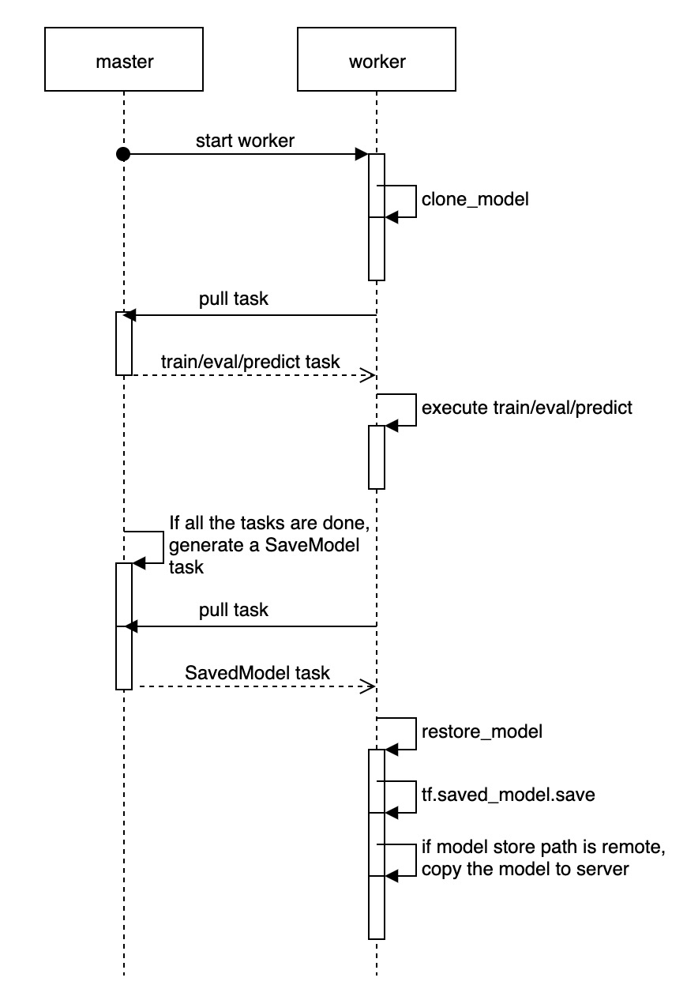

# Serving Design

## Background

Model serving is an essential part in an end-to-end machine learning lifecycle. Publishing the trained model as a service in production can make it valuable in the real world. 

[SavedModel](https://www.tensorflow.org/guide/saved_model?hl=zh_cn) is the universal serialization format for tensorflow models. It's language neutral and can be loaded by multiple frameworks (such as TFServing, TFLite, TensorFlow.js and so on). We choose to store the ElaticDL model into SavedModel format. In this way, we can leverage various mature solutions to serving our model in different scenarios.

The model size can vary from several kilobytes to several terabytes. We divide the model size into two categories: *Small or medium size* and *large size*. The small or medium size model can be loaded by a process, and the latter can not fit in a single process. Training and serving strategies are different between these two cases. Please check the following table:

|                            | Master Central Storage |  AllReduce  |            Parameter Server              |
|----------------------------|:----------------------:|:-----------:|------------------------------------------|
| Small or Medium Size Model |       SavedModel       |  SavedModel |               SavedModel                 |
| Large Size Model           |          N/A           |     N/A     | Distributed Parameter Server for Serving |

Small or medium size model\
A single serving process can load the entire model into memory. No matter which training strategy to choose, we will serialzied the model into SavedModel format. And then we can deploy it using the existed serving frameworks like TFServing. **We focus on this case in this article.**

Large size model\
A single serving process will run out of memory while loading the model. We partition the model variables into multiple shards, store them in distributed parameter server for serving. The inference engine will execute the serving graph, query the variable values from the distributed parameter server as needed and finish the calculation. It's necessary to upgrade the serving framework to support this. **We will discuss this case in a separate design in the next step.**


1. 训练与预测的数据一致性
2. Embedding layer 怎么保存 SavedModel
3. fault-tolerance to save model

## Feature Columns

ElasticDL is a distributed deep learning framework based TensorFlow 2.0 eager execution. In ElasticDL, we use dataset to create input pipeline for training and the recommended way to preprocess data from dataset is to use [feature columns](https://www.tensorflow.org/tutorials/structured_data/feature_columns) in TensorFlow. What's more, tf.saved_model.save will save the defined feature columns with the model. So, tf-serving will use the same preprocessing as training to make inference.

Define a keras model with feature columns:
```
def get_feature_columns():
    age = tf.feature_column.numeric_column("age", dtype=tf.int64)
    education = tf.feature_column.categorical_column_with_hash_bucket(
        'education', hash_bucket_size=4)
    education_one_hot = tf.feature_column.indicator_column(education)
    return [age, education_one_hot]

def get_input_layer():
    input_layers = {}
    input_layers['age'] = tf.keras.layers.Input(name='age', shape=(1,), dtype=tf.int64)
    input_layers['education'] = tf.keras.layers.Input(name='education', shape=(1,), dtype=tf.string)
    return input_layers

def custom_model(feature_columns):
    input_layers = get_input_layer()
    dense_feature = tf.keras.layers.DenseFeatures(feature_columns=feat_cols)(input_layers)
    dense = tf.keras.layers.Dense(10, activation='relu')(dense_feature)
    dense = tf.keras.layers.Dense(1, activation='sigmoid')(dense)
    return tf.keras.models.Model(inputs=input_layers, outputs=dense)

```

Although all feature columns in TensorFlow can be used in ElasticDL, the tf.feature_column.embedding_column is not recommended in ElasticDL. Because the embedding_column has a large trainable embedding parameters. In eager execution the model must get all embedding parameters to train which will cost large inter-process communication overhead.

## Save Model Using SavedModel
Using native Keras layers to define a model is more user-friendly than using custom layers in ElasticDL. However, it is inefficient to train a model with tf.keras.layers.Embedding. When the model executes the forward-pass computation for each mini-batch, it must get all embedding parameters from the parameter server (PS) even if the mini-batch only contains several embedding ids. So, the elastic.layers.Embedding is designed to improve the training efficiency in ElasticDL. Considering user-friendliness and training efficiency, we need to define a model with tf.keras.layers.Embedding and execute training with elastic.layers.Embedding. There is a feasible method that we replace the tf.keras.layers.Embedding layer with elastic.layers.Embedding layer to create a new model instance. For the Sequential model and the Model class used with the functional API, we can do it by tf.keras.models.clone_model.

```
def clone_function(layer):
    if type(layer) == keras.layers.Embedding:
        edl_layer = elastic.layers.Embedding(layer.output_dim)
        return edl_layer
    return layer

model = tf.keras.Model(inputs=[inputs], outputs=[output])
new_model = keras.models.clone_model(model, clone_function=clone_function)
```

For subclass model, we can replace the tf.keras.layers.Embedding attribute with elastic.layers.Embedding.

```
class CustomModel(tf.keras.Model):
    def __init__(self):
        super(MyModel, self).__init__()
        self.embedding = Embedding(10,4)
    def call(self, inputs):
        embedding = self.embedding(inputs)
        return embedding
model = CustomModel()

for attr_name, attr_value in model.__dict__.items():
    if type(attr_value) == keras.layers.Embedding:
        setattr(model, attr_name, edl_Embedding(attr_value.output_dim))
```

However, tf.saved_model.save can not save the replaced model using SavedModel, because elasticDL.layers.Embedding is not the native layer in tf.keras.layers. There are two methods to save the model by tf.saved_model.save. One is that we add the elasticDL.layers.Embedding to tensorflow.keras.layers and compile TensorFlow with the custom layer to a custom version. It may be incompatible with a new TensorFlow version. In this case, we may need to adjust the elasticDL.layers.Embedding implementation when every new version of TensorFlow is released. Another method is that we can save the origin model and replace the embedding parameters with the trained parameters of elasticDL.layers.embedding layer. 

```
def replace_embedding_params_with_edl(layer):
    embedding_params = EmbeddingService.get_all_embedding_params(layer)
    layer.trainable_variables.assign(embedding_params)
    
def replace_model_embedding_layer(model):
    for layer in model.layers:
        if type(layer) == tf.keras.layers.Embedding:
            replace_embedding_params_with_edl(layer)

replace_model_embedding_layer(model)
```

## Model Saving Process

