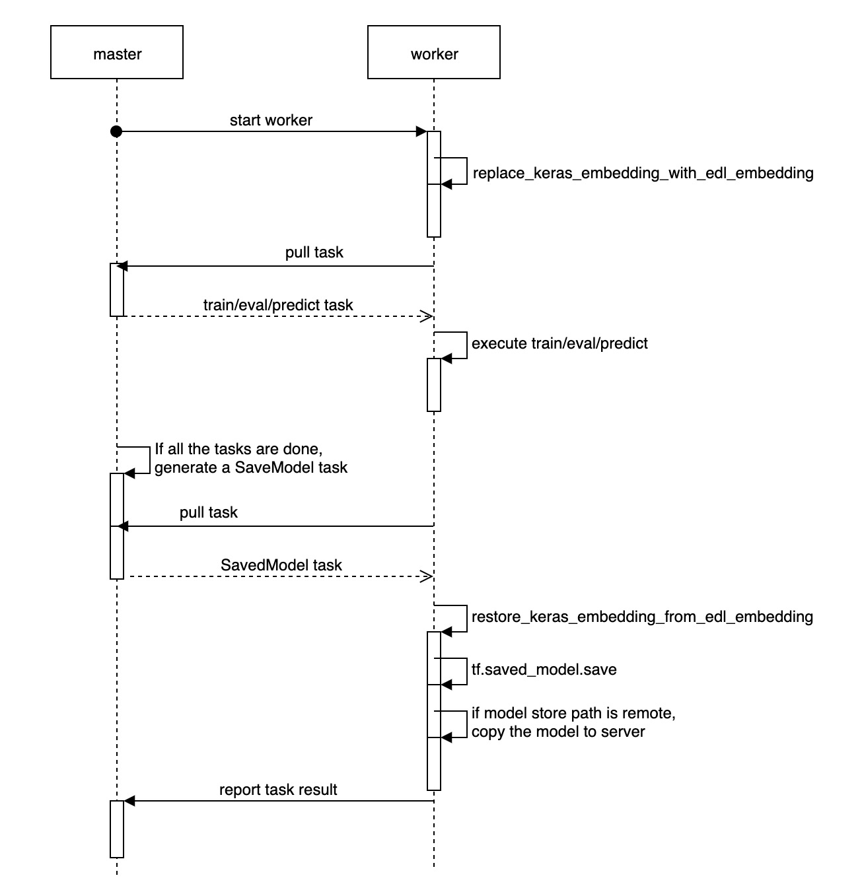

# Serving Design

## Background

Model serving is an essential part in an end-to-end machine learning lifecycle. Publishing the trained model as a service in production can make it valuable in the real world. In the literature, we focus on how to save the model trained in ElasticDL for serving.

[SavedModel](https://www.tensorflow.org/guide/saved_model?hl=zh_cn) is the universal serialization format for TensorFlow models. It's language neutral and can be loaded by multiple frameworks (such as TFServing, TFLite, TensorFlow.js and so on). We choose to export the ElasticDL model to the SavedModel format. In this way, we can leverage various mature solutions to serving our model in different scenarios.

The model size can vary from several kilobytes to several terabytes. Exporting to savedModel can't apply to all the scenarios. We divide the model size into two categories: *Small or medium size* and *large size*. The small or medium size model can be loaded by a process, and the latter can not fit in a single process. Training and serving strategies are different between these two cases. Please check the following table:

|                            | Master Central Storage |  AllReduce  |            Parameter Server              |
|----------------------------|:----------------------:|:-----------:|------------------------------------------|
| Small or Medium Size Model |       SavedModel       |  SavedModel |               SavedModel                 |
| Large Size Model           |          N/A           |     N/A     | Distributed Parameter Server for Serving |

Small or medium size model\
A single serving process can load the entire model into memory. No matter which training strategy to choose, we will export the model to the SavedModel format. And then we can deploy it using the existed serving frameworks like TFServing. **We focus on this case in this article.**

Large size model\
A single serving process will run out of memory while loading the model. We partition the model variables into multiple shards, store them in distributed parameter server for serving. The inference engine will execute the serving graph, query the variable values from the distributed parameter server as needed and finish the calculation. It's necessary to upgrade the serving framework to support this. **We will discuss this case in a separate design in the next step.**

In this article, we want to achieve these three goals in ElasticDL:

1. Guarantee consistency between training and serving for data input.
2. Export the model with elasticdl.layers.Embedding to SavedModel for serving.
3. Execute task to save model with fault-tolerance in ElasticDL.

## Guarantee consistency between training and serving for data input

ElasticDL is a distributed deep learning framework based on TensorFlow 2.0 eager execution. In ElasticDL, we use tf.data.Dataset to create input pipeline for training. The recommended way to preprocess data from tf.data.Dataset is to use [feature columns](https://www.tensorflow.org/tutorials/structured_data/feature_columns) in TensorFlow. What's more, tf.saved_model.save will save the defined feature columns with the model. So, tf-serving will use the same preprocessing logic with training to make inference.

Define a keras model with feature columns:

```python
def get_feature_columns():
    age = tf.feature_column.numeric_column("age", dtype=tf.int64)
    education = tf.feature_column.categorical_column_with_hash_bucket(
        'education', hash_bucket_size=4)
    education_one_hot = tf.feature_column.indicator_column(education)
    return [age, education_one_hot]

def get_input_layer():
    input_layers = {}
    input_layers['age'] = tf.keras.layers.Input(name='age', shape=(1,), dtype=tf.int64)
    input_layers['education'] = tf.keras.layers.Input(name='education', shape=(1,), dtype=tf.string)
    return input_layers

def custom_model(feature_columns):
    input_layers = get_input_layer()
    dense_feature = tf.keras.layers.DenseFeatures(feature_columns=feat_cols)(input_layers)
    dense = tf.keras.layers.Dense(10, activation='relu')(dense_feature)
    dense = tf.keras.layers.Dense(1, activation='sigmoid')(dense)
    return tf.keras.models.Model(inputs=input_layers, outputs=dense)
```

Although all feature columns in TensorFlow can be used in ElasticDL, the tf.feature_column.embedding_column is not recommended in ElasticDL. Because the embedding_column has a variable containing a large embedding table. In eager execution the model must get all the embedding parameters to train. It will bring a large inter-process communication overhead.

## Export the model with elasticdl.layers.Embedding to SavedModel for serving

Using native Keras layers to define a model is more user-friendly than using custom layers in ElasticDL. However, it is inefficient to train a model with tf.keras.layers.Embedding. When the model executes the forward-pass computation for each mini-batch, it must get all embedding parameters from the parameter server (PS) even if the mini-batch only contains several embedding ids. So, the elastic.layers.Embedding is designed to improve the training efficiency in ElasticDL. Considering user-friendliness and training efficiency, we need to define a model with tf.keras.layers.Embedding and train the model with elastic.layers.Embedding. For the Sequential model and the Model class used with the functional API, we can use tf.keras.models.clone_model to replace the tf.keras.layers.Embedding with elastic.layers.Embedding before training starts. For subclass model, we can replace the tf.keras.layers.Embedding attribute with elastic.layers.Embedding.

```python
def clone_model(model)
    # replace the embedding layer for Sequential and functional API models
    if isinstance(model, tf.keras.Sequential) or model._is_graph_network:
        def _clone_function(layer):
            if type(layer) == keras.layers.Embedding:
                edl_layer = elastic.layers.Embedding(layer.output_dim)
                return edl_layer
            return layer
        return keras.models.clone_model(model, clone_function=clone_function)
    else:
    # replace embedding attribute for subclass model
        for attr_name, attr_value in model.__dict__.items():
            if type(attr_value) == keras.layers.Embedding:
                setattr(model, attr_name, edl_Embedding(attr_value.output_dim))
        return model
```

However, tf.saved_model.save can not save the replaced model using SavedModel, because elasticDL.layers.Embedding is not the native layer in tf.keras.layers. There are two methods to save the model using SavedModel. One is that we add the elasticDL.layers.Embedding to tensorflow.keras.layers and compile TensorFlow with the custom layer to a custom version. It may be incompatible with a new TensorFlow version. In this case, we may need to adjust the elasticDL.layers.Embedding implementation when every new version of TensorFlow is released. Another method is that we can save the origin model and replace the embedding parameters with the trained parameters of elasticDL.layers.embedding layer.

```python
def restore_keras_embedding_for_subclass(model):
    for attr_name, attr_value in model.__dict__.items():
        if type(attr_value) == elasticdl.layers.Embedding:
            setattr(model, attr_name, keras.layers.Embedding(attr_value.output_dim))
    return model

def replace_keras_embedding_params(model):    
    for layer in model.layers:
        if type(layer) == tf.keras.layers.Embedding:
            embedding_params = EmbeddingService.get_all_embedding_params(layer)
            layer.embeddings.assign(embedding_params)
```

## Execute task to save model with fault-tolerance in ElasticDL

We designed the master-worker architecture and task dispatch&recover mechanism in ElasticDL to make the job execution fault tolerant. Please check [overall design](./overall_design.md).\
For model saving work, we use the same mechanism. After completing all the training/evaluation/prediction tasks, master will generate a SaveModel task and insert it into the todo task queue. The first worker pulling this task will execute the model saving process. Please check the diagram below:


