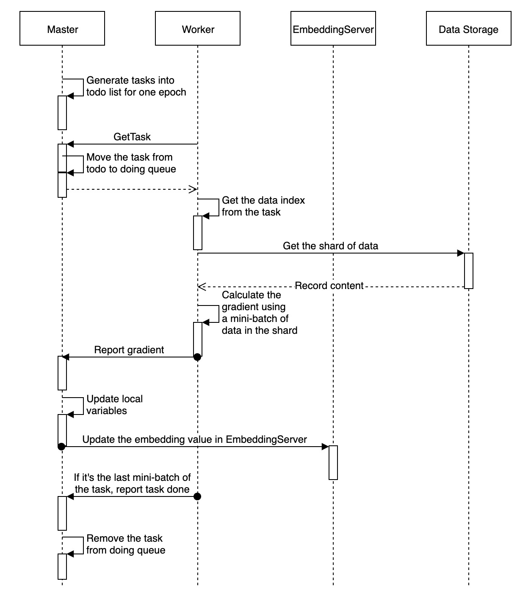

# ElasticDL Work Together with PyTorch

## Catalog
- WHY
    - Introduction
- HOW
    - The Architecture of ElasticDL
    - Input with DataLoader
    - Training Loop about PyTorch in ElasticDL
    - Transmission of Gradient/Parameter Information

## WHY

ElasticDL is an elastic and k8s native distributed deep learning framework. It
targets to work with a deep learning framework smoothly. This document is going
to show readers the design of how it works with PyTorch.
There are three reasons to support the PyTorch framework.

1. EDL is an optional item for users of PyTorch.
PyTorch provides distributed package(i.e., torch.distributed) enables
researchers  to parallelize their computations.
However, the parallelize computing model of PyTorch does not adopt the parameter
server structure, and the structure is the same as Uber Horovod, which is based on
a RingAllReduce algorithm. ElasticDL model not only supports the parameter server
distributed method but also supports AllReduce.
2. There are more users of PyTorch than TensorFlow in academia.
It is necessary to provide a distributed framework for users of PyTorch.
3. The use of PyTorch under the ElasticDL framework is also simple.

<table>
<tr>
<th>PyTorch</th>
<th>TensorFlow</th>
</tr>
<tr>
<td>
<pre>

```python
class CustomModel(nn.Module):
    def __init__(self):
        super(Net, self).__init__()
        self.conv1 = nn.Sequential(
            nn.Conv2d(
                in_channels=1,
                out_channels=16,
                kernel_size=5,
                stride=1,
                padding=2,
            ),
            nn.ReLU(),
            nn.MaxPool2d(kernel_size=2),
        )
        self.conv2 = nn.Sequential(
            nn.Conv2d(16, 32, 5, 1, 2),
            nn.ReLU(),
            nn.MaxPool2d(2),
        )
        self.out = nn.Linear(32 * 7 * 7, 10)

    def forward(self, x):
        x = self.conv1(x)
        x = self.conv2(x)
        x = x.view(x.size(0), -1)
        output = self.out(x)
        return output

def loss(labels, predictions):
    labels = tf.reshape(labels, [-1])
    func = nn.CrossEntropyLoss()
    return func(predictions, labels)
    )

def optimizer(lr=0.1):
    return torch.optim.Adam(cnn.parameters(), lr)

def dataset_fn(data_list, mode, _):
    feature_list = []
    label_list = []
    if mode == Mode.PREDICTION:
        while(len(data_list)!=0):
            feature_list.append(data_list[:28 * 28].reshape((28, 28)))
            label_list.append(data_list[28 * 28:28 * 28 + 1])
            data_list = data_list[28 * 28 + 1:]
    else:
        while (len(data_list) != 0):
            feature_list.append(data_list[:28 * 28].reshape((28, 28)))
            label_list.append(data_list[28 * 28:28 * 28 + 1])
            data_list = data_list[28 * 28:]
        return feature_list, label_list
        
class Custom_Datasets(Dataset):
    def __init__(self, tf_dataset,dataset_fn, transform=None):
        self.transform = transform
        self.dataset = tf_dataset.map(lambda x: tf.strings.to_number(x, tf.float32))
        self.data_list = list(dataset.as_numpy_iterator())
        self.feature_list, self.label_list = dataset_fn(self.data_list)

    def __getitem__(self, idx):
        element = torch.from_numpy(self.data_list[idx])
        if self.transform is not None:
            element = self.transform(element)
        label = torch.from_numpy(self.label[idx])
        return element, label

    def __len__(self):
        return len(self.data_list)
```

</pre>
</td>
<td>
<pre>

```python
class CustomModel(tf.keras.Model):
    def __init__(self, channel_last=True):
        super(CustomModel, self).__init__(name="mnist_model")
        if channel_last:
            self._reshape = tf.keras.layers.Reshape((28, 28, 1))
        else:
            self._reshape = tf.keras.layers.Reshape((1, 28, 28))
        self._conv1 = tf.keras.layers.Conv2D(
            32, kernel_size=(3, 3), activation="relu"
        )
        self._conv2 = tf.keras.layers.Conv2D(
            64, kernel_size=(3, 3), activation="relu"
        )
        self._batch_norm = tf.keras.layers.BatchNormalization()
        self._maxpooling = tf.keras.layers.MaxPooling2D(pool_size=(2, 2))
        self._dropout = tf.keras.layers.Dropout(0.25)
        self._flatten = tf.keras.layers.Flatten()
        self._dense = tf.keras.layers.Dense(10)

    def call(self, inputs, training=False):
        x = self._reshape(inputs["image"])
        x = self._conv1(x)
        x = self._conv2(x)
        x = self._batch_norm(x, training=training)
        x = self._maxpooling(x)
        if training:
            x = self._dropout(x, training=training)
        x = self._flatten(x)
        x = self._dense(x)
        return x


def loss(labels, predictions):
    labels = tf.reshape(labels, [-1])
    return tf.reduce_mean(
        input_tensor=tf.nn.sparse_softmax_cross_entropy_with_logits(
            logits=predictions, labels=labels
        )
    )


def optimizer(lr=0.01):
    return tf.optimizers.SGD(lr)


def dataset_fn(dataset, mode, _):
    def _parse_data(record):
        if mode == Mode.PREDICTION:
            feature_description = {
                "image": tf.io.FixedLenFeature([28, 28], tf.float32)
            }
        else:
            feature_description = {
                "image": tf.io.FixedLenFeature([28, 28], tf.float32),
                "label": tf.io.FixedLenFeature([1], tf.int64),
            }
        r = tf.io.parse_single_example(record, feature_description)
        features = {
            "image": tf.math.divide(tf.cast(r["image"], tf.float32), 255.0)
        }
        if mode == Mode.PREDICTION:
            return features
        else:
            return features, tf.cast(r["label"], tf.int32)

    dataset = dataset.map(_parse_data)

    if mode == Mode.TRAINING:
        dataset = dataset.shuffle(buffer_size=1024)
    return dataset

```

</pre>
</td>
</tr>
</table>

## HOW

### The Architecture of ElasticDL

The master process of ElasticDL uses asynchronous or synchronous SGD methods to
coordinate workers for training. Using the asynchronous SGD method, the master
will start a high-performance parameter server for each worker to use. When using
synchronous SGD, ElasticDL uses Kubernetes-native's fault-tolerable AllReduce
implementation. The rest of this document focus on
[parameter server](https://github.com/sql-machine-learning/elasticdl/blob/develop/docs/designs/parameter_server.md)
methods, and ElasticDL holds
[master-worker architecture](https://github.com/sql-machine-learning/elasticdl/blob/develop/docs/designs/overall.md#architecture).



Master

- Partition the training/evaluation data into mutiple shards. (see
[dynamic_data_sharding_design](dynamic_data_sharding.md))
- Generate the training/evaluation tasks from the data shards.
- Dispatch these tasks to different workers.
- Aggregate the gradients reported from the workers.
- Update the model variables and save the checkpoint if necessary.

Worker

- Pull the task from the master. The task contains the index of this data
shard.
- Read the data according to the data index message. (
[data_io_pipeline_design](data_io_pipeline.md))
- Run the training process using this data shard.
- Report the calculated gradients and task result to the master.

The training data of ElasticDL is in the format of [RecordIO](https://github.com/wangkuiyi/recordio)
or a table in the [MaxCompute](https://www.alibabacloud.com/zh/product/maxcompute)
database system. Before starting training, the master process scans the data across
the basic storage unit (block) and divides it into small segments(task).
After scanning and dividing the data, the master sequentially takes out tasks from
the TODO queue and sends them to a specific living worker via gRPC.

**The worker calls the user-defined PyTorch program.**
A task received by a worker includes minibatches. For each task, the worker opens
the corresponding file or table, and then does the following:
* Read a mini-batch training data.
* Call the user-defined forward function with the local model to calculate the cost.
If the model is large, some parameters may pull from the parameter server.
* Perform backward calculation to get the gradient.
* The worker pushes gradients to the parameter server from time to time and obtains
global model parameters from the parameter server.

### Input with DataLoader

This section describes how workers obtain data.The worker that receives the task
opens the file (or table), and reads records in sequence starting from the specified
offset, and updates the local model.
There is a tutorial about [feed](https://github.com/sql-machine-learning/elasticdl/blob/dc4b2901d651cea08cdb2825a6829c97294e4652/model_zoo/mnist/mnist_subclass.py#L64)
in TensorFlow.Pytorch's input design is different from TensorFlow. This is a
[dataset tutorial](https://github.com/sql-machine-learning/elasticdl/wiki/Dataset-About-PyTorch)
for producing input data for a PyTorch model.

Let's take a brief look at the data processing in ElasticDL. This helps us
understand how to make data for the PyTorch model.
Pay attention to the code in [worker.py](https://github.com/sql-machine-learning/elasticdl/blob/f9c4afceea9d498a92ed580ccc8a456679213578/elasticdl/python/worker/worker.py#L863).

```python
dataset = self._task_data_service.get_dataset()
dataset = self._dataset_fn(
    dataset,
    Mode.TRAINING,
    self._task_data_service.data_reader.metadata,
)
def get_dataset():
    ds = tf.data.Dataset.from_generator(self._gen, self.data_reader.records_output_types)
    return ds
```

`_dataset_fn()` converts string types to corresponding numeric types because
`data_reader.read_records` gets string data.

Three methods about PyTorch data loading in ElasticDL:
1. Reuse the `dataset` of TensorFlow. Convert `dataset` from tf eager tensor to `NumPy`
and send it to the training loop when sending batch data to PyTorch.
2. We read all the data from a task and saved it into a list, then created a `dataset`
from a `list`. In this case, a `dataset` and `dataloader` need to be created for
each task.
3. There a `gen` function that yields `data`. We can create an `IterableDataset`
from this `gen` function and sends the `data` to the training loop.

The rest of this section concerns the case with the second method. In support of PyTorch,
we will turn the `dataset` into a list while turning the data inside into a `NumPy`
format.
`_dataset_fn` is defined by the user and make `NumPy` data into the index `list`
for `Custom_Datasets`, which is the subclass of an abstract class `torch.utils.data.Dataset`.

```python
self.dataset = tf_dataset.map(lambda x: tf.strings.to_number(x, tf.float32))
data_list = list(dataset.as_numpy_iterator())

def dataset_fn(data_list, mode, _):
    feature_list = []
    label_list = []
    if mode == Mode.PREDICTION:
        while(len(data_list)!=0):
            feature_list.append(data_list[:28 * 28].reshape((28, 28)))
            label_list.append(data_list[28 * 28:28 * 28 + 1])
            data_list = data_list[28 * 28 + 1:]
    else:
        while (len(data_list) != 0):
            feature_list.append(data_list[:28 * 28].reshape((28, 28)))
            label_list.append(data_list[28 * 28:28 * 28 + 1])
            data_list = data_list[28 * 28:]
        return feature_list, label_list
class Custom_Datasets(Dataset):
    def __init__(self, tf_dataset,dataset_fn, transform=None):
        self.transform = transform
        self.dataset = tf_dataset.map(lambda x: tf.strings.to_number(x, tf.float32))
        self.data_list = list(dataset.as_numpy_iterator())
        self.feature_list, self.label_list = dataset_fn(self.data_list)

    def __getitem__(self, idx):
        element = torch.from_numpy(self.data_list[idx])
        if self.transform is not None:
            element = self.transform(element)
        label = torch.from_numpy(self.label[idx])
        return element, label

    def __len__(self):
        return len(self.data_list)
```

### Training Loop about PyTorch in ElasticDL

The process of training a deep learning model locally:([Completed example mnist pytorch](https://github.com/sql-machine-learning/elasticdl/wiki/Summary-on-Supporting-PyTorch#example-about-mnist-pytorch))
1. Define the network: Define the `Class` of the network, declare the instance of
   the network net=Net().
2. Define the optimizer: `optimizer=optim.xxx(net.parameters()，lr=xxx)`
3. Define the loss function: `compute_loss=nn.MSELoss()`
4. training loop:
    * Clear the gradient information in the optimizer: `optimizer.zero_grad()`
    * Forward: `output=net(input)`
    * Calculate the loss: `loss=compute_loss(target,output)`
    * Backward: `loss.backward()`
    * Update parameters: `optimizer.step()`

In the MapReduce framework, users only need to cloze two functions: map and reduce.
All the user needs to do is fill in a few functions just like cloze fills in the
blank while the framework's code does distribute computing (including communication,
synchronization, and fault tolerance).

ElasticDL requests users to provide several functions, including `forward`,
`loss`, `optimizer` and `feed`. [Here](https://github.com/sql-machine-learning/elasticdl/blob/develop/model_zoo/mnist/mnist_subclass.py)
is a MNIST model written in TensorFlow Keras API. The `feed` customizes the conversion
process of training data to PyTorch model input.
In PyTorch, we follow the same interface design,
users also need to specify `loss`, `optimizer`, `feed`.
Examples are given at the beginning. 

```python
# Pseudocode about training loop:
while (True):
    task = get_task()
    dataset = create_dataset(task)
    for minibatch in dataset:
        pull_parameters()
        forward()
        backward()
        push_gradients()
```

**The parameter update method is different from building model with PyTorch locally.**
This [document](https://github.com/sql-machine-learning/elasticdl/blob/develop/docs/designs/parameter_server.md)
describes the design of a distributed structure for ElasticDL, which
aggregate gradient under the parameter server strategy.
The advanced API in PyTorch such as `torch.optim` is not available, we had to
update the value of each parameter by name, and manually zero the gradient of
each parameter. `torch.no_grad()` context is necessary because we don't want to
record these operations in the next gradient calculation. To go further, we can use
`model.parameters()` and `model.zero_grad()` (defined by PyTorch for `nn.Module`)
to make these steps more concise, and there will be no errors in forgetting some
parameters, especially when we build a complex model:

```python
with torch.no_grad():
    grads = [param.grad.numpy() for param in model.parameters()]
    self.ps_client.push_gradients(grads)
```

`PSClient` provides several util functions, such as `push_gradients` and `pull_dense_parameters`.

### Transmission of Gradient/Parameter Information

In the parameter server strategy, the workers pull the latest parameters from
the PS before forwarding and push gradients to the PS after backward.
Each PS pod has a RPC server to provide RPC services. Workers use RPC services
to pull model parameters. `pull_variable` function is to pull all non-embedding
parameters. `pull_embedding_vector` service is to pull embedding vectors
specified by an embedding layer name and a list of discrete IDs.

```python
service PServer{
    rpc pull_variable(PullModelRequest) returns (PullModelResponse);
    rpc pull_embedding_vector(PullEmbeddingVectorRequest) returns (Tensor);
    rpc push_gradient(PushGradientRequest) returns (PushGradientResponse);
}
```
A worker computes gradients in each training iteration, containing gradients
for non-embedding parameters and some embedding vectors if applicable. The worker
partitions these gradients using their corresponding parameter names or discrete
IDs for embedding vectors. Then the worker sends gradient partitions to their
relevant PS pods by RPC calls `push_gradient`.