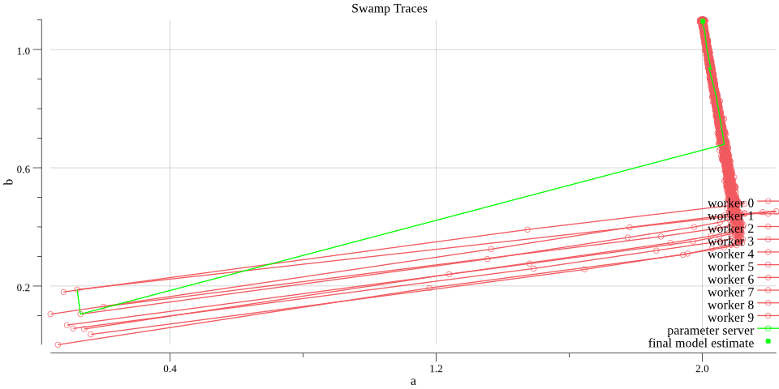

# Swamp Optimization Algorithm

For the background of this algorithm, please refer to https://github.com/wangkuiyi/elasticdl/issues/75. This document is about an illustrative example.

## Build and Run

To try this example, [install Go](https://golang.org/doc/install) and run the following command:

```bash
go run linear_regression.go
```

This updates the `traces.png` file that presents the optimization traces of the swamp.



The swamp consists of some trainers goroutines and the parameter server running by the main goroutine.  Each trainer and the parameter server trace their local model.  After the training, the example program plots traces of local model updates by trainers in red and that by the parameter server in green.  We can see that the final estimate of the model on the parameter server is around the truth ϴ={a,b}={2,1}.  It is not precisely on {2,1} partly due to the randomness from data synthesis and goroutine scheduling.

## A Synthetic Problem

To illustrate the search traces of some bees, I want a model that have two real number parameters, so could I plot the traces on 2-dimensional space.  Also, as most deep learning models are supervised models, we use the following regression model in the example

  y = a x + b
  
The 2-dimensional space is spanned by axis a and b, denoted by ϴ={a,b}.

Such a space is "colored" by the cost C:

  C = cost(D, ϴ) = mse(Y'=a X + b, Y)
  
where mse denotes the mean-square-error, Y' is the set of predicted result and Y is the label, D={X,Y} denotes the training dataset.

Please be aware that for each training job, D={X,Y} is fixed, and we don't plot them.

### The Truth Model

Let's assume that the truth model is ϴ={a,b}={2,1}.

### Synthesize the Data

```
func synthesize(n int, a, b float64) (x, y []float64) {
   for i := 0; i < 1000; i++ {
      α := rand.Float64() * 100
      β := a * α + b + rand.Float64() / 10
      x = append(x, α)
      y = append(y, β)
   }
   return x, y
}
```

### The Gradient and Optimization

Because the cost is as

  c = 1/N Σeᵢ² = 1/N Σ(a xᵢ + b - yᵢ)²

the gradients of a and b are

  ∂c/∂a = Σ ∂c/∂eᵢ ∂eᵢ/∂a = 1/N Σ 2 eᵢ xᵢ

  ∂c/∂b = ∂c/∂eᵢ ∂eᵢ/∂b = 1/N Σ 2 eᵢ

Please be aware that the backward pass that computes the gradients don't need c, but only eᵢ and xᵢ.  So we have the forward pass algorithm:

```go
func forward(x, y []float64, a, b float64) (e []float64) {
   c := 0.0
   for i := range x {
      e = append(e, a * x[i] + b - y[i])
   }
   return e
}
```

and the backward algorithm:

```go
func backward(x, y, e []float64) (da, db flaot64) {
    for i := range x {
        da += e[i] * x[i]
        db += e[i]
    }
    n := float64(len(x))
    return da*2/n, db*2/n
}
```

### The Local Optimization Algorithm

Let us use the very simple fixed-learning-rate SGD algorithm.

```go
func optimize(a, b, da, db, η float64) (a, b float64) {
   return a + da * η, b + db * η
}
```
