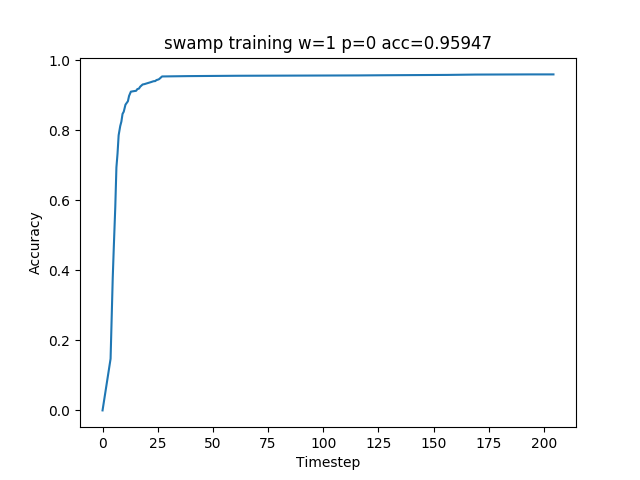
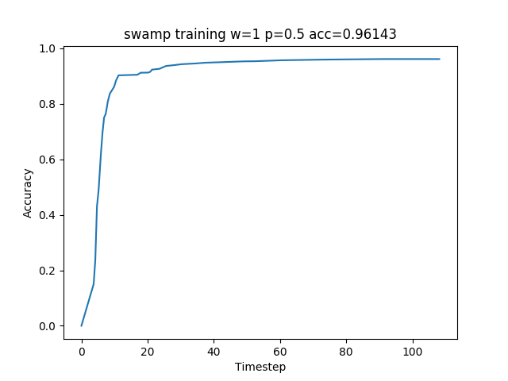
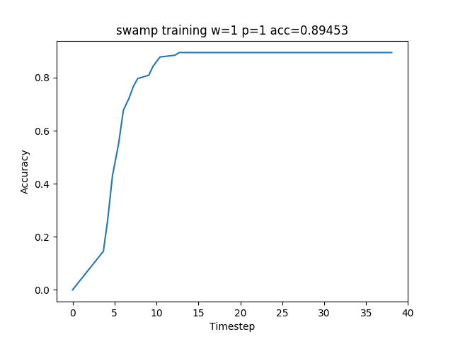
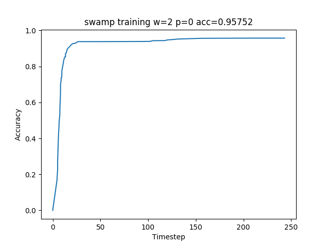
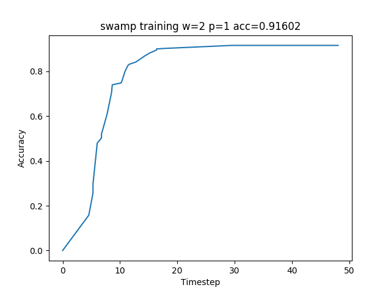

# Swamp Algorithm with Mnist data 

### Usage

```
python3 src/swamp_launcher.py src/mnist.py --class_name MnistCNN --runner thread --input MNISR_DATA_DIR --num_worker W --pull_probability P --evaluation_frequency F --log_image PNG_IMAGE 

MNISR_DATA_DIR: directory contains recordioIO format data. Training data under sub-directory train/, and test data under sub-directory test/
W: the number of worker
P: pull model probability between 0 and 1
F: the frequency of model evaluation(decide pull/push) in batch step. Default 4.
PNG_IMAGE: filename for the saved image, which has a diagram of the training.
```

##### example

python3 src/swamp_launcher.py src/mnist.py --class_name MnistCNN --runner thread --input my_data/mnist --num_worker 2 --pull_probability 0.5 --evaluation_frequency 4  --log_image w2p05.png 

#### Prerequiste packages

tensorflow, recordIO, matplotlib

### Basic algorithm

##### worker

1. Keep a best test accuracy(with test data) MA, and a best batch accuracy(training batch) BA.
2. train with training data for F batches
3. compare the current batch accuracy LBA with BA. if LBA > BA, BA=LBA, goto 4; else, with a probability of P, pull model from ps, update BA, goto 1. If probability misses, continue to 4.
4. Evaluate accuracy A with test data. if A > BA, report A to ps. if ps returns TRUE (A is better than ps), push model. Otherwise, pull model.

##### ps

1. keep a model M and its accuracy A.
2. when worker report accuracy, the compare it with A, and tell the result to the worker (return True if reported accuracy is better than A).
3. when the worker pulls, transfer M values to the worker.
4. when the worker pushes, comare the accuracy with A, if better than A, update M with the pushed model.

### Test Result

For the 60k mnist train data, 58k is used for training data, and 2k is used for test data.

```
Batch Size=64
evaluation_frequence=4
w: num_worker
p: pull_probability
acc: model accuracy after 1 epoch
```












When pull probablity is low, more validation step is used, resulting in more running time.

But p=0 has the highest accuracy,  p=1 has the lowest accuracy, while p=0.5 get nearly similar result as p=0.
