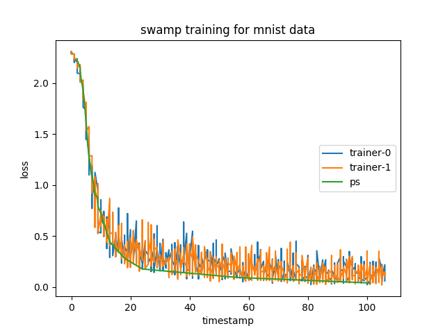
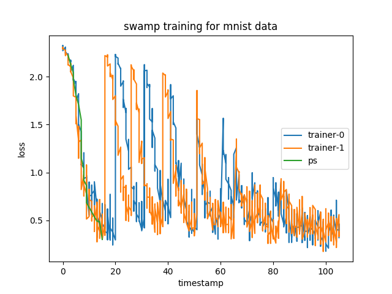
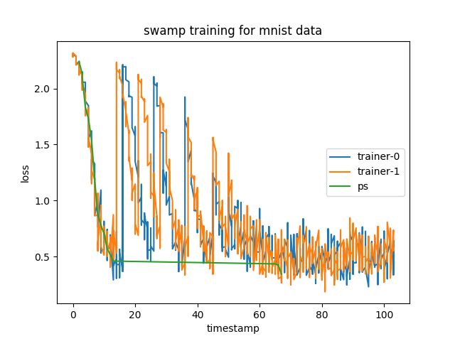
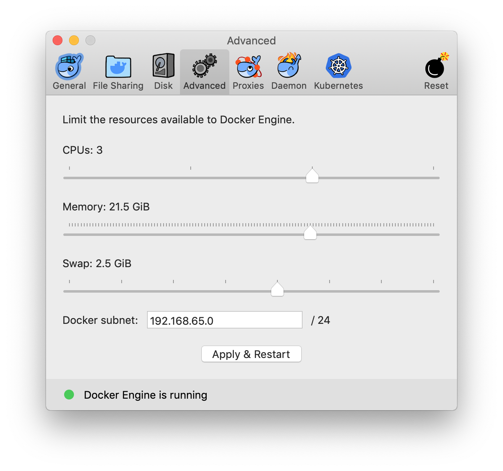

To run this example in a Docker container, we need to build an image including PyTorch, matplotlib and reportlab:

### Step 1: build image.
```bash
docker build -t swamp .
```

### Step 2: train the model.
```bash
docker run --rm -it -v $PWD:/work -w /work swamp python train.py \
    --trainer-number 2 \
    --pull-probability 0.5 \
    --model-sample-interval 10 \
    --model-name MNISTNet \
    --data-type mnist \
    --use-gpu True \
    --job-root-dir jobs
```

`train.py` execute the taining process and dump models to the `--job-root-dir` at interval `--model-sample-interval`. 
The meaning of parameters in the above command are described below:

`--trainer-number` : number of trainers running in total.

`--pull-probability` : the probability of trainer pulling from ps.

`--model-sample-interval` : how many batches to wait before dump a model. 

`--model-name` : the name of the net model (MNISTNet, CIFAR10Net, resnet18).

`--data-type` : data type, valid values are mnist and cifar10.

`--use-gpu` : use GPU for training if available.

`--job-root-dir` : the storage path of job datanet and params. 

### Step 3: evaluate models dumped in the training process.
```bash
docker run --rm -it -v $PWD:/work -w /work swamp python eval.py \
    --job-root-dir jobs \
    --delete-job-data True \
    --eval-batch-size 64 \
    --eval-max-batch 200 \
    --model-name MNISTNet \
    --data-type mnist \
    --use-gpu False  \
    --eval-concurrency 2
```

`eval.py` evaluate all the dumped models in train.py using validation dataset and write loss and accuracy to disk file.

`--job-root-dir` : The root directory of all job result data.

`--delete-job-data` : Whether to delete experiment job result data after evaluation(consideration of disk space).

`--eval-batch-size` : Batch size for evaluate model logged by train.py.

`--eval-max-batch` : Max batch for evaluate model logged by train.

`--model-name` : keep the corresponding values in step 2 the same.

`--data-type`  : data type, valid values are mnist and cifar10.

`--use-gpu`  : when True, use gpu if it is available.

`--eval-concurrency` : Process concurrency for CPU evaluation with default value 2.

### Step 4: plot metrics.
```bash
docker run --rm -it -v $PWD:/work -w /work swamp python plot.py --data-type mnist --job-root-dir jobs
```

`plot.py` read all the metrics data produced by `eval.py` and generate metrics curve graphs for every training job in `train.py`.

`--data-type`  : data type, valid values are mnist and cifar10.

`--job-root-dir` : The root directory of all job result data.

### Step 5: merge all the metrics curve graph into one single PDF file.
```bash
docker run --rm -it -v $PWD:/work -w /work swamp python pdf_creator.py
```

`pdf_creator.py` merge all the curve graphs generated by `plot.py` into one PDF `metrics.pdf` in the current dir.

An example with 2 trainer threads with the trainer pulling probability of 0, 0.5 and 1.0 respectively looks like the following:



From the figure above, with the pulling probability 0, the effect of ps is simply observing the best trainer and do nothing.



as the probability increases to 0.5 and 1.0, trainer is trapped in local optimum caused by a bad loss value of the last minibatch, loss experienced repeated shocks. and with probability of 0.5, loss in ps stopped updating very quickly, which possibly because pushed loss from tainer failed to pass double check of validation dataset.



Note: to run the example on macOS, please remember to enlarge the amount of memory to the virtual machine that runs the Docker daemon.


