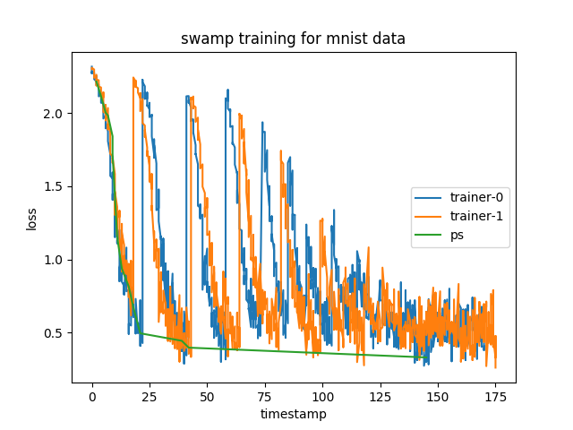

To run this example in a Docker container, we need to build an image including PyTorch and matplotlib:

```bash
docker build -t swamp .
```

Then, we can run the example

```bash
docker run --rm -it -v $PWD:/work -w /work swamp python mnist.py --loss-file loss.png --pull-probability 0.5
```

`mnist.py` writes an image `./loss.png` showing the loss curves of the parameter server and all trainers and the parameter `--pull-probability` represens the probability of trainer pulling from ps.

An example with 2 trainer threads looks like the following:



Note: to run the example on macOS, please remember to enlarge the amount of memory to the virtual machine that runs the Docker daemon.


